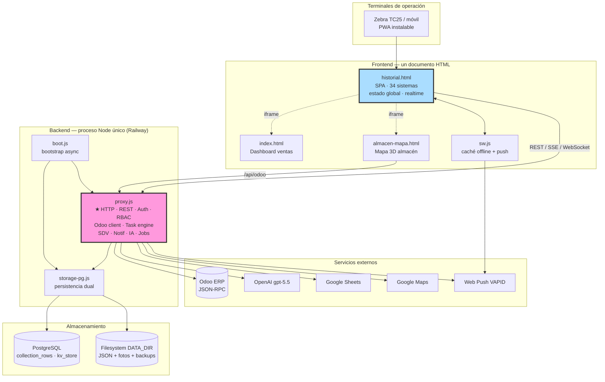
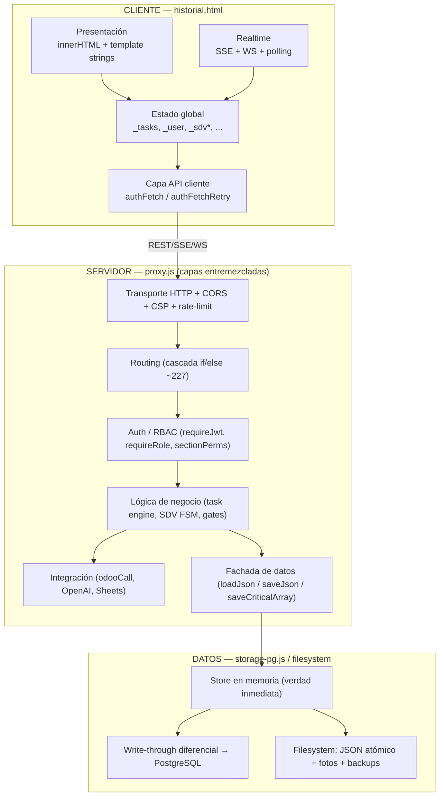
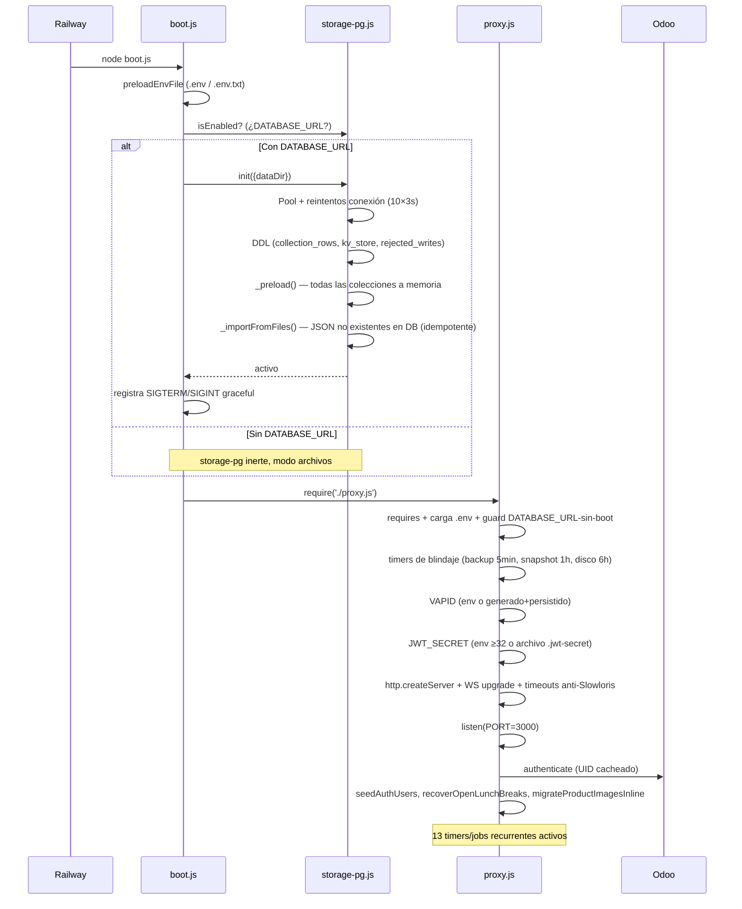
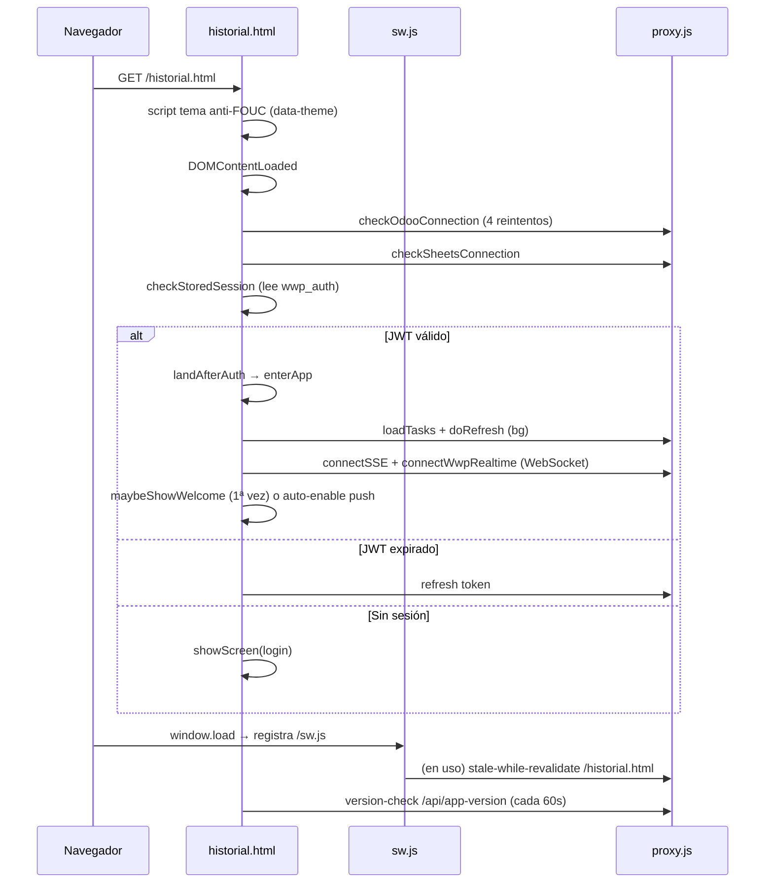

# Documento de Arquitectura Técnica — OpsAT / Dashboard Despachos

> Auditoría de arquitectura y transferencia de conocimiento · 2026-07-22
> Autor: auditoría técnica (Staff Architect). Toda afirmación está respaldada por evidencia `archivo:línea`. Lo no verificable se marca **NO VERIFICADO**.
> Documentos hermanos: `00-resumen-ejecutivo`, `02-inventario-tecnologias`, `03-mapa-modulos`, `04-api-integraciones`, `05-riesgos-deuda-tecnica`, `06-preguntas-abiertas`.

---

## 1. Qué es este sistema

**OpsAT** (interno: "Dashboard Despachos" / "Workforce Platform" / WWP) es una **plataforma de gestión operativa de almacén y despachos** para la empresa Altri Tempi, integrada con el ERP **Odoo**. Digitaliza el flujo físico de la bodega: empaque, despacho, devoluciones, inventario, inspección de vehículos y gestión de personal, con evidencia fotográfica y GPS, sobre terminales industriales (Zebra) y móviles.

Es una aplicación **en producción real** (build v218), en uso operativo diario, con ~823 commits en ~3 meses (may–jul 2026) de un solo desarrollador principal (`gjs6301-code`, 830 commits).

### Cifras estructurales
| Métrica | Valor |
|---|---|
| Código propio (sin librerías) | ~72.600 líneas |
| Backend (`proxy.js`) | 20.766 líneas, ~238 endpoints |
| Frontend (`historial.html`) | 40.727 líneas, 34 sistemas funcionales |
| Persistencia (`storage-pg.js`) | 536 líneas |
| Dependencias npm de producción | 4 directas |
| Integraciones externas | 6 (Odoo, PostgreSQL, OpenAI, Google Sheets, Google Maps, Web Push) |

---

## 2. Arquitectura general

### 2.1 Estilo arquitectónico

El sistema es un **monolito cliente-servidor de dos capas**, con una arquitectura deliberadamente minimalista:

- **Cliente:** una SPA (Single-Page Application) monolítica servida como un único archivo HTML, sin framework, sin bundler, sin build. El DOM se manipula con `innerHTML` + template strings.
- **Servidor:** un único proceso Node.js sobre el módulo `http` nativo, **sin framework web** (ni Express), que hace de: servidor de estáticos, API REST, proxy a Odoo, motor de tareas, motor de notificaciones (SSE/WebSocket/Push) y orquestador de IA.
- **Datos:** backend dual PostgreSQL / archivos JSON, transparente al código de negocio.

No es una arquitectura de moda (no hay microservicios, ni capas hexagonales, ni DDD, ni ECS). Es un **monolito pragmático optimizado para velocidad de iteración de un solo desarrollador**, con un patrón de "todo en un archivo por tier". Esta elección explica tanto su mayor virtud (cambios end-to-end en minutos, cero fricción de infraestructura) como su mayor deuda (dos archivos de decenas de miles de líneas — ver riesgos R-11).

### 2.2 Diagrama de componentes (C4 nivel contenedor)

### 2.3 Capas lógicas (dentro de los monolitos)

Aunque físicamente hay dos archivos, lógicamente el sistema tiene estas capas. La observación clave es que en `proxy.js` **las capas no están separadas en código** — conviven en el mismo handler de ruta.

### 2.4 Patrones arquitectónicos presentes

| Patrón | Dónde | Calidad |
|---|---|---|
| **Cliente-servidor** de 2 capas | Todo el sistema | Correcto para la escala |
| **Fachada de persistencia** | `loadJson`/`saveJson` ocultan PG vs archivos | Excelente — abstracción limpia |
| **Backend dual / Strangler invertido** | `storage-pg.js` con rollback a archivos | Excelente — permite revertir de PG a JSON sin código |
| **Máquina de estados (FSM)** | SDV (`sdvTransition`), tareas | Bien — transiciones explícitas |
| **Fail-open resiliente** | Gates de Odoo (>20 sitios) | Decisión de negocio deliberada y auditada |
| **Write-behind / cola diferida** | `storage-pg.js` opQueues | Bien — memoria como verdad, DB eventual |
| **Índice fraccional** | Columna `ord` para orden de arrays | Sofisticado y correcto |
| **PWA / offline-first parcial** | `sw.js` stale-while-revalidate | Correcto |
| **Proxy** | `/api/odoo` resuelve CORS + oculta credenciales | Correcto (pero ver endpoints sin auth, R-06B) |

**Anti-patrones presentes:** God Object (ambos monolitos), Copy-Paste Programming (715 `Content-Type`, 4 escapes, R-13), Magic Strings (tipos de tarea, estados), estado global mutable compartido (frontend sin `'use strict'`).

---

## 3. Flujo de ejecución — arranque del servidor

Secuencia exacta desde `node boot.js` (el `startCommand` de Railway):

**Puntos críticos del arranque:**
- Si hay `DATABASE_URL` pero se arranca con `node proxy.js` directo (saltándose boot.js), el proxy **sale con error a propósito** (`:129-133`) — evita servir vacío.
- Si Postgres no conecta tras 10 intentos, boot.js hace `process.exit(1)` — **no arranca sirviendo datos vacíos** (decisión correcta anti-pérdida).
- El seed de usuarios y la migración de imágenes corren en el callback de `listen`, es decir, **después** de aceptar conexiones — hay una ventana breve donde el server responde pero el seed no terminó (**NO VERIFICADO** si causa problemas en la práctica).

## 4. Flujo de ejecución — arranque del cliente

`enterApp` (`historial.html:11479`) construye los tabs de la WWP **según el RBAC del usuario** (`:11496-11582`): cada rol ve un subconjunto distinto de las secciones. Rol `ventas` aterriza en el historial; el resto en la WWP.

## 5. Manejo del estado

### Servidor
El estado autoritativo vive en **el store en memoria de `storage-pg.js`** (o en los archivos JSON con caché por `mtime` en modo archivos). El monolito muta arrays en memoria in-place y llama al saver. No hay estado de sesión en RAM más allá del UID de Odoo cacheado y los mapas de rate-limit; las sesiones se persisten (`wwp-sessions.json`), de modo que **el proceso es casi stateless y reiniciable** — clave para el restart-on-failure de Railway.

### Cliente
Todo el estado vive en **variables globales top-level** compartidas entre los 6 `<script>` de `historial.html` (`_tasks`, `_allUsers`, `_drawerTask`, `_notifications`, `_user`, `_token`, módulos con prefijo `_sdv*`/`_emp*`/`_pol*`). No hay store ni patrón de gestión de estado. `_token`/`_user` son **globals implícitos sin declaración** (R-11). La coordinación entre "módulos" es por llamada directa a funciones globales — **no hay event bus** (0 `CustomEvent`).

**Sincronización realtime multicapa** (robusta ante caídas de Railway):
- WebSocket `/ws/wwp` (retry 2.5s) — señales "dirty" → el cliente re-fetchea.
- SSE stream (retry 10s) — notificaciones.
- Polling cada 60s + version-check cada 60s + refresco en `visibilitychange`/`pageshow`.

## 6. Eventos y comunicación

| Mecanismo | Uso | Evidencia |
|---|---|---|
| **onclick inline** | Dominante (~9:1): 787 `onclick=` vs 82 `addEventListener` | `historial.html` |
| **postMessage** | Solo cliente ↔ Service Worker (SKIP_WAITING, NOTIFICATION_CLICK) | `:10469`, `:21905` |
| **SSE** (Server-Sent Events) | Servidor → cliente: notificaciones en vivo | `proxy.js` stream |
| **WebSocket** | Servidor ↔ cliente: señales dirty (handshake sin JWT, R-10) | `proxy.js:20583` |
| **Web Push** | Servidor → SW: notificaciones con app cerrada | VAPID |
| **CustomEvent / event bus** | **Ausente** — coordinación por globals | — |

El listener `message` para `openNewTask` (`historial.html:11632`) es una **reliquia del diseño original por iframes**: valida same-origin pero ya no se usa como se pensó (la WWP hoy es `#screen-app` del mismo documento, no un iframe).

---

## 7. Seguridad — postura general

Resumen; el detalle y las acciones están en `05-riesgos-deuda-tecnica.md`.

**Fortalezas:**
- `requireJwt` relee el usuario en cada request → revocación y cambio de rol inmediatos.
- `timingSafeEqual` en todas las comparaciones sensibles (JWT, tokens, contraseñas).
- Contraseñas: PBKDF2-SHA512, 100.000 iteraciones, salt 16B (`proxy.js:3133`).
- Rate limiting en 3 capas (login, cambio de contraseña, por IP).
- Escritura de datos atómica + guarda anti-vacío + 3 niveles de backup.
- Anti path-traversal + allowlist de extensiones + denylist de JSON de negocio en estáticos.
- Anti-Slowloris (timeouts 30/15/65s).

**Debilidades (ver riesgos):** credencial Odoo commiteada (R-02), fuente descargable (R-03), `/api/health` filtra datos (R-05), endpoints sin auth que tocan Odoo (R-06B), CSP con `'unsafe-inline'` + XSS manual (R-07), contraseñas semilla en fuente (R-08), JWT artesanal (R-09), token en query string SSE (R-10), WS sin auth de handshake (R-10).

---

## 8. Calidad de arquitectura — evaluación

| Atributo | Nota | Justificación |
|---|---|---|
| **Cohesión** | Baja (a nivel archivo) / Media (a nivel función) | Los monolitos mezclan todo; las funciones individuales suelen tener propósito claro |
| **Acoplamiento** | Alto | Scope global compartido; `proxy.js` es un hub del que todo depende |
| **Mantenibilidad** | Media-baja | Comentarios excepcionales (con fechas y contexto de decisión) compensan parcialmente el tamaño; `renderDrawer` de 1.060 líneas es intratable |
| **Escalabilidad** | Media | Vertical OK; horizontal limitada (estado en memoria + WS/SSE con afinidad de proceso). A la escala actual (una bodega) sobra |
| **Modularidad** | Baja | Solo `storage-pg.js` y `sw.js` son módulos reales |
| **Legibilidad** | Media | Nombres claros en español, buenos comentarios; pero funciones y archivos gigantes |
| **Reutilización** | Baja | Duplicación masiva (R-13) en vez de helpers compartidos |
| **Separación de responsabilidades** | Baja en backend, Media en el conjunto | El split cliente/servidor/datos es limpio; dentro de cada tier no hay capas |
| **Resiliencia** | **Alta** | Fail-open, backups triples, anti-vacío, rollback de PG, reintentos, degradación de dependencias lazy |
| **Trazabilidad** | Alta | `appendAuditLog` (53 usos), eventos de negocio auditados, comentarios fechados |

**Veredicto:** es un sistema **maduro en resiliencia operativa y funcionalidad de negocio, inmaduro en modularidad de código**. La deuda no es accidental sino el resultado consciente de priorizar velocidad de entrega de un solo desarrollador sobre estructura — una decisión razonable para llegar a producción, que ahora empieza a cobrar intereses (bug R-01 propagado por copy-paste es el ejemplo perfecto).

---

## 9. Performance

**Observaciones (con evidencia; impacto real NO VERIFICADO sin profiling):**
- **I/O síncrona en el hot path** (R-14): `fs.*Sync` en `loadJson/saveJson`. Mitigado por caché `mtime` y por el modo PG (memoria). En modo archivos, guardar un archivo grande bloquea el event loop.
- **Escalación de vencidas** (`enrichOverdueTasks`): corría en cada GET reescribiendo 28 MB por request por un timestamp — **ya corregido** el 20-jul (persiste solo ante cambio material). Buen ejemplo de deuda de performance detectada y saneada.
- **Deduplicación de imágenes** (`/prod-img/`): resolvió un payload de tareas de 19 MB gzip → 8 KB. Optimización de alto impacto ya aplicada.
- **Routing O(n)**: ~227 condiciones por petición. Despreciable a esta escala.
- **Frontend de 2.5 MB**: `historial.html` se descarga entero; mitigado por SW cache-first y stale-while-revalidate. La hidratación de íconos Lucide es perezosa por perf en gama baja (Zebra).
- **Caché de Odoo** con TTL 60s–12h evita machacar el ERP.

## 10. Testing

- **27 harnesses** en `tests/`, sin framework, convención `_test_vNNN.mjs` (NNN = build del fix que blindan). Patrón: arrancan `proxy.js` real con puerto y `DATA_DIR` temporales, algunos contra un "Odoo falso" HTTPS local.
- `npm test` = `test-smoke.js`, que **requiere el servidor vivo en `:3000`**.
- Suites con contrato HTTP: `test:inventario`, `test:geo` (autogeneran su cert con OpenSSL).
- **Sin CI de tests, sin cobertura instrumentada.** 6 harnesses no corren en clon limpio por falta de los `.pem` (gitignored) — R-18.
- **Estrategia real:** regresión defensiva por bug — cada fix de producción deja un harness que lo blinda. Es efectivo para no reintroducir bugs conocidos, pero no da cobertura de features nuevas ni del frontend.

## 11. Build y deployment

- **Sin build.** El frontend se sirve tal cual; el backend corre directo con Node.
- **Deploy:** Railway (NIXPACKS), `startCommand: node boot.js`, healthcheck `/api/health`, restart-on-failure ×10. **Manual vía Railway CLI** (`railway up`); GitHub no dispara deploys (es respaldo del código).
- **Riesgo de deriva:** si se despliega sin commitear, el repo queda por detrás de producción (documentado en CLAUDE.md).
- **Monitoreo:** GitHub Actions (`uptime.yml`) pinguea `/api/health` cada 5 min; si cae 3 veces abre un issue `wwp-down` con runbook (incluye el rollback a modo archivos) y notifica por correo; al recuperarse lo cierra solo.
- **Respaldo:** `scripts/backup-wwp.mjs` (Nivel 1) copia colecciones + fotos incrementales a OneDrive vía tarea de Windows 2:00 AM.

---

## 12. Conclusión arquitectónica

OpsAT es un **monolito cliente-servidor pragmático** que cumple su función de negocio con una robustez operativa notable (fail-open, backups triples, rollback de datos, realtime multicapa) construida sobre una base de código con deuda estructural significativa (dos archivos gigantes, scope global, duplicación masiva, un bug de `ReferenceError` latente propagado por copy-paste).

La tesis de la arquitectura es clara y coherente: **minimizar la infraestructura y la ceremonia para que un solo desarrollador itere a máxima velocidad sobre un dominio operativo complejo**. Esa apuesta ganó — el sistema está en producción y en uso diario — pero ha llegado al punto donde la falta de modularidad empieza a generar bugs (R-01) y a frenar cambios. Las recomendaciones (documento `00`) apuntan a **pagar la deuda crítica sin reescribir**: arreglar los cuatro riesgos críticos (esfuerzo bajo), y luego extraer módulos incrementalmente detrás de las fachadas que ya existen.
