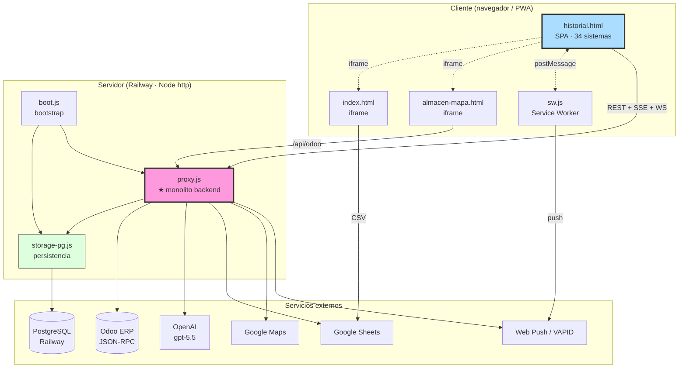
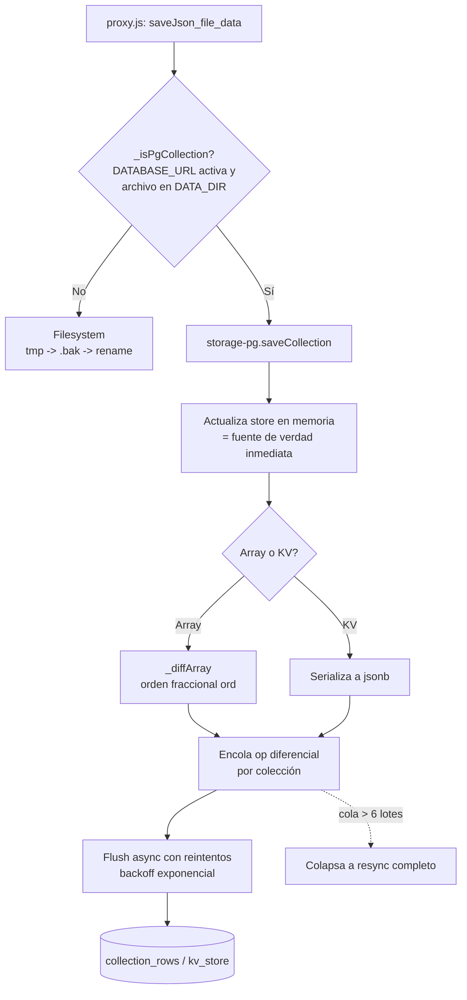
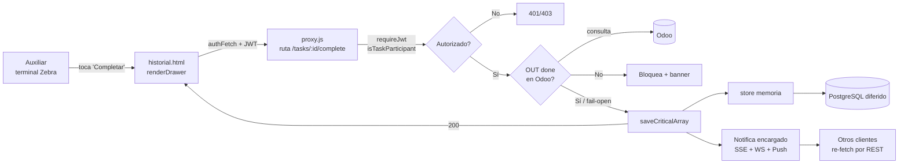

# Mapa de Módulos, Estructura y Persistencia — OpsAT

> Auditoría de arquitectura · 2026-07-22

## 1. Estructura del proyecto (raíz)

El proyecto **no** usa la estructura `src/ · components/ · services/` habitual. Es un conjunto de archivos planos en la raíz, donde **dos monolitos concentran el 85% del sistema**. Mapa por responsabilidad:

```
OpsAT/
├── boot.js                 # Bootstrap: init async de Postgres ANTES de cargar proxy.js (61 líneas)
├── proxy.js                # ★ SERVIDOR COMPLETO: HTTP, ~238 endpoints, auth, RBAC, Odoo, IA, jobs (20.766 líneas)
├── storage-pg.js           # Capa de persistencia PostgreSQL (backend dual) (536 líneas)
│
├── historial.html          # ★ APP PRINCIPAL: SPA monolítica, 34 sistemas funcionales (40.727 líneas)
├── index.html              # Dashboard de ventas standalone (Chart.js) — embebido por iframe (806)
├── almacen-mapa.html       # Mapa 3D del almacén (Three.js r147 + canvas 2.5D) — iframe (1.962)
├── almacen-mapa.css        # Estilos del mapa (167)
├── wwp.html                # ⚠️ App WWP VIEJA completa (deprecada por 302 server-side, NO es redirect) (3.393)
├── wwp-guide*.html         # Manuales de usuario estáticos (admin / staff)
│
├── sw.js                   # Service Worker PWA (caché wwp-v57 + push) (237)
├── manifest.json           # Web App Manifest ("Ops AT")
│
├── lucide/chart/xlsx/three.min.js, OrbitControls.js   # Librerías vendorizadas (locales)
│
├── sync-from-prod.js       # ⚠️ Obsoleto: baja datos de prod (apunta a Render) (135)
├── _ron_neg_watch.mjs      # ⚠️ Huérfano con credenciales Odoo commiteadas (94)
├── _mockup_notif_panel.html# ⚠️ Mockup ya portado a producción (huérfano)
│
├── tests/                  # 27 harnesses de regresión (_test_vNNN.mjs) — sin framework
├── scripts/                # backup-wwp.mjs + import/sync PowerShell de deploy
├── .github/workflows/      # uptime.yml — monitoreo cada 5 min
├── .claude/                # launch.json (previews locales) + worktrees viejos
├── _archivo/               # Todo lo fuera de uso activo, organizado por tema
│
├── railway.json / render.yaml   # Config de deploy (Railway actual / Render viejo)
├── package.json / package-lock.json
├── CLAUDE.md / AGENTS.md / MEMORIA-PROYECTO.md / AUDITORIA-*.md   # Documentación
└── icons, badges, favicons, apple-touch-icon   # Assets PWA
```

## 2. Responsabilidades por módulo

| Módulo | Responsabilidad | Líneas | Acoplamiento |
|---|---|---:|---|
| `boot.js` | Punto de entrada real. Precarga Postgres async, registra SIGTERM/SIGINT graceful, luego `require('./proxy.js')` | 61 | → storage-pg, proxy |
| `proxy.js` | **Todo el backend**: servidor HTTP, routing, auth/JWT, RBAC, cliente Odoo, motor de tareas, SDV, notificaciones, IA, jobs, estáticos, persistencia (fachada `loadJson`/`saveJson`) | 20.766 | → storage-pg, pg, nodemailer, web-push, @anthropic-ai/sdk (muerto) |
| `storage-pg.js` | Persistencia PostgreSQL: store en memoria + write-through diferencial por fila, orden fraccional, anti-vacío, export a JSON | 536 | → pg |
| `historial.html` | **Todo el frontend operativo**: 34 sistemas, estado global, capa API cliente, realtime, PWA | 40.727 | → proxy (REST/SSE/WS), sw.js, iframes |
| `index.html` | Dashboard de ventas (Chart.js), 3 modos de datos (Sheets CSV / proxy) | 806 | → Sheets, proxy (`/api/sheets-csv-index`) |
| `almacen-mapa.html` | Mapa 3D del almacén, 4 vistas (3D/2.5D/planta/rack) | 1.962 | → proxy (`/api/odoo`), Three.js |
| `sw.js` | Caché offline + recepción de push | 237 | → proxy (`/api/app-version`) |

**Observación de acoplamiento:** `proxy.js` es un hub del que todo depende. No hay separación de capas dentro del monolito (routing, lógica de negocio, acceso a datos y presentación de JSON conviven en el mismo handler). `storage-pg.js` es el único módulo con una frontera limpia y responsabilidad única — es la mejor pieza de ingeniería del repo.

## 3. Diagrama de dependencias entre módulos



**Dependencias circulares:** ninguna a nivel de módulo (el grafo backend es un árbol `boot → {pg, proxy → pg}`). Dentro de cada monolito el acoplamiento es total (todo con todo por scope compartido), pero eso no es una dependencia circular entre archivos.

**Módulos aislados / bien encapsulados:** `storage-pg.js` (interfaz mínima `init/loadCollection/saveCollection/shutdown`), `sw.js`.

## 4. Persistencia — backend dual

El sistema tiene **dos backends de datos intercambiables** gobernados por la variable `DATABASE_URL`:

### Modo archivos JSON (local, tests, y fallback de rollback)
- `loadJson(file, fallback)` (`proxy.js:34-59`): caché por `mtime`+`size`; si el JSON está corrupto **no devuelve `[]` en silencio** — intenta `.bak` y si no, lanza (evita persistir la pérdida en la siguiente escritura).
- `saveJson(file, data)` (`:60-76`): escritura **atómica** `tmp → copia a .bak → rename`.
- `saveCriticalArray` (`:158-189`): añade **guarda anti-vacío** (rechaza vaciar un array de ≥5 items y registra el intento) + backups rotativos (40 copias, throttle 5 min). Lo usan las colecciones sensibles: tareas, SDV, casos de inventario, alertas, auditoría de cancelaciones.
- Snapshot horario de todo `DATA_DIR` (24 retenidos) + chequeo de disco cada 6h.

### Modo PostgreSQL (producción Railway)
Cuando `DATABASE_URL` está definida, `_isPgCollection()` (`proxy.js:28-32`) detecta que un `.json` vive directo en `DATA_DIR` y **enruta la misma llamada a `storage-pg.js`**. El monolito no cambia: la fachada `loadJson/saveJson` es transparente.



**Claves del diseño de `storage-pg.js`:**
- **Store en memoria = verdad inmediata**: `loadCollection` devuelve la referencia viva que el código muta in-place; la escritura a PG es diferida y tolerante a fallos de red (la cola reintenta hasta converger).
- **Diff por fila con orden fraccional** (`ord`, columna `DOUBLE PRECISION`): solo se escriben las filas que cambiaron; el orden del array se preserva sin renumerar todo (renumera solo si se agota la precisión, `MIN_GAP = 1e-6`).
- **Anti-vacío en PG también** (`saveCollection` con `opts.critical`): rechaza vaciar ≥5 filas → 0 y lo registra en `rejected_writes`.
- **Rollback de un botón**: `exportAllToFiles()` vuelca memoria → los mismos `.json` de siempre. Quitar `DATABASE_URL` + redeploy vuelve a modo archivos perdiendo ≤1h (export horario + en SIGTERM).
- **Import idempotente al boot**: solo importa colecciones que no existan ya en la DB; ignora respaldos manuales (`.json.` interno o sufijo timestamp de 13 dígitos).

### Fotos / evidencia (siempre en filesystem, nunca en PG ni base64 inline)
- 6 carpetas de fotos en `DATA_DIR` (despacho, avería, inspección, empaque, adjuntos SDV, guía).
- `/prod-img/`: imágenes de producto de Odoo **deduplicadas por SHA-1 de contenido** (`saveProductImageB64`), servidas `immutable` con caché de 1 año. Una migración idempotente al boot convierte cualquier base64 heredado (redujo el archivo de tareas de 6.1 MB a 93 KB).

## 5. Tabla de colecciones de datos (principales)

| Archivo / colección | Contenido | Persistencia |
|---|---|---|
| `wwp-tasks.json` | Tareas y subtareas (núcleo) | `saveCriticalArray` |
| `wwp-users-auth.json` | Usuarios + hash PBKDF2 | `saveJson` |
| `wwp-sessions.json` | Sesiones activas (refresh tokens) | `saveJson` |
| `wwp-roles.json` | Roles custom + `sectionPerms` | `saveJson` |
| `wwp-notifications.json` | Historial de notificaciones | `saveJson` |
| `wwp-audit.json` | Log de auditoría (cap 10.000) | `saveJson` |
| `sdv-solicitudes.json` | Solicitudes de despacho/devolución | `saveCriticalArray` |
| `sdv-cancellation-audit.json`, `sdv-reactivations.json`, `sdv-alertas.json` | Ciclo de vida SDV | `saveCriticalArray` |
| `wwp-inventario-casos.json`, `-snapshots.json` | Salud de inventario | `saveCriticalArray` |
| `wwp-locations.json` | Historial GPS (retención 7 días, PII) | `saveJson` |
| `emp-materiales.json`, `emp-reglas.json` | Catálogo/reglas de empaque | `saveJson` |
| `averias.json` | Reportes de daños | `saveJson` |
| `vehiculos-inspecciones.json` | Inspecciones de flota | `saveJson` |
| `push-subscriptions.json`, `vapid-keys.json` | Web Push | `saveJson` |

## 6. Flujo de datos (petición operativa típica)

Ejemplo: un auxiliar completa una tarea de despacho desde su terminal Zebra.



Los pasos de **captura de evidencia** (3 fotos obligatorias, GPS best-effort, estado por artículo) ocurren antes del `complete` y persisten por endpoints dedicados (`/tasks/:id/fotos-*`, `/auth/location`, `/tasks/:id/items/:itemId/entrega`).
