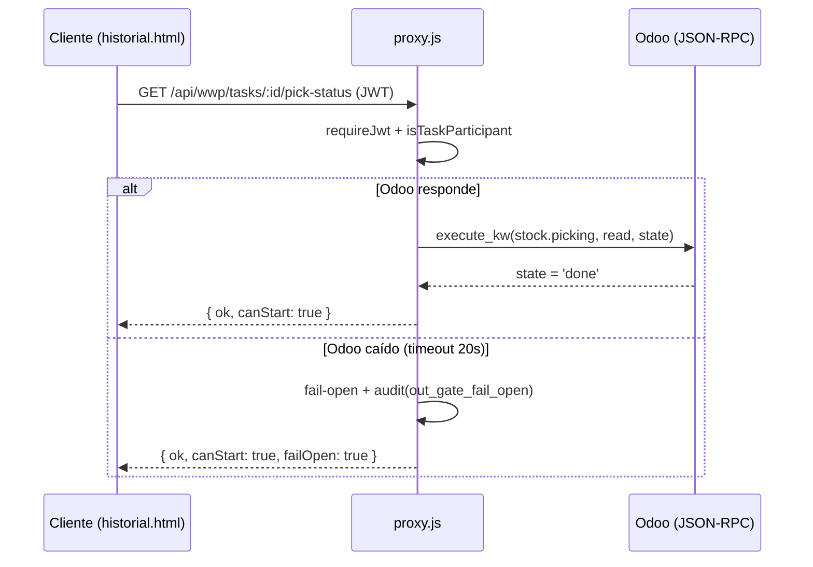

# API e Integraciones — OpsAT / Dashboard Despachos

> Auditoría de arquitectura · 2026-07-22 · La superficie de API vive íntegra en `proxy.js`. El conteo (~238 endpoints) depende de si los sub-handlers multi-método se cuentan como uno o varios; se marca **NO VERIFICADO** donde aplica.

## 1. Arquitectura de enrutamiento

No hay Express ni router. Un único `http.createServer` (`proxy.js:7882`) contiene un handler async de ~12.700 líneas con una **cascada lineal de ~227 condicionales**:

```js
if (reqPath === '/api/...' && req.method === 'X') { ... return; }
if (reqPath.startsWith('/api/...') && ...) { ... return; }
if (reqPath.match(/^\/api\/.../) && ...) { ... return; }
```

El primer match responde y hace `return`. Consecuencias arquitectónicas:

- **El orden importa**: una ruta general declarada antes que una específica la ensombrece. No hay verificación estructural de esto.
- **Sin middleware pipeline**: cada rama repite manualmente auth, parsing y headers (de ahí las 715 repeticiones de `Content-Type` — ver riesgos R-13).
- **Coste O(n)**: una petición a una ruta declarada al final evalúa ~227 condiciones. Irrelevante a esta escala, pero es un olor arquitectónico.

### Capas transversales aplicadas a toda petición
1. **CORS + headers de seguridad** (`:7886-7912`): allowlist de orígenes, CSP, `Permissions-Policy`, `Referrer-Policy`, HSTS condicional.
2. **Rate limit por IP** en `/api/*` (`:7919-7925`) — 5 rutas caras con límites 20-30/min → 429.
3. **Autenticación** (por ruta, no global) — ver §2.

## 2. Autenticación y autorización

| Mecanismo | Implementación | Evidencia |
|---|---|---|
| Firma de token | JWT **HS256 artesanal** (`jwtSign`/`jwtVerify`), sin librería, `timingSafeEqual` | `proxy.js:3108-3130` |
| Vida del token | 8 horas | `:3120` aprox. |
| Guard principal | `requireJwt` — **relee el usuario del disco en cada request** (revocación inmediata) — 210 usos | `:3153-3171` |
| RBAC por rol | `requireRole` + `ROLE_PERMISSIONS` — 55 usos | `:3175`, `:4622` |
| RBAC por sección | `requireSectionPerm` (bypass admin) — 18 usos | `:3187` |
| Anti-IDOR por tarea | `isTaskParticipant` | `:3205-3214` |
| Tokens dedicados | Codex Bridge (`CODEX_BRIDGE_TOKEN`, timing-safe) y Backup (`BACKUP_TOKEN`) | `:7929` |

Roles: `admin`, `manager`, `assistant`, `ventas` + roles custom con `sectionPerms` granulares. Conviven **dos sistemas de permisos** (`ROLE_PERMISSIONS` y `sectionPerms`) — deuda R-16.

## 3. Inventario de endpoints por dominio

Conteo aproximado **≈238 endpoints REST activos** (+4 deshabilitados en ramas `if(false)`, +1 WebSocket, +estáticos). Distribución:

| Dominio | # | Autenticación típica | Propósito |
|---|---:|---|---|
| WWP Tasks (tareas/items/fotos/OUT/kit) | 36 | JWT + participante/rol | Motor central de tareas |
| SDV (despacho/devolución) | 24 | JWT + rol (ventas/ops) | Solicitudes de despacho y devolución |
| Auth / sesión | 22 | Mixto (login público, resto JWT) | Login, refresh, reset, impersonation |
| Inventario | 16 | JWT + admin/manager | Negativos, casos, kardex, tránsitos |
| Notificaciones + Web Push | 15 | JWT | Panel, suscripción push, SSE |
| Agentes IA | 13 | JWT + admin/manager | OpsAgent, Mesa de Agentes, Auditor |
| Empaque | 11 | JWT + admin | Materiales y reglas |
| Despacho-obsoleto | 11 | JWT | Conduce documental de obsoletos |
| Training / Daily-close / Lunch | 10 | JWT | LMS, cierre del día, almuerzos |
| Codex Bridge / Backup / Admin / Salud | 10 | Token dedicado / mixto | Puente Codex, respaldo, health |
| Vehículos / inspecciones | 9 | JWT | Checklist de flota |
| Showroom / Reposición | 9 | JWT | Solicitudes de reposición |
| Averías | 8 | **Mixto — parte sin JWT (R-06B)** | Registro de daños |
| Sheets / Analysis / Transfer | 8 | **Parte sin JWT (R-06B)** | Contenedores, análisis Odoo |
| Odoo directo / búsqueda | 6 | JWT (proxy genérico allowlist) | Búsquedas Odoo |
| EO / despachos / KPIs | 6 | JWT + ventas | Estado de órdenes |

> La tabla exhaustiva ruta-por-ruta (método, patrón, auth, propósito) está en el informe fuente `agentB-endpoints.md`. Aquí se resume por dominio para el documento de arquitectura.

### Endpoints deshabilitados / muertos
Cuatro endpoints viven en ramas `if (false && …)` con `FIX_SECRET` hardcodeados (inertes): `proxy.js:8007`, `:8092`, `:20304`. Higiene — R-19.

## 4. Integración con Odoo ERP (la más crítica)

**Protocolo:** JSON-RPC 2.0 sobre HTTPS al endpoint `/jsonrpc` de `altritempi.odoo.com` (no XML-RPC).

| Wrapper | Función | Evidencia |
|---|---|---|
| Transporte | `odooRpc` — timeout 20s | `proxy.js:7390` |
| Autenticación | `authenticate` — **una cuenta de servicio con API key**, UID cacheado en memoria | `:7434` |
| Ejecución de modelos | `odooCall` = `execute_kw`, con **re-auth automático** ante "Access Denied" | `:7445` |

**Modelos Odoo referenciados: 20.** Los más usados:

| Modelo | # llamadas aprox. | Uso |
|---|---:|---|
| `stock.picking` | 37 | Picks, gate OUT, estado done |
| `product.product` | 34 | Artículos, imágenes, dimensiones |
| `sale.order` | 22 | Órdenes de venta, SDV |
| `stock.move` / `stock.location` | 15 c/u | Movimientos, ubicaciones (mapa 3D) |
| `stock.quant`, `mrp.bom`, `sale.return.order`, `mail.message`, `res.partner`, … | resto | Inventario, kits, devoluciones, notificaciones |

**Escrituras a Odoo: solo 3** (el sistema es mayormente read-only sobre el ERP):
1. `stock.picking` → estado `done` (confirmar OUT).
2. `mail.message` create (notificaciones vía Odoo Discuss).
3. `mail.notification`.

El proxy genérico `GET/POST /api/odoo` tiene una **allowlist read-only** de modelos/métodos (`proxy.js:8672`) para que el cliente no pueda ejecutar escrituras arbitrarias.

**Caching:** múltiples cachés con TTL de 60s a 12h según volatilidad del dato.

**Fail-open** (patrón deliberado, documentado y auditado en >20 sitios): *"un gate no puede depender de que el ERP esté arriba"*. Cuando Odoo no responde, los gates se abren registrando el evento (`task.outGateFailOpen`, evento `out_gate_fail_open`) en vez de bloquear la operación. Es una decisión de negocio correcta (no parar la bodega por caída del ERP) pero implica que **la integridad contra Odoo es eventual, no fuerte**.



## 5. Motor de tareas WWP (backend)

- **Tipos de tarea:** `packaging`, `dispatch_order`, `warehouse_move`, `item_pickup`, `truck_loading`, `general`, `staffing`.
- **Estados:** `pending → assigned → in_progress → completed → validated` (+ `cancelled`).
- **Cadenas:** tarea madre + subtareas (`parentId`, `subIndex`, `dependsOnPrev`).
- **Claims por unidad** (`getOrderClaims`, `proxy.js:1761`): evita que dos cadenas de la misma orden reclamen la misma unidad física, incluyendo **componentes ocultos de kits armados** (los componentes de un kit armado quedan `selected:false` y se protegen en todas las rutas que reescriben items).
- **Kits** (`syncKitStructureToChildren`): un kit armado = 1 unidad; desarmado = componentes. Se sincroniza del empaque al despacho.
- **Escalación de vencidas** (`enrichOverdueTasks`, `proxy.js:5295`): corre en cada GET de tareas; tras el fix del 20-jul **persiste solo ante cambio material** (antes reescribía 28 MB por request por un timestamp `escalation.generatedAt` que cambiaba en cada llamada — `:5349`).
- **Gate OUT de doble capa (v213-v218):** el encargado no puede cerrar un `dispatch_order` hasta que el OUT esté `done` en Odoo (gate duro, `proxy.js:13285`); solo un admin puede validar, con override auditado por motivo.

## 6. SDV — Solicitud de Despacho / Devolución (backend)

Máquina de estados explícita con helper único `sdvTransition` (`proxy.js:2112`), 5 estados y transiciones válidas declaradas (`:2098-2124`). Esto cerró un bypass que resucitaba SDVs canceladas.

- **Devolución multi-RET:** el lookup no colapsa a la última RET; devuelve todas las no canceladas y la vendedora elige cuáles procesar. Resolución compartida en `sdvFindRetPickings`.
- **Browse-first (v209):** al pulsar "Devolución" se listan las RET pendientes; ventas ve solo las suyas (match por nombre normalizado), admin/manager ven todas.
- **Cancelación consciente (v218):** al cancelar una SDV se **sella el estado en Odoo** para evitar inventario fantasma (`proxy.js:19453`).
- **Reactivación (v213-v217):** con **dedup de 1 pendiente** + guard "la SDV sigue cancelada" (`proxy.js:19700`) para evitar doble despacho (P0 de la auditoría del 21-jul).

## 7. Notificaciones

- **Catálogo `NOTIF_META`** (`proxy.js:5403`): ~55 tipos, cada uno con categoría y nivel de urgencia. Espejado en `historial.html` y `sw.js`.
- **Entrega multicanal:** SSE (stream) + WebSocket (`/ws/wwp`) + Web Push (VAPID). Las notificaciones **críticas siempre se entregan**.
- **VAPID:** claves de env o **generadas al vuelo y persistidas** en disco si faltan (`proxy.js:313`).
- **Reglas de supervisores:** `SUPERVISOR_SKIP_TYPES` — algunos tipos (geo, inventario_negativo) notifican directo a ops sin copia a supervisores.
- **Sin SMTP real en la práctica:** aunque `nodemailer` está instalado, los "correos" del sistema (reclamos, reset) van por **Odoo Discuss** (`mail.message` create, `proxy.js:20402`). El reset de contraseña **no envía email** — el token se maneja por otra vía.

## 8. IA integrada — ⚠️ OpenAI, no Claude

**Hallazgo verificado (ver R-16B):** pese a la documentación, la IA usa OpenAI.

- `anthropicClient` se instancia (`proxy.js:1545`) pero **nunca se invoca**.
- Los call-sites reales: `fetch('https://api.openai.com/v1/responses')`, modelo `gpt-5.5` (`CODEX_AUDITOR_MODEL`, `:1549`, `:1562`, `:4320`).

| Feature | Endpoint(s) | Modelo | Propósito |
|---|---|---|---|
| Gerente de Operaciones (OpsAgent) | `/api/wwp/agent/*` | gpt-5.5 | Brief, chat, follow-up sobre datos vivos de operación |
| Mesa de Agentes | `/api/wwp/agent-group/*` | gpt-5.5 | Chat multi-agente + rutinas programables (timer 60s) |
| Auditor de Procesos | (embebido en Mesa) | gpt-5.5 | Auditoría de procesos |

**Codex Bridge** (`/api/codex/*`): **no ejecuta IA en Railway**. Solo entrega contexto (resumen, tareas, personas, memoria) protegido por `CODEX_BRIDGE_TOKEN` timing-safe (`proxy.js:7929`). La idea es que Codex/ChatGPT (fuera de Railway) consuma datos vivos sin gastar cuota de API dentro del servidor.

## 9. Otras integraciones

- **Google Sheets** (contenedores): CSV publicado + endpoints `/api/sheets*`. El endpoint `/api/sheets-csv-index` re-fetchea el CSV público sin auth (R-06).
- **Google Maps / Street View:** key vía `/api/maps-key` (sin auth, mitigado por restricción de dominio GCP).
- **WebSocket `/ws/wwp`** (`proxy.js:20583`): handshake **sin JWT** — cualquiera abre el socket, pero por diseño solo transmite señales "dirty" y el cliente re-fetchea por REST con RBAC. No filtra datos, pero no autentica la conexión (R-10 relacionado).
