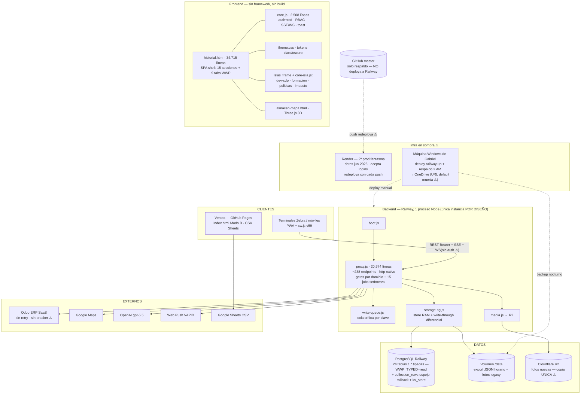
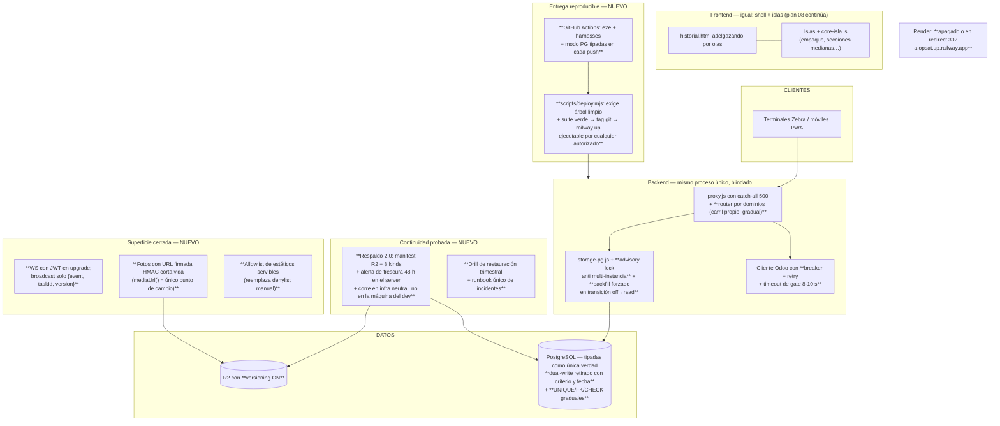

# Auditoría integral de arquitectura — OpsAT / Dashboard Despachos

> **Fecha:** 2026-07-23 · **Alcance:** 100 % del código propio del repo (~59.000 líneas vivas) + documentación operativa + verificación puntual contra producción (`opsat.up.railway.app`).
> **Método:** 41 agentes de análisis — 10 lectores en paralelo (uno por área A–L del alcance), verificación **adversarial** de cada hallazgo P0/P1 (un agente escéptico independiente intentó refutarlo contra el código actual) y un crítico de completitud final. ~3,6 M de tokens de análisis, 916 operaciones de lectura.
> **Regla cumplida:** no se modificó ningún archivo de la aplicación durante la auditoría.
> **Anexo:** [`09-anexo-hallazgos-2026-07-23.md`](09-anexo-hallazgos-2026-07-23.md) — los 132 hallazgos en el formato completo obligatorio (evidencia `archivo:línea`, causa raíz, criterio de aceptación, veredicto de verificación).

**Relación con la auditoría previa (docs 00–08, 2026-07-22):** esta auditoría la **re-verificó completa** en vez de heredarla. Resultado: 9 de los 24 hallazgos previos están **corregidos con evidencia en código** (incluidos 3 de los 4 críticos: `silentCatch` definida en `proxy.js:25`, fuente del servidor en denylist, `.gitignore` completado), 7 parciales y 8 vigentes. El sistema además cambió de categoría desde entonces: cutover relacional a 24 tablas tipadas (Fase 3B) y modularización por islas (Olas 0–3 del plan 08).

---

## 1. Resumen ejecutivo

### Qué es el sistema

OpsAT es la plataforma operativa de almacén y despachos de Altri Tempi, integrada con el ERP Odoo: digitaliza empaque, despacho, devoluciones, inventario, inspecciones y personal, con evidencia fotográfica y GPS, para ~30 usuarios en terminales industriales y móviles. Está en producción real, en uso diario, construida y operada por **una sola persona** con apoyo de agentes de IA.

### Estado general

**Sistema funcionalmente maduro y en mejora estructural activa, con un desequilibrio claro: la ingeniería del producto va muy por delante de la ingeniería de la operación que lo rodea.** El código tiene prácticas que equipos de diez personas no tienen (escritura atómica con anti-vacío, dual-write transaccional con kill-switch por variable de entorno, colas de escritura por dominio, 80 tests e2e como red de seguridad de la modularización). Pero el sistema **alrededor** del código — respaldo, deploy, monitoreo, recuperación — depende de la disciplina, la memoria y la máquina personal de una sola persona, y esta auditoría encontró que varias de esas piezas están hoy rotas o ciegas sin que nadie lo sepa.

### Nivel de riesgo: **MEDIO-ALTO**, concentrado en continuidad de datos y exposición de información — y mitigable en 30 días

No es el riesgo típico de un sistema desordenado (el código está bien cuidado). Es el riesgo de un sistema cuyo **plan B no está probado**: el respaldo externo apunta por defecto a un dominio que murió el 22-jul, dejó de cubrir las fotos nuevas tras la migración a R2, nunca incluyó dos carpetas de evidencia, corre en una máquina personal sin monitoreo, y **jamás se ha ensayado una restauración**. En paralelo, dos canales exponen datos de clientes sin autenticación (WebSocket en tiempo real y fotos de evidencia por URL). Casi todos los arreglos son de esfuerzo **bajo**.

### Los diez problemas más importantes

| # | Problema | Hallazgo(s) | Por qué importa al negocio |
|---|---|---|---|
| 1 | **El WebSocket `/ws/wwp` no exige autenticación** y difunde en tiempo real cada tarea completa (cliente, dirección de entrega, GPS, artículos) y cada notificación a cualquier cliente anónimo de Internet | API-01 (P0) | Exposición continua de PII de clientes y de la operación; el propio código dice "no incluir tasks en el broadcast" y se incumple |
| 2 | **El respaldo externo nocturno puede llevar desde el 22-jul sin correr** (URL default muerta) y quedó **ciego a las fotos nuevas** tras el flip a R2; dos carpetas de evidencia jamás se respaldaron; ninguna restauración se ha ensayado | INF-01 (P0), INF-02, DB-02, DB-03, DB-04 | El negocio cree tener respaldo y puede no tenerlo; en un desastre real la evidencia legal de entregas podría ser irrecuperable |
| 3 | **Las fotos de evidencia se sirven sin autenticación** con nombres semi-predecibles (`<taskId>_<timestamp>`) | FE-01 (P1) | Fotos tomadas dentro de casas de clientes, descargables por cualquiera con la URL |
| 4 | **La API key de Odoo sigue en claro** en 5 scripts archivados y en el historial git; no hay evidencia de rotación | SEC-01 (P1) | Acceso completo al ERP para cualquiera con acceso al repo o a un clon |
| 5 | **Producción no es reproducible**: deploy = `railway up` del árbol de trabajo vivo (commiteado o no), sin CI, sin tags, sin procedimiento de rollback, solo desde la máquina de Gabriel | ARQ-02, INF-03, GAP-01 | Ante un deploy malo no hay versión identificable a la cual volver; si la máquina o la persona faltan, no se puede deployar |
| 6 | **Render es una segunda producción fantasma**: vive con datos congelados de jun-2026, acepta logins y escrituras reales, y se redeploya sola con cada push a GitHub | INF (dif. diseño/realidad) | Trabajo operativo real puede estar registrándose en una instancia que nadie mira (split-brain) |
| 7 | **Una caída de Odoo degrada en cascada a todo el equipo**: sin circuit breaker, cada mutación espera hasta 20–60 s reteniendo el lock del dominio; y el health público reporta `odoo: ok` con un uid cacheado aunque Odoo lleve horas caído | API-02, API-03 | Bodega lenta o parada en hora pico; caídas del ERP invisibles hasta que un operario choca con ellas |
| 8 | **El rollback del cutover relacional puede resucitar datos viejos**: la guardia al volver de `WWP_TYPED=off` a `read` compara solo conteos, no contenido | DB-01 (P1) | El kill-switch — la póliza de seguro del cutover — puede corromper silenciosamente al usarse |
| 9 | **Contraseñas semilla del código siguen siendo válidas** (`WWP2026!`/`Admin2026!`): el cambio forzado existe pero está detrás de una env var apagada; mínimo 6 caracteres, sin MFA para admin | OW-01 (P1) | Cuentas con credenciales públicas conocidas; el rol admin puede impersonar a cualquiera |
| 10 | **La red de pruebas no cubre lo que más importa**: los flujos críticos por UI siguen como `test.fixme` sin definir, no hay CI (nada corre tests automáticamente), y la suite por defecto no ejercita el modo real de producción (PostgreSQL + tablas tipadas) | QA-01, QA-02, QA-03 | Una regresión en despacho o en la capa de datos de producción puede llegar a la bodega con la suite "en verde" |

### Principales fortalezas (verificadas)

- **Resiliencia de datos de primer nivel en el código**: escritura atómica, guarda anti-vacío nacida de un incidente real, dual-write transaccional con paridad verificable (`typed-parity`), rollback por variable de entorno, graceful shutdown con drenado de colas.
- **La auditoría anterior se ejecutó de verdad**: 9 hallazgos corregidos con evidencia, incluidos 3 de los 4 críticos, en menos de 24 horas.
- **Modularización con método**: plan 08 en ejecución real (core.js + theme.css + 5 islas + core-isla.js), con regla dura de "suite e2e verde antes y después" y disciplina de hashes verificada por tests.
- **Seguridad de sesión sólida**: PBKDF2-SHA512 100k iteraciones, `timingSafeEqual`, revocación inmediata, JWT con secreto gestionado, SQL 100 % parametrizado, mass assignment contenido por whitelists.
- **Documentación de decisiones excepcional** para un equipo de 1 (MEMORIA-PROYECTO.md, CLAUDE.md, 12 docs de auditoría, comentarios con fecha y contexto).

### Principales debilidades

- Continuidad: respaldo offsite roto/ciego, restauración jamás ensayada, todo el plan B en una máquina personal.
- Exposición: WS sin auth, fotos públicas, key de Odoo en el historial, PII de apariencia real en el HTML público.
- Proceso de entrega: sin CI, deploy irreproducible, sin rollback, bus factor 1 en deploy/datos/decisiones.
- Observabilidad: sin logs estructurados ni métricas; el health miente sobre Odoo; señales de auditoría (`out_gate_fail_open`) que nadie consume.
- Lazos de proceso abiertos con Odoo: rechazos/averías se re-digitan a mano sin bandeja de pendientes; recepciones tránsito→CDP se validan tarde y siguen generando inventario negativo.

### Recomendación general

**No reescribir nada.** La arquitectura (monolito modular sin build, en transición por islas) es la correcta para este contexto y está siendo pagada con método. Lo que hay que hacer es **cerrar la brecha entre la calidad del código y la fragilidad de la operación**: ejecutar el paquete de 30 días (10 acciones, casi todas de esfuerzo bajo — §8.1), formalizar deploy/respaldo/runbook para que cualquier tercero autorizado pueda operar el sistema, y cerrar los lazos de proceso con Odoo que hoy dependen de memoria humana. El plan de modularización 08 debe continuar tal como está, con los flujos críticos e2e definidos **antes** de la Ola 4.

---

## 2. Diagrama de arquitectura actual

**Flujos principales:** el cliente PWA habla REST con Bearer JWT; recibe realtime por WS + SSE + polling (degradación elegante). Toda colección vive en RAM del proceso y se persiste con write-through diferencial a PG (tablas tipadas + espejo). Odoo se consulta con fail-open auditado en ~20 gates. Las fotos van a R2; los datos se exportan cada hora a JSON en el volumen como capa de rollback.

## 3. Diagrama de arquitectura recomendada

El estado objetivo **no cambia la forma** (monolito modular, un proceso, sin frameworks): cierra los canales expuestos, hace reproducible la entrega y le da al plan B cobertura y pruebas. Lo nuevo respecto al actual está marcado en negrita.

**Qué NO aparece a propósito:** microservicios, Kubernetes, frameworks frontend, staging permanente, APM distribuido. Para 1 desarrollador y ~30 usuarios serían costo operativo sin beneficio; el crítico de completitud lo confirmó como "no aplica" (§7).

---

## 4. Inventario técnico

| Categoría | Elemento | Detalle | Propietario |
|---|---|---|---|
| Repositorio | `OpsAT` (GitHub, master) | Respaldo de código; **no** dispara deploys a Railway (sí a Render ⚠) | Gabriel Ramirez |
| Aplicación | `historial.html` + `core.js` + `theme.css` | SPA shell (34.715 + 2.508 líneas), 15 secciones + 9 tabs WWP | Gabriel |
| Aplicación | Islas: `dev-cdp` · `formacion` · `politicas` · `impacto` (+ `core-isla.js`, `ui-isla.css`) | Iframes lazy con contrato postMessage; `basedatos` retirada (visor eliminado en v228); `empaque.html` nueva, sin commitear al cierre | Gabriel |
| Aplicación | `almacen-mapa.html` | Mapa 3D del almacén (Three.js + OrbitControls) | Gabriel |
| Aplicación | `index.html` (raíz) + GitHub Pages Modo B | Dashboard despachos para Ventas vía CSV Sheets (estado real: requiere validación) | Gabriel |
| Backend | `proxy.js` (20.974 líneas) | ~238 endpoints, http nativo, gates por dominio, 15 jobs internos | Gabriel |
| Backend | `boot.js` · `storage-pg.js` · `typed-schemas.js` · `write-queue.js` · `media.js` | Bootstrap async, persistencia dual, esquema tipado, colas, media R2 | Gabriel |
| Base de datos | PostgreSQL (Railway) | 24 tablas `t_*` tipadas (`WWP_TYPED=read`) + `collection_rows` espejo + `kv_store` | Gabriel |
| Base de datos | Volumen `/data` (Railway) | Export JSON horario (rollback), fotos legacy, `prod-img/` | Gabriel |
| Almacenamiento | Cloudflare R2 | Fotos de evidencia post-flip (⚠ copia única hoy) | Gabriel |
| API externa | Odoo ERP (SaaS) | Órdenes, picks, inventario, RET; fail-open auditado en ~20 gates | Altri Tempi |
| API externa | OpenAI (`gpt-5.5`) | Gerente de Operaciones + Auditor de Procesos (IA) | Gabriel |
| API externa | Google Maps / Google Sheets CSV / Web Push (VAPID) / SMTP nodemailer | Mapa GPS · contenedores · notificaciones push · correo (sin SMTP en prod: requiere validación) | Gabriel |
| Puente | Codex Bridge (`/api/codex/*`) | Consulta de datos vivos para agentes externos; fail-closed sin token | Gabriel |
| Librerías npm | `pg` · `nodemailer` · `web-push` · `@aws-sdk/client-s3` | Únicas 4 dependencias de runtime | — |
| Librerías vendorizadas | lucide 0.469.0 · Chart.js 4.5.0 · SheetJS **0.18.5 (CVEs conocidos, hoy inexplotables)** · three.js | Locales, sin CDN (correcto para Zebra); sin inventario de versiones ⚠ | — |
| Infraestructura | Railway (`opsat.up.railway.app`) | Producción única real; 1 proceso, 1 volumen, PG administrado | Gabriel |
| Infra en sombra | Render (`dashboard-despachos.onrender.com`) | "Fallback" vivo con datos jun-2026 que acepta logins ⚠ | Gabriel |
| Infra en sombra | Máquina Windows personal | Deploy CLI + respaldo nocturno 2 AM → OneDrive ⚠ | Gabriel |
| CI | `.github/workflows/uptime.yml` | Único workflow: ping `/api/health` cada 5 min con auto-issue (bien hecho) | Gabriel |
| Tests | `tests/e2e/` (Playwright, ~80) + ~25 harnesses `.mjs` + contratos geo/inventario/storage-pg/typed-cutover | Ejecución 100 % manual (sin CI) ⚠ | Gabriel |
| Ambientes | Producción (Railway) + local (`data-local/`, modo archivos) | Sin staging (deliberado); e2e con server efímero :3100 | Gabriel |

<b>Inventario extendido por área (generado por los auditores)</b>

<b>A/B — Arquitectura general y organización del código</b>

- historial.html — shell SPA monolítico (34.662 líneas, 2,2 MB, no-store): nav, auth UI, router por paths reales, tasks/SDV/estado-órdenes/inventario y 9 tabs WWP
- core.js — núcleo del shell extraído (2.508 líneas, ?v=md5-8 immutable): authFetch/refresh, RBAC can/canSection, sesión, notificaciones + SSE/WS, esc/toast/fmtDate
- core-isla.js — núcleo de las islas (99 líneas, versionado): esc, islaFetch/Bearer, islaUser, tema, toast, contrato postMessage (ready/vista/ruta/badge/pedir-tarea)
- theme.css / ui-isla.css — design tokens claro/oscuro compartidos shell+islas, versionados por hash
- Islas iframe: formacion.html (393), politicas.html (683), impacto.html (863, incluye eqp*), dev-cdp.html (310), empaque.html (en curso por otra sesión); precedente almacen-mapa.html (1.962, Three.js)
- index.html — tombstone del dashboard de ventas retirado (R-06D)
- wwp-guide.html / wwp-guide-staff.html — manuales de usuario estáticos (1.621/1.089 líneas)
- sw.js — service worker PWA (242 líneas, CACHE wwp-v59): cache-first estáticos, SWR de la app, Web Push con NOTIF_URGENCY espejo
- proxy.js — backend monolítico (20.964 líneas): http nativo, ~166 condiciones de ruta (~238 endpoints según auditoría previa), auth/RBAC, motor de tareas, SDV FSM, proxy Odoo, SSE/WS, jobs, write-gate por dominio
- boot.js — bootstrap async (61 líneas): init de PG antes del monolito, graceful shutdown
- storage-pg.js — persistencia dual PG/archivos (798 líneas) + cutover relacional WWP_TYPED (24 tablas t_*)
- typed-schemas.js — esquemas de las 24 tablas tipadas generados desde datos reales de prod (422 líneas)
- write-queue.js — cola de sección crítica por clave (30 líneas)
- media.js — capa de fotos/videos disco/Cloudflare R2 (223 líneas)
- Librerías vendorizadas: lucide.min.js 0.469.0, chart.min.js 4.5.0, xlsx.min.js 1.15.0, three.min.js + OrbitControls.js
- Deps npm runtime (4): @aws-sdk/client-s3, nodemailer, pg, web-push; node_modules NO commiteado, package-lock.json presente
- tests/ — 27+ harnesses .mjs de regresión por fix + contratos (inventario/geo/typed-cutover/storage-pg) + tests/e2e/ (Playwright autocontenido, ~80 tests, server efímero :3100)
- scripts/ — backup-wwp.mjs (respaldo N1 a OneDrive), migrate-media-to-r2.mjs, import-railway-env.ps1, sync-render-to-railway.ps1
- Docs: CLAUDE.md, AGENTS.md, MEMORIA-PROYECTO.md, RAILWAY.md, docs/auditoria-arquitectura/00-08 + 3 prompts, AUDITORIA-WWP, CORRECCION-INVENTARIO, PLAN-ACCION-NEGATIVOS, _archivo/README.md
- Infra de deploy: railway.json (node boot.js, healthcheck /api/health), render.yaml (fallback legacy), restart.bat/start-server.bat (Windows), .github/workflows/uptime.yml (ping cada 5 min + issue con runbook)
- Sin README.md en la raíz (el rol lo cumplen CLAUDE.md + MEMORIA-PROYECTO.md); sin tags git; ramas: master + claude/* efímeras

<b>C — Backend y lógica de negocio</b>

- proxy.js — servidor HTTP nativo (sin frameworks), ~230 rutas (142 exactas + 91 regex) en un solo createServer async; CORS restrictivo, CSP, rate limit por IP (4 prefijos) y por email (login), anti-Slowloris
- boot.js — bootstrap async: init de storage-pg ANTES de cargar el monolito; drain de colas + export JSON en SIGTERM/SIGINT
- storage-pg.js — backend dual PG/archivos: memoria como verdad, write-behind diferencial por fila (ord fraccional, _rid), colas por colección con retry/backoff/coalescing, pool pg max 5 con query_timeout 30 s, blindaje anti-vacío + rejected_writes, export horario a JSON
- typed-schemas.js — 24 esquemas t_* generados de datos reales de prod (Fase 3B); modos WWP_TYPED off/dual/read (default read desde 22-jul)
- write-queue.js — sección crítica por clave (30 líneas), contrato testeado en tests/_test_b1b3_colas.mjs
- media.js — capa única fotos/videos: Cloudflare R2 (S3 SDK lazy) con fallback a disco, 8 kinds, anti-traversal, self-test
- Gates de escritura por dominio: tasks-sdv, inventario, averias, inspecciones, showroom (proxy.js:7851-7874) con backstop 60 s
- Jobs setInterval: snapshot horario de backups, chequeo de disco 6 h, scheduler de rutinas de agentes 60 s, limpieza rate-map/WS/SSE, geo stale-check 30 min, alerta vence-hoy 20:00 RD, out-recon 10 min, watchdog inventario 08:00 RD, transit-recon, snapshot inventario diario
- Tiempo real: SSE por usuario (/api/wwp/notifications/stream) + WebSocket artesanal /ws/wwp (broadcast de versión de estado)
- Auth: JWT HS256 artesanal (alg fijo, timing-safe), PBKDF2 100k, refresh tokens con sesiones de 30 días, impersonación de admin auditada, RBAC (ROLE_PERMISSIONS) + permisos granulares de sección + predicado de participante
- Integraciones: Odoo JSON-RPC (timeout configurable, uid re-auth on-demand), Codex Bridge (3 endpoints token-protegidos), respaldo externo token-protegido, web-push (VAPID) y nodemailer lazy
- Notificaciones: createNotification con coalescing por tipo+destino, preferencias por usuario, copia a supervisores, trim a 2000

<b>D — APIs e integraciones</b>

- Dispatcher HTTP nativo en proxy.js (~245 checks de ruta, ~238 endpoints REST activos + 4 desactivados en if(false))
- Integración Odoo SaaS (altritempi.odoo.com) vía JSON-RPC 2.0: odooRpc/authenticate/odooCall (proxy.js:7605-7670), timeout 20 s configurable, cuenta de servicio con API key, UID cacheado en memoria
- OpenAI Responses API (modelo por env CODEX_AUDITOR_MODEL, default gpt-5.5): aiComplete (proxy.js:1757) + 3 fetches directos — agentes ops-agent, mesa de agentes (rutinas programadas, tick 60 s), auditor de procesos
- @anthropic-ai/sdk opcional (anthropicClient, proxy.js:1740-1742) — carga condicional, hoy todo corre con OpenAI
- Cloudflare R2 vía @aws-sdk/client-s3 con fallback a disco (media.js, 8 kinds de evidencia)
- Web Push con VAPID (web-push lazy, keys por env o autogeneradas persistidas, proxy.js:323-378) + sw.js en el cliente
- SSE por usuario: GET /api/wwp/notifications/stream?token= (proxy.js:11202) con heartbeat 25 s
- WebSocket propio /ws/wwp con framing manual (proxy.js:20775, wsEncodeFrame :5036) — broadcast de versión de estado + eventos
- Google Maps JavaScript API (key servida por /api/maps-key, restricción declarada en GCP)
- Codex Bridge: 3 endpoints GET protegidos por CODEX_BRIDGE_TOKEN timing-safe (contexto, tasks filtrables, CSV)
- Backup externo: /api/backup/manifest + /api/backup/collections.json.gz protegidos por BACKUP_TOKEN
- Notificaciones a empleados vía Odoo Discuss (mail.message/mail.notification create — sin SMTP)
- nodemailer: cargado (proxy.js:13) pero sin ningún uso — dependencia muerta
- storage-pg.js (dual PostgreSQL/JSON) + write-queue.js (colas por clave) + gate de escritura por dominio en el dispatcher (proxy.js:7851)
- Rate limiting: por email en login (5/15min), por userId en cambio de contraseña, por IP en 4 rutas caras (proxy.js:4754)
- Google Sheets CSV: integración ELIMINADA del proxy en jul-2026 (R-06D); restos en CSP y posible Modo B en GitHub Pages (repo externo)
- Producción anterior en Render viva como fallback (dashboard-despachos.onrender.com) — fuera del alcance verificable de este repo

<b>E — Base de datos y modelo de datos</b>

- storage-pg.js — store en memoria + write-through diferencial a PostgreSQL (pg ^8.22, pool max 5, query_timeout 30s)
- Tablas PG: collection_rows (PK collection+id, ord DOUBLE PRECISION, data JSONB, idx collection+ord), kv_store, rejected_writes
- 24 tablas tipadas t_* (Fase 3B): _key TEXT PK, _ord DOUBLE PRECISION + idx, _extra JSONB, columnas tipadas generadas de datos reales (typed-schemas.js)
- typed-schemas.js — esquemas text/boolean/float8/jsonb por colección; wwp-audit solo tipa event+timestamp
- boot.js — init async de storage ANTES de proxy.js; SIGTERM/SIGINT con drain + export JSON
- write-queue.js — secciones críticas por clave (B1/B2) para read-modify-write con awaits
- media.js — capa única fotos/videos: Cloudflare R2 (activo en prod, migrated=true) con fallback a disco; 8 kinds
- proxy.js: loadJson/saveJson/saveCriticalArray (ruteo dual PG/archivos), blindaje anti-vacío (>=5), backups rotativos 5-min (modo archivo, keep 40), snapshot horario snap_* (keep 24), export horario memoria→JSON
- Endpoints de respaldo: /api/backup/manifest + /api/backup/collections.json.gz (BACKUP_TOKEN) + /api/admin/export-data (admin)
- scripts/backup-wwp.mjs — respaldo nocturno incremental a OneDrive (Tarea de Windows, 30 snapshots)
- scripts/migrate-media-to-r2.mjs + migrateMediaToR2OnBoot + migrateEmbeddedMediaOnBoot (A1/A2)
- /api/admin/db/typed-parity + typedParity() — paridad memoria ↔ tablas tipadas
- wwp-audit (cap 10.000), wwp-notifications (cap 2.000/200 por usuario), wwp-locations (GPS, 7 días / 5.000)
- FSM SDV (SDV_ESTADOS/SDV_TRANSICIONES + sdvTransition H0-1) y guardas parciales de status de tareas WWP
- Contadores kv: sdv-seq, wwp-task-seq, despacho-obsoleto-seq, wwp-state-version, vapid-keys
- Tests: tests/test-storage-pg.mjs, tests/test-typed-cutover.mjs (29 checks vs PG real), tests/_test_b1b3_colas.mjs

<b>F — Frontend</b>

- historial.html — shell SPA monolítica (34.662 líneas, 2,21 MB, gzip 514 KB), v228: router, WWP, SDV, inventario, averías, reposición, mapas
- core.js — núcleo del shell (2.508 líneas): auth+refresh, patch de fetch, RBAC cliente (can/canSection), sesión, notificaciones+SSE+WS, version-gate, utilities (?v=77118dd8)
- core-isla.js — núcleo de islas (99 líneas): esc, islaFetch/Bearer, tema, toast, contrato postMessage (?v=f7b1b597)
- theme.css — design tokens claro/oscuro compartidos shell+islas (?v=f232ab1b); ui-isla.css — estilos base de islas (?v=0135f0d7)
- Islas iframe (lazy): formacion.html (393 líneas), politicas.html (683), impacto.html (863), dev-cdp.html (310); empaque.html en extracción (sesión paralela); basedatos.html ELIMINADA (commit 5275c3a)
- sw.js — service worker (242 líneas): SWR del HTML, cache-first estáticos, Web Push con urgencias/acciones/vibración
- almacen-mapa.html — mapa 3D del almacén (1.962 líneas, Three.js + OrbitControls, sesión compartida por storage)
- index.html — placeholder de retiro del Modo B/Google Sheets (31 líneas)
- Librerías locales: lucide.min.js (358 KB, defer + hidratación acotada), xlsx.min.js (881 KB, carga perezosa), three.min.js (607 KB, solo almacen-mapa), OrbitControls.js, chart.min.js (208 KB, SIN referencias — muerta)
- PWA: manifest.json, icon-192/512 (png+svg), badges por urgencia (svg)
- tests/e2e — Playwright autocontenido: smoke-01..05, smoke-07-islas, flujos-criticos, helpers/islas.js, start-server con guardia de sandbox

<b>H1 — Seguridad: re-verificación de la auditoría previa</b>

- Autenticación: jwtSign/jwtVerify HS256 propio con crypto nativo (proxy.js:3306-3329), JWT_SECRET desde env con guardia >=32 chars o archivo .jwt-secret (proxy.js:3294-3301)
- Contraseñas: PBKDF2-SHA512 100k iteraciones + timingSafeEqual (proxy.js:3332-3343)
- Guards: requireJwt (230 usos; relee el usuario del storage en cada request → revocación inmediata, proxy.js:3350-3369), requireRole (59 usos), requireSectionPerm (18 usos)
- RBAC dual: ROLE_PERMISSIONS (proxy.js:4818) + sectionPerms de BUILTIN_ROLE_DEFS/roles custom (proxy.js:2204-2259)
- Anti-brute-force: lockout por email 5 intentos/ventana (proxy.js:4707-4729) + rate limit por IP en rutas costosas (proxy.js:4752-4773)
- Headers: CSP (con 'unsafe-inline' en script-src), X-Content-Type-Options, Referrer-Policy, Permissions-Policy, HSTS condicional (proxy.js:7810-7829)
- CORS restrictivo: same-origin/localhost/ALLOWED_ORIGIN (proxy.js:7798-7805)
- Estáticos: denylist _FORBIDDEN + patrón _FORBIDDEN_JSON + allowlist de extensiones + anti path-traversal (proxy.js:20640-20678)
- Media: media.js (223 líneas) — capa única disco/Cloudflare R2 con migración on-boot (proxy.js:619-647); servido sin Authorization (proxy.js:20589-20605)
- Tokens de puente: CODEX_BRIDGE_TOKEN y BACKUP_TOKEN comparados con timingSafeEqual (proxy.js:3431,3455)
- Sanitización de errores: safeError (proxy.js:4780-4789)
- Auditoría: appendAuditLog en login ok/fail/seed_password/impersonate
- Escapes XSS: esc (core.js:2439), escH (historial.html:21261), escHtml (:26769), escapeHtml (:33213) — los 4 cubren & < > " '
- SSE: /api/wwp/notifications/stream con token en query (proxy.js:11201-11210); WebSocket y polling en paralelo
- Secretos versionados fuera del repo: .gitignore con globs wwp-*/sdv-*/emp-*, vapid-keys.json, .jwt-secret, *.pem, carpetas de fotos

<b>H2 — Seguridad: pase OWASP fresco</b>

- proxy.js — servidor HTTP nativo, ~238 endpoints, autenticación/JWT, RBAC, rate-limiting, cabeceras de seguridad, servido de estáticos y media
- core.js / core-isla.js — helper esc() de escape HTML compartido por shell e islas
- storage-pg.js — backend dual PostgreSQL/JSON, consultas parametrizadas, tablas tipadas t_*
- media.js — capa de almacenamiento de fotos/videos (R2/disco) con _safeName y whitelist de kinds
- typed-schemas.js — esquemas de las 24 tablas tipadas
- crypto (Node) — PBKDF2-SHA512, HMAC-SHA256 (JWT), timingSafeEqual, randomBytes
- web-push / VAPID — notificaciones push, claves en env o vapid-keys.json
- Integración Odoo JSON-RPC (execute_kw) con dominios estructurados
- OpenAI API (fetch a host fijo) para análisis/chat IA
- Cabeceras: CSP, HSTS condicional, X-Content-Type-Options, Referrer-Policy, Permissions-Policy, CORS restrictivo
- Rate-limiters en memoria: login por email, self-password por userId, por IP en rutas costosas
- wwp-audit.json — log de auditoría (cap 10.000 FIFO)
- Endpoints Codex Bridge / Backup con tokens comparados timing-safe

<b>G/I/J — Infraestructura, rendimiento y observabilidad</b>

- Railway: servicio dashboard-despachos (https://opsat.up.railway.app), volumen /data (DATA_DIR), PostgreSQL addon (DATABASE_URL), secretos en dashboard
- railway.json: builder NIXPACKS, npm install --production, start node boot.js, healthcheck /api/health, restart ON_FAILURE ×10
- boot.js: preload .env, init async de storage-pg ANTES del monolito, graceful SIGTERM/SIGINT (drain + export JSON)
- storage-pg.js: pool pg (max 5, query_timeout 30s, keepAlive), colas de escritura por colección con backoff y colapso a resync, modo WWP_TYPED off/dual/read, export horario a JSON, typedParity, blindaje anti-vacío
- write-queue.js: sección crítica por clave + gate por dominio en el dispatcher (tasks-sdv, inventario, averias, inspecciones, showroom)
- media.js: R2 (S3-compatible, SDK lazy) o disco, fallback bidireccional, 8 kinds
- Render (fallback vivo): dashboard-despachos.onrender.com, render.yaml (plan starter + disco 10GB propio), autodeploy desde GitHub — datos congelados jun-2026
- GitHub Pages: altritempisrl.github.io/OpsAT (rama gh-pages, 'Modo B' CSV Sheets — estado por validar tras retiro de Sheets R-06D)
- Monitoreo: .github/workflows/uptime.yml (ping /api/health cada 5 min, issue wwp-down con runbook, auto-cierre); único workflow del repo — sin CI de tests
- Respaldos: snapshotAllCritical (horario, mismo volumen, 24 copias), backups rotativos pre-escritura (40), scripts/backup-wwp.mjs (nocturno, Task Scheduler Windows → OneDrive, token BACKUP_TOKEN, endpoints /api/backup/manifest + collections.json.gz)
- Salud: /api/health (shallow público / deep con JWT + footprint evidencia + statfs), /api/app-version (build del HTML en disco), /api/admin/db/typed-parity
- Watchdogs internos: checkDiskSpace (6h, DISK_ALERT_MIN_MB), invWatchdog (diario 08:00 RD, INV_WATCHDOG), geo-stale, due-today, out-recon, inv-snapshot — 15 setInterval en el proceso web
- Protecciones de red: rate limit por IP (4 rutas costosas), timeouts server 30/15/65s, Odoo RPC 20s (ODOO_RPC_TIMEOUT_MS), CORS restrictivo (ALLOWED_ORIGIN)
- Config: ~40 env vars reales (ODOO_*, JWT_SECRET, DATA_DIR, DATABASE_URL, WWP_TYPED, R2_*×5, BACKUP_TOKEN, CODEX_BRIDGE_TOKEN, VAPID_*, GOOGLE_MAPS_API_KEY, GEO_*, INV_*, TZ_OFFSET_HOURS, WWP_ARCHIVE_DAYS, DISK_ALERT_MIN_MB, OPENAI_*…); .env.example (16, desactualizado); scripts/import-railway-env.ps1
- Deploy: Railway CLI manual (railway up) desde la máquina Windows del dev; restart.bat / start-server.bat para local; APP_BUILD manual en proxy.js + historial.html + sw.js (CACHE)
- Tests como red de deploy: tests/e2e Playwright autocontenido (sandbox DATA_DIR) + harnesses .mjs — solo ejecución local, sin CI

<b>K — Pruebas y calidad</b>

- tests/e2e/ — suite Playwright autocontenida (~75 tests activos + 2 fixme, chromium, workers:1, server real efímero :3100 con DATA_DIR desechable y guardia de sandbox): smoke-01-server (29: health, redirects, fallback SPA 19 rutas, no-store, denylist, contrato login/refresh), smoke-02-login-ui (3), smoke-03-secciones (15: deep-link 13 secciones + almacen-mapa standalone/iframe), smoke-04-wwp-tabs (9), smoke-05-core (6: contrato core.js/theme.css/APP_BUILD Ola 1), smoke-07-islas-ola3 (10: 4 islas iframe+standalone, dev-cdp, badge postMessage), flujos-criticos (3 reales + 2 fixme); helpers: session.js (login por API + inyección wwp_auth), console-guard.js (pageerror=fallo + allowlist), islas.js (registro, huérfano); start-server.js (guardia .data-e2e); smoke-06-isla-basedatos retirado con el visor BD (5275c3a)
- Harnesses de integración con server real aislado (DATA_DIR mkdtemp, JWT forjado, sin datos vivos): _stress360.mjs (1.000+ checks SDV↔WWP: link/idempotencia/despacho/notifs/rechazo/RBAC/races F1-F2/no-regresión), _gateodoo.mjs (gate de picking con Odoo FALSO HTTPS: ALLDONE/ALLCANCEL/REPICK/NOTDONE/NOPICK/ODOODOWN), _test_v113/114/117/188/189/190/192/193/202/212.mjs (fixes por versión: pick-diff, visibilidad equipo, items del pick, fechas H2-1, ciclo empaque→despacho, DELETE items, reprogramar, fotos ventas, kits armados, out-unconfirm), _test_capa1_picks, _test_dividir_sedes, _test_faseBC_reprogramar (OTIF contra promesa original), _test_multiorden, _test_sdv_devolucion_recogida (38 asserts), _test_sdv_multiret (23), test-geo-contract.mjs (GPS/RBAC mapa/alertas, genera cert con openssl), test-inventario-contract.mjs (36KB, mock Odoo, RBAC 401/403/token desactivado/cambio rol)
- Harnesses unit-style sin server: _test_eometrics.mjs y _test_outcierre.mjs (extraen funciones reales de proxy.js con regex + new Function y stubs), _test_b1b3_colas.mjs (contrato write-queue + dirty-flags touched con pool PG falso, 17/17)
- Tests de la capa de persistencia (opcionales, SKIP sin WWP_PG_TEST_URL): test-storage-pg.mjs (contrato storage PG, limpia la DB apuntada) y test-typed-cutover.mjs (Fase 3B: dual-write transaccional, roundtrip, backfill idempotente, modo read con guardia de conteos, paridad — usa typed-schemas.js reales)
- Scripts npm: test/test:smoke=test-smoke.js (ROTO: exige server en :3000 y llama /api/smoke-test sin JWT, hoy 401), test:inventario, test:geo, test:e2e (cd tests/e2e && npx playwright test), test:all=inventario+geo+smoke (no incluye e2e ni storage ni harnesses)
- Endpoint de self-check del server: GET /api/smoke-test (proxy.js:8507, JWT-gated desde R-06C: Odoo auth, archivos averías, carpeta fotos, env vars)
- Artefactos manuales/stale: test-sdv-cancel-reactivate.sh (usa /api/login inexistente), test-mobile-usuarios.html y test-usuarios-responsive.html (páginas de prueba visual manual), _mapa_visual_server.mjs (harness del mapa)
- Fixtures/deps de test NO versionadas: _fakecert.pem/_fakekey.pem (gitignore *.pem — 7 harnesses los requieren, ausentes en clon fresco), _odoo_fixtures.json (opcional, fallback sintético en stress360)
- CI: .github/workflows/uptime.yml únicamente (monitor /api/health cada 5 min con auto-issue; NO ejecuta tests). Sin lint (no eslint/prettier), sin hooks de git, sin coverage tooling (no c8/nyc); node --check como única validación estática (referida en MEMORIA:47,231)

<b>L — Procesos reales frente al diseño</b>

- Gates operativos server-side: pick-gate de inicio de despacho (proxy.js:13383-13425, ACTIVADO 20-jun), OUT-gate de validación con fail-open auditable QW4 (proxy.js:13311-13379), checklist de 3 fotos obligatorias (proxy.js:13236), guard SDV terminal (H0-5)
- Watchdog de inventario negativo (invWatchdog, proxy.js:6700-6746, INV_WATCHDOG default ON, diario 08:00 RD) + sección inventario-salud + colección de casos con conciliación automática
- Cierre diario de operación: endpoints /api/wwp/daily-close/* (proxy.js:14152-14229) — sin recordatorio automático (R4 pendiente)
- Audit log: appendAuditLog ×56 eventos (out_gate_fail_open, impersonate_start, password_reset_requested, role_change, codex_bridge_context...) en wwp-audit.json/t_wwp_audit — SIN visor humano
- Impersonation de admin auditada: POST /api/wwp/auth/impersonate + stop-impersonate (proxy.js:11583-11604)
- Codex Bridge para reuniones con datos vivos: /api/codex/agents/context|tasks|export/tasks.csv (proxy.js:7878-7902, token CODEX_BRIDGE_TOKEN)
- Alerta de vencimientos: checkDueTodayAlert diaria (proxy.js:6277); geo-verificación y alertas GPS (v204); notificaciones NOTIF_META en triple espejo
- Endpoint muerto: POST /api/sdv/sync-to-odoo (proxy.js:19409, sin llamadores; write directo de state='done')
- Módulo Políticas: /api/politicas CRUD (proxy.js:9994+, restaurado v219) + isla politicas.html con historial mock (_POL_MOCK_SEED)
- Documentos de proceso vivos: MEMORIA-PROYECTO.md (decisiones fechadas + plan go-live D1-D4), AUDITORIA-WWP-2026-07-06.md (fronteras F0-F5, backlog R0a-R10), CORRECCION-INVENTARIO-2026-06-30.md (46 fichas), PLAN-ACCION-NEGATIVOS-2026-07-07.md (fases 0-3 + prevención P1-P5 + 5 decisiones pendientes), RAILWAY.md (parcialmente desactualizado: CONT_SHEETS_ID)
- Procesos/almacenes de información FUERA del sistema: Odoo SaaS altritempi.odoo.com (correcciones manuales de inventario, validación de OUT/recepciones), cerebro de agentes en OneDrive personal de Gabriel (Agentes-Estandar + _DECISIONES-DESPACHO-2026-06-20.md), hoja Google Sheets de contenedores (estado post-R-06D desconocido), GitHub Pages Modo B (desmantelado/incierto), Render como producción fantasma (dashboard-despachos.onrender.com, datos congelados jun-2026, auto-deploy desde GitHub)
- Incidente cerrado con material archivado: _archivo/incidentes-cerrados/_RECOVERY_2026-06-25/ (restauración manual post-pérdida de datos; origen del hardening de persistencia)

---

## 5. Matriz de hallazgos

**132 hallazgos vigentes** tras verificación adversarial (los 28 P0/P1 fueron atacados uno a uno por verificadores independientes; ninguno fue refutado, dos bajaron de severidad). Distribución: **2 P0 · 26 P1 · 71 P2 · 33 P3** — severidad: 1 Crítica · 20 Altas · 73 Medias · 38 Bajas.

Convención de columnas: *Impacto* deriva de la severidad verificada; *Probabilidad* refleja el estado de evidencia (Alta = condición confirmada presente en el código/infra; Por validar = requiere confirmación fuera del repo). El detalle completo de cada fila —evidencia, causa raíz, criterio de aceptación— está en el [anexo](09-anexo-hallazgos-2026-07-23.md) bajo el mismo ID.

| ID | Área | Hallazgo | Severidad | Impacto | Probabilidad | Prioridad | Esfuerzo | Recomendación |
|---|---|---|---|---|---|---|---|---|
| API-01 | D | WebSocket /ws/wwp sin autenticación difunde tareas completas y notificaciones de todos los usuarios a clientes | Crítica | Muy alto | Alta | P0 | Bajo | Cambio de ~5 líneas en broadcastWwpTasks/_emitNotif para vaciar el payload de datos; la rama de re-fetch REST ya existe en core.js |
| INF-01 | G/I/J | El respaldo externo nocturno apunta por defecto a un dominio Railway muerto | Alta | Alto | Alta | P0 | Bajo | Cambiar el default de BASE a https://opsat.up.railway.app (1 línea) y correr el script a mano verificando que baja el snapshot; re |
| ARQ-01 | A/B | Proceso de versionamiento frágil: sin tags git, rama 'dev' documentada pero inexistente, deploy manual desde á | Alta | Alto | Alta | P1 | Bajo | git tag vNNN && git push --tags en cada deploy; verificar git status limpio antes de railway up. |
| ARQ-02 | A/B | Datos personales de apariencia real (clientes, teléfonos, direcciones) embebidos como 'mock' en el HTML servid | Alta | Alto | Alta | P1 | Bajo | Confirmar naturaleza de los datos; anonimizar si son reales. |
| API-02 | D | Integración Odoo sin reintentos ni circuit breaker; con Odoo lento, los awaits dentro del write-gate serializa | Alta | Alto | Alta | P1 | Medio | Timestamp del último fallo en odooRpc: si falló hace <60 s, los 3 gates hacen fail-open sin llamar a Odoo (~20 líneas). |
| DB-01 | E | Guardia de conteos (no de contenido) al reconstruir memoria desde tablas tipadas: un ciclo off→read sirve y pr | Alta | Alto | Alta | P1 | Bajo | Regla operativa escrita: tras cualquier periodo en WWP_TYPED=off, antes de volver a read correr un backfill forzoso (borrar t_* o  |
| DB-02 | E | El respaldo offsite de fotos quedó ciego tras el flip a R2: el manifest solo inventaría disco y omite 2 carpet | Alta | Alto | Alta | P1 | Medio | Añadir 'inspection' y 'showroom-fotos' al dirs del manifest y activar versioning u object lifecycle en el bucket R2 desde el dashb |
| FE-01 | F | Fotos de evidencia (clientes, direcciones, entregas) servidas sin autenticación | Alta | Alto | Alta | P1 | Medio | Query-token HMAC (?t=firma(exp,path)) validado antes de servir /wwp-fotos/* y /desp-fotos/*. |
| SEC-01 | H1 | R-02 (parcial) · API key de Odoo sigue en claro en 5 scripts archivados y en el historial git; rotación sin ev | Alta | Alto | Alta | P1 | Bajo | Rotar la API key en Odoo (Ajustes → Seguridad → API Keys) y actualizar ODOO_API_KEY en Railway. 30 minutos. |
| OW-01 | H2 | Política de contraseñas débil: mínimo 6 caracteres, sin complejidad, sin MFA y contraseñas semilla no rotadas  | Alta | Alto | Alta | P1 | Medio | Poner WWP_FORCE_PW_CHANGE=1 tras avisar al equipo para expulsar las semillas; subir el mínimo a 8 y rechazar las semillas y el top |
| INF-02 | G/I/J | El manifest de respaldo no cubre 'inspection' ni 'showroom-fotos', y con R2 activo deja de ver las fotos nueva | Alta | Alto | Alta | P1 | Medio | Añadir 'inspection' y 'showroom-fotos' a los dirs del manifest (siguen teniendo histórico en disco) y activar object versioning +  |
| INF-03 | G/I/J | Deploy = 'railway up' del árbol de trabajo, sin CI, sin trazabilidad a commit y con SPOF humano+máquina | Alta | Alto | Alta | P1 | Medio | Documentar en RAILWAY.md el procedimiento de deploy de emergencia desde cualquier máquina (railway login + up) y guardar un RAILWA |
| INF-04 | G/I/J | Multi-instancia corrompería datos en silencio y no hay guard que lo impida | Alta | Alto | Alta | P1 | Bajo | En storage-pg.init(): SELECT pg_try_advisory_lock(constante); si falla, exit(1) con mensaje claro «otra instancia activa — este si |
| INF-05 | G/I/J | Respaldo y deploy dependen de la misma máquina personal, sin monitoreo del job de respaldo | Alta | Alto | Alta | P1 | Medio | Verificar HOY en la máquina: existencia de la tarea, WWP_BACKUP_BASE_URL, y fecha del último snapshot; anotar el resultado en MEMO |
| QA-01 | K | Los flujos críticos del negocio por UI siguen como test.fixme sin definir | Alta | Alto | Alta | P1 | Bajo | Sesión de 1 hora con Gabriel/Filippo para nombrar los 3-5 flujos; implementarlos siguiendo el patrón ya funcionando en el mismo ar |
| QA-02 | K | Cero CI de tests: toda la calidad depende de disciplina manual en la máquina del dev | Alta | Alto | Alta | P1 | Bajo | Workflow tests.yml: npm ci en tests/e2e + npx playwright install chromium + npx playwright test, más node --check de proxy.js/stor |
| QA-03 | K | La red de seguridad por defecto no prueba el modo de producción (PostgreSQL + tablas tipadas) | Alta | Alto | Alta | P1 | Medio | Documentar en README de tests que el SKIP existe y correr test-storage-pg + test-typed-cutover manualmente tras cada cambio en sto |
| PR-01 | L | El plan de corrección de 46 negativos de inventario no consta ejecutado y la prevención de proceso (P1/P2/P4)  | Alta | Alto | Alta | P1 | Medio | Consultar el panel inventario-salud (o POST /api/inventario/watchdog-run) para conocer el estado real HOY; si los casos siguen abi |
| PR-02 | L | Dependencia unipersonal estructural: deploy solo desde la máquina de Gabriel, consulta de datos solo por SQL d | Alta | Alto | Alta | P1 | Medio | Runbook de deploy paso a paso (login Railway con token del equipo, railway up, verificación /api/health) probado por una segunda p |
| ARQ-03 | A/B | Módulos de servidor nuevos (write-queue.js, typed-schemas.js) descargables desde producción — regresión del pa | Media | Medio | Alta | P1 | Bajo | Añadir 'write-queue.js' y 'typed-schemas.js' a _FORBIDDEN. |
| ARQ-04 | A/B | Espejos sincronizados a mano en 4+ archivos: APP_BUILD ×2, versión de caché del SW, NOTIF_META ×3 y hashes ?v= | Media | Medio | Alta | P1 | Bajo | Test e2e de divergencia de claves NOTIF_META/_NOTIF_META. |
| BE-01 | C | El dispatcher no tiene catch-all: un error no capturado deja la request colgada sin respuesta (y el gate de do | Media | Medio | Alta | P1 | Bajo | try { …dispatcher… } catch(e) { if(!res.headersSent) sendJson(res,500,{ok:false,error:safeError(e)}); else try{res.end()}catch(_){ |
| BE-02 | C | readBody decodifica cada chunk por separado: riesgo de corrupción UTF-8 en fronteras de chunk + JSON.parse de  | Media | Medio | Alta | P1 | Bajo | Cambiar a acumulación de Buffers + concat. |
| BE-03 | C | El gate de escritura por dominio se adquiere ANTES de leer el body: una subida lenta de foto/video serializa t | Media | Medio | Alta | P1 | Medio | Exención selectiva de los endpoints de media con cola interna. |
| API-03 | D | Monitoreo del enlace Odoo débil: el health shallow reporta un uid cacheado como 'ok', sin chequeo vivo ni aler | Media | Medio | Alta | P1 | Bajo | Actualizar un timestamp en cada RPC exitosa dentro de odooRpc y reportarlo en /api/health en vez de !!odooUid. |
| DB-03 | E | La URL por defecto del respaldo nocturno responde 404: el offsite puede llevar semanas sin correr | Media | Medio | Alta | P1 | Bajo | Revisar %USERPROFILE%\OneDrive\Documentos\Respaldos-WWP\backup-log.txt: fecha de la última corrida exitosa; actualizar el default  |
| DB-04 | E | Restauración jamás ensayada y backups administrados de PG sin verificar | Media | Medio | Alta | P1 | Bajo | Drill documentado: PG local vacío + descomprimir un collections.json.gz real al DATA_DIR + boot → verificar conteos vs manifest. C |
| INF-06 | G/I/J | No existe runbook de incidentes consolidado; el conocimiento de recuperación está disperso en 4 lugares | Media | Medio | Alta | P1 | Bajo | RUNBOOK.md en la raíz con los 6 escenarios anteriores (~2 páginas), enlazado desde el issue de uptime.yml. |
| FE-02 | F | Tokens JWT (access + refresh) en localStorage con CSP 'unsafe-inline' — XSS = robo de sesión persistente | Alta | Alto | Alta | P2 | Medio | Rotación de refresh token con invalidación del anterior y vida útil acortada (solo backend). |
| FE-03 | F | Monolito historial.html: 34.662 líneas, ~2.481 globals y 1.056 funciones en un espacio de nombres plano | Alta | Alto | Alta | P2 | Alto | Siguiente ola: extraer la sección más grande restante tras empaque. |
| ARQ-05 | A/B | core.js no es un módulo: acoplamiento textual bidireccional con el shell vía globals implícitos en sloppy mode | Media | Medio | Alta | P2 | Medio | Preámbulo con declaraciones explícitas de _token/_user/_tasks/_refreshToken etc. |
| ARQ-06 | A/B | Duplicación masiva de patrones en proxy.js: 752 'Content-Type' inline y 767 res.writeHead frente a 69 usos del | Media | Medio | Alta | P2 | Medio | Formalizar la regla para código nuevo. |
| ARQ-07 | A/B | Código vestigial de la remoción de Google Sheets (R-06D): el cliente sigue llamando /api/sheets (404 intencion | Media | Medio | Alta | P2 | Bajo | Quitar la llamada de :18415 y el indicador sheets-status. |
| ARQ-08 | A/B | Duplicación de helpers de escape y formato en el frontend: 3 variantes de escape conviven dentro del propio sh | Media | Medio | Alta | P2 | Bajo | function escH(s){return esc(s);} y equivalente para escHtml. |
| ARQ-09 | A/B | proxy.js sigue siendo un monolito de 20.964 líneas con routing en cascada lineal y sin carril de modularizació | Media | Medio | Alta | P2 | Alto | Escribir el plan (esfuerzo horas) para no perder la intención. |
| ARQ-10 | A/B | El shell historial.html conserva 34.662 líneas con los dominios de mayor cambio dentro (tasks/SDV/estado-órden | Media | Medio | Alta | P2 | Alto | Test que cuente hijos directos de .app-body/#tab-tasks (anti-
 huérfano). |
| BE-04 | C | Dispatcher monolítico: ~230 rutas en cascada de if dentro de una sola función de ~12.980 líneas | Media | Medio | Alta | P2 | Alto | Router-tabla y regla: toda ruta NUEVA nace en módulo propio. |
| BE-05 | C | Proxy Odoo genérico restringe MÉTODOS pero no MODELOS: cualquier admin/manager/ventas puede leer todo el ERP c | Media | Medio | Alta | P2 | Bajo | Set de modelos permitidos derivado de grep en historial.html. |
| BE-06 | C | Predicado de participante de tarea implementado 3 veces con drift real (createdBy cuenta para VER pero no para | Media | Medio | Alta | P2 | Bajo | Reemplazar las 2 copias inline por la función central. |
| BE-07 | C | Endpoints de creación sin idempotencia: reintentos móviles duplican tareas/solicitudes | Media | Medio | Alta | P2 | Medio | d.clientRequestId en POST de tareas con búsqueda de tarea reciente con ese campo. |
| BE-08 | C | Ventana de pérdida ante muerte dura del proceso mientras PostgreSQL está caído (memoria diverge de la DB sin q | Media | Medio | Alta | P2 | Bajo | Job de vigilancia de pgStorage.health() con notificación a admins. |
| BE-09 | C | JWT de 8 h viaja en query string para el stream SSE (persiste hallazgo R-10) | Media | Medio | Alta | P2 | Medio | POST /api/wwp/notifications/ticket (JWT en header) → ticket 60 s; el stream valida el ticket. |
| API-04 | D | Evidencia fotográfica (fotos de entregas, averías, adjuntos SDV) servida sin autenticación | Media | Medio | Alta | P2 | Medio | Cerrar el hallazgo P0 del WS; asegurar que ningún nombre nuevo use solo timestamp (añadir 8+ bytes aleatorios donde falten). |
| API-05 | D | GET /api/wwp/tasks/:id/messages sin control de participación: cualquier usuario autenticado lee el chat de cua | Media | Medio | Alta | P2 | Bajo | 6 líneas: admin/manager pasan; assistant requiere isTaskParticipant; ventas requiere task.sdvId. |
| API-06 | D | Llamadas a OpenAI sin timeout ni control de gasto | Media | Medio | Alta | P2 | Bajo | signal: AbortSignal.timeout(60_000) en los 4 fetches; unificar los 3 directos sobre aiComplete. |
| API-07 | D | /api/maps-key entrega la key de Google Maps sin autenticación — la mitigación declarada (restricción por domin | Media | Medio | Por validar | P2 | Bajo | Revisión de la config GCP por Gabriel (10 min). |
| API-08 | D | SSE con token JWT en query string y sin relectura del estado del usuario | Media | Medio | Alta | P2 | Bajo | Replicar la relectura de requireJwt en el handler del stream + destroy dirigido de las conexiones del usuario al desactivarlo (sse |
| API-09 | D | Rate limiting incompleto: clave IP spoofeable vía X-Forwarded-For y login sin límite por IP | Media | Medio | Alta | P2 | Bajo | Cambiar el parseo del XFF + regla IP en login. |
| API-10 | D | forgot-password en producción no entrega el token por ningún canal (sin SMTP): flujo de autoservicio roto | Media | Medio | Alta | P2 | Medio | Cambio de copy o envío por Odoo Discuss (canal ya integrado). |
| DB-05 | E | Cero integridad declarativa: sin FKs, sin UNIQUE en ids naturales, sin CHECK; relaciones por convención de nom | Media | Medio | Alta | P2 | Medio | Endpoint/job admin de integridad: huérfanos por parentId/sdvId/wwpTaskId, ids duplicados (contar remaps _rid con id natural presen |
| DB-06 | E | Máquina de estados de tareas WWP incompleta: el backend nunca valida el enum de status para admin/manager | Media | Medio | Alta | P2 | Bajo | Al inicio del PATCH: if (d.status && !TASK_ESTADOS.includes(d.status)) → 400. Cinco líneas. |
| DB-07 | E | Borrado duro de tareas sin registro de auditoría ni papelera | Media | Medio | Alta | P2 | Bajo | appendAuditLog('task_deleted', { snapshot compacto de la tarea y subtareas, by }) dentro del queueWrite — el audit ya viaja a PG c |
| DB-08 | E | La paridad tipadas↔memoria solo se verifica a mano; ninguna alerta automática de divergencia | Media | Medio | Alta | P2 | Bajo | setInterval diario (patrón ya usado 14 veces en proxy.js): typedParity() → si !ok, createNotification a admins con las colecciones |
| DB-09 | E | Sin plan de retiro del dual-write y procedimiento de regeneración de typed-schemas.js perdido | Media | Medio | Alta | P2 | Bajo | Reconstruir gen-schema.mjs (es corto: la query de typed-schemas.js:6-7 + reglas de :8-11) y commitearlo a scripts/. |
| DB-10 | E | El snapshot de respaldo completo exporta secretos en claro (passwordHash, refreshTokens, resetTokens, claves V | Media | Medio | Alta | P2 | Bajo | Cifrar en el script nocturno antes de escribir (age/gpg simétrico con clave fuera de OneDrive), o excluir refreshToken/resetToken  |
| DB-11 | E | rejected_writes y bloqueos del blindaje anti-vacío no se alertan a nadie | Media | Medio | Alta | P2 | Bajo | En el bloqueo: createNotification a admins (patrón disk-alert, proxy.js:280-283) + exponer count de rejected_writes en pgStorage.h |
| FE-04 | F | Bug RBAC en kanban: can('tasks_edit') usa una clave de permiso inexistente — solo admin puede arrastrar tarjet | Media | Medio | Alta | P2 | Bajo | Cambiar 'tasks_edit' por 'edit_task' en historial.html:10870. |
| FE-05 | F | Metadata de notificaciones espejada a mano en 3 archivos (proxy.js, core.js, sw.js) — drift garantizado | Media | Medio | Alta | P2 | Medio | Harness .mjs que parsee los 3 mapas y falle ante claves faltantes. |
| FE-06 | F | Acoplamiento por globals implícitos: core.js depende de símbolos definidos más abajo en el shell, sin contrato | Media | Medio | Alta | P2 | Medio | Mover escHtml a core.js; assert de arranque con la lista contractual de globals. |
| FE-07 | F | Interpolación de datos en handlers inline: esc() no protege el contexto JavaScript (muestra: p.name sin escapa | Media | Medio | Alta | P2 | Medio | Fix de 15758 + grep-auditoría de ${…} dentro de atributos on* sin esc. |
| FE-08 | F | El server confía la identidad enviada por el frontend al crear tareas (createdBy/by spoofeables) | Media | Medio | Alta | P2 | Bajo | createdBy = jp.userId y by = nombre resuelto del JWT en POST/PATCH de tareas. |
| SEC-02 | H1 | Regresión de R-03: typed-schemas.js y write-queue.js (backend, Fase 3B) descargables desde producción | Media | Medio | Alta | P2 | Bajo | Dos strings en el Set de proxy.js:20648 + bump APP_BUILD + deploy. 10 minutos. |
| SEC-03 | H1 | Fotos de evidencia (despachos, averías, inspecciones) servidas sin autenticación | Media | Medio | Alta | P2 | Medio | Añadir los prefijos de media a IP_RATE_RULES para frenar enumeración; verificar que ningún log de Railway persista estas URLs. |
| SEC-04 | H1 | R-07 (parcial) · CSP mantiene 'unsafe-inline' en script-src; XSS sigue dependiendo de disciplina manual | Media | Medio | Alta | P2 | Alto | Grep dirigido de innerHTML con datos de chat/comentarios/nombres Odoo verificando que pasan por esc/escH; regla de revisión: nunca |
| SEC-05 | H1 | R-08 (vigente) · Contraseñas semilla WWP2026!/Admin2026! en el fuente; cambio forzado detrás de un flag apagad | Media | Medio | Alta | P2 | Bajo | Consultar wwp-audit por login_seed_password de los últimos 30 días; avisar y activar el flag esa semana. |
| SEC-06 | H1 | R-10 (vigente) · JWT de acceso completo (8h) en query string del stream SSE | Media | Medio | Alta | P2 | Bajo | Verificar que los logs de Railway no persistan query strings de requests (si no lo hacen, el riesgo baja a historial de navegador  |
| SEC-07 | H1 | R-16 (vigente) · Doble sistema de permisos: ROLE_PERMISSIONS y sectionPerms conviven | Media | Medio | Alta | P2 | Medio | Documentar en CLAUDE.md cuál sistema gobierna qué dominios y la regla para endpoints nuevos. |
| SEC-08 | H1 | R-11 (parcial) · Monolitos: historial.html bajó a 34.662 líneas con core.js e islas extraídos; proxy.js sigue  | Media | Medio | Alta | P2 | Alto | Nada urgente — el plan en curso es el correcto. |
| OW-02 | H2 | CSP con script-src 'unsafe-inline' desactiva la principal defensa contra XSS y el JWT vive en almacenamiento a | Media | Medio | Alta | P2 | Alto | Auditar sistemáticamente los innerHTML que interpolan datos de usuario (nombre, nota, cliente, dirección, mensajes de error de ser |
| OW-03 | H2 | Rate-limit de login solo por email; no hay tope por IP en /auth/login → credential stuffing entre cuentas | Media | Medio | Alta | P2 | Bajo | Añadir una regla por IP para /api/wwp/auth/login (p.ej. 20 intentos/15 min/IP) reutilizando checkIpRateLimit o un contador equival |
| OW-04 | H2 | Protección de estáticos por lista-negra frágil: vapid-keys.json (clave privada VAPID) no está cubierto y es se | Media | Medio | Por validar | P2 | Bajo | Añadir 'vapid-keys.json' (y cualquier secreto conocido) a _FORBIDDEN; fijar DATA_DIR obligatorio y fallar el arranque si no está e |
| OW-05 | H2 | Acciones realizadas durante impersonation se auditan como el usuario suplantado, sin rastro del admin, y el to | Media | Medio | Alta | P2 | Bajo | En appendAuditLog incluir impersonatedBy cuando esté presente en el JWT (una línea en el helper, leyendo el contexto del request). |
| OW-06 | H2 | Log de auditoría único con tope global de 10.000 entradas (FIFO): los eventos de seguridad se mezclan con oper | Media | Medio | Alta | P2 | Medio | Separar los eventos de seguridad (login_*, impersonate_*, password_*, session delete) en su propio archivo/tabla con retención may |
| INF-07 | G/I/J | Logs sin estructura, sin request-id y sin acceso: el diagnóstico de incidentes depende del dashboard de Railwa | Media | Medio | Alta | P2 | Medio | Wrapper de 30 líneas: log JSON {ts, level, reqId, ruta, status, ms, userId} para todo 5xx y para requests >2s; reqId corto generad |
| INF-08 | G/I/J | Cero métricas de proceso y de latencia: no se sabe cuánta RAM usa prod ni cuándo se acerca a un límite | Media | Medio | Alta | P2 | Bajo | Añadir al health deep: process.memoryUsage(), process.uptime(), suma de queuePending, tamaño en filas de las 5 colecciones más gra |
| INF-09 | G/I/J | El monitoreo externo solo cubre disponibilidad del proceso; Odoo/PG/R2 caídos no alertan a nadie fuera de la a | Media | Medio | Alta | P2 | Bajo | En uptime.yml, además de ok:true, parsear con jq: odoo.ok==true, storage.lastError==null, storage.queuePending < N; si falla persi |
| INF-10 | G/I/J | Render sigue vivo como segunda producción accesible, con datos congelados y autodeploy desde GitHub | Media | Medio | Alta | P2 | Bajo | Env var MAINTENANCE_REDIRECT=https://opsat.up.railway.app en Render: 10 líneas en proxy.js al inicio del handler que respondan 302 |
| INF-11 | G/I/J | Inventario de configuración desactualizado: .env.example documenta 16 variables de ~40 reales, RAILWAY.md list | Media | Medio | Alta | P2 | Bajo | Regenerar .env.example desde el grep real (con comentario de propósito y default de cada var, marcando cuáles son obligatorias en  |
| INF-12 | G/I/J | Sin staging ni entorno de ensayo para cambios de alto riesgo | Media | Medio | Alta | P2 | Bajo | Procedimiento de ensayo puntual sin entorno permanente: restaurar el snapshot de respaldo (collections.json.gz) en local con una P |
| QA-04 | K | npm test (entry point por defecto) está roto: golpea un endpoint que ahora exige JWT y presupone server corrie | Media | Medio | Alta | P2 | Bajo | Repuntar npm test a la suite e2e (test:e2e) o hacer que test-smoke.js haga login con el seed admin antes de llamar /api/smoke-test |
| QA-05 | K | Siete harnesses no corren en un clon fresco: dependen de certificados gitignorados (hallazgo previo aún sin co | Media | Medio | Alta | P2 | Bajo | Extraer la createCertificate() de test-geo-contract.mjs a un helper compartido (tests/_certs.mjs) y usarla en los 6 harnesses. |
| QA-06 | K | El flujo SDV cancelar→reactivar no tiene cobertura automatizada: su único test usa un endpoint que ya no exist | Media | Medio | Alta | P2 | Bajo | Borrar o marcar OBSOLETO el .sh para que no aparente cobertura. |
| QA-07 | K | Sin lint, formatter ni análisis estático; node --check es la única validación y no detecta referencias indefin | Media | Medio | Alta | P2 | Bajo | eslint flat config con solo no-undef/no-unused-vars sobre proxy.js, storage-pg.js, write-queue.js, media.js, boot.js, core.js, cor |
| QA-08 | K | Cobertura por dominio dispareja: averías, inspecciones vehiculares, formación, políticas, usuarios y media/R2  | Media | Medio | Alta | P2 | Medio | Priorizar 2 harnesses de contrato: averías (crear+foto+persistencia+RBAC) e inspecciones (idem), con la plantilla estándar del rep |
| QA-09 | K | El guard de coherencia de hash de las islas se retiró con smoke-06 y su reemplazo quedó huérfano | Media | Medio | Alta | P2 | Bajo | Spec smoke-08-islas-contrato.spec.js que use el registro ISLAS: para cada isla, fetch del HTML y assert de que referencia /core-is |
| PR-03 | L | Telemetría de control diseñada que nadie consume: out_gate_fail_open, dueDateAuto y el audit log no tienen lec | Media | Medio | Alta | P2 | Bajo | Exponer un contador en /api/health?deep=true (fail-opens últimos 7 días, tareas con outGateFailOpen sin re-verificar) y definir la |
| PR-04 | L | El historial de cumplimiento del tab Políticas muestra datos FABRICADOS (seed mock) en producción | Media | Medio | Alta | P2 | Bajo | Ocultar o deshabilitar el bloque 'Historial de Cumplimiento' (o pintarle un banner 'DATOS DEMO — no usar para decisiones') — cambi |
| PR-05 | L | Cierre del lazo WWP→Odoo sigue manual: la nota de crédito por rechazos (D3) nunca se implementó y el endpoint  | Media | Medio | Alta | P2 | Medio | Eliminar o desactivar (patrón if(false && …) de los /api/_fix/*) el endpoint sync-to-odoo; listar en el dashboard OUT-cierre las t |
| PR-06 | L | Dashboard de Ventas por Google Sheets (Modo B) desmantelado sin destino documentado y con documentación contra | Media | Medio | Alta | P2 | Bajo | Actualizar RAILWAY.md (quitar CONT_SHEETS_*) y MEMORIA (párrafo Modo B); preguntar a Ventas qué usan hoy. |
| PR-07 | L | La producción anterior (Render) sigue viva con datos congelados y redeploy automático desde GitHub: dos 'produ | Media | Medio | Alta | P2 | Bajo | Configurar Render para responder 302 a opsat.up.railway.app (o suspender el servicio tras verificar que sus datos ya no tienen val |
| PR-08 | L | Tab Políticas estuvo roto en producción durante toda la era Node sin que ningún usuario lo reportara: señal de | Media | Medio | Alta | P2 | Bajo | Preguntar a los 2-3 admins si usan Políticas y para qué; si nadie, ocultar el tab (no borrar). |
| PR-09 | L | Cierre diario existe pero no es obligatorio ni tiene recordatorio, y el handoff auxiliar→encargado sigue sin a | Media | Medio | Alta | P2 | Medio | Consultar cuántos registros reales tiene la colección daily-close del último mes (t_wwp_daily_close) para dimensionar la adopción; |
| PR-10 | L | Cola de decisiones pendientes concentrada en Gabriel sin sistema de seguimiento: B5, las 5 decisiones de negat | Media | Medio | Alta | P2 | Bajo | Crear DECISIONES.md en la raíz consolidando las abiertas de hoy (B5, negativos 1/2/4/5, R-08, R0a residual, destino de Render, des |
| BE-10 | C | Costo CPU por guardado: los mutadores de tareas no declaran `touched`, forzando re-serialización de la colecci | Baja | Bajo | Media | P2 | Medio | { touched: [tarea] } en los queueWrite('wwp-tasks') puntuales. |
| API-11 | D | Contrato de respuesta inconsistente y saneamiento de errores aplicado a medias | Baja | Bajo | Alta | P2 | Medio | Convención documentada + barrido de los 500 con e.message crudo en endpoints de auth. |
| API-12 | D | Documentación de API estática y parcialmente obsoleta; sin fuente de verdad del contrato | Baja | Bajo | Alta | P2 | Bajo | Anotar R-06B como corregido en el doc. |
| SEC-09 | H1 | R-13 (vigente) · Duplicación de patrones: 652 Content-Type inline pese a helpers sendJson/sendGzipJson | Baja | Bajo | Alta | P2 | Medio | Añadir el umbral-ratchet a la suite (falla si el conteo sube de 652). |
| INF-13 | G/I/J | Versionado de build manual en 3 puntos con 2 esquemas distintos (APP_BUILD v228 ×2 + CACHE wwp-v59) | Baja | Bajo | Alta | P2 | Bajo | Script pre-deploy de 15 líneas (o paso del workflow del hallazgo de deploy) que estampe el mismo build en los 3 puntos a partir de |
| PR-11 | L | Registro tardío de evidencia es posible sin señal: las fotos se pueden subir a tareas ya completadas/validadas | Baja | Bajo | Alta | P2 | Bajo | Usar SIEMPRE jp.name (ignorar d.by) — 1 línea por endpoint. |
| FE-09 | F | Cada bump de build re-descarga y re-parsea todo el shell (2,21 MB / 514 KB gzip) en toda la flota | Media | Medio | Alta | P3 | Alto | Cambio de ~3 líneas en core.js:1811-1814 (delete selectivo). |
| ARQ-11 | A/B | Documentación operativa con detalles desactualizados que contradicen el código (index.html, rama dev, inventar | Baja | Bajo | Alta | P3 | Bajo | Editar las líneas citadas. |
| ARQ-12 | A/B | Suite de harnesses no reproducible en clon limpio: 7 tests leen certificados .pem gitignorados desde la raíz ( | Baja | Bajo | Alta | P3 | Bajo | Helper compartido de certs en tests/helpers/. |
| ARQ-13 | A/B | Convenciones de nombres heterogéneas: español/inglés mezclado, ~15 prefijos-namespace sin registro central y d | Baja | Bajo | Alta | P3 | Bajo | Tabla de prefijos en CLAUDE.md. |
| BE-11 | C | safeError incompleta y aplicada de forma inconsistente: mensajes internos de PG/Odoo llegan al cliente | Baja | Bajo | Alta | P3 | Bajo | Marca 'mensaje seguro' vía e.httpStatus; sin marca → 'Error interno' + log. |
| BE-12 | C | El health público (shallow) expone inventario de colecciones, conteos y último error de PG a visitantes anónim | Baja | Bajo | Alta | P3 | Bajo | Mover los campos a la rama deep. |
| BE-13 | C | pbkdf2Sync (100k iteraciones) bloquea el event loop en cada intento de login | Baja | Bajo | Alta | P3 | Bajo | Variante async con firma idéntica. |
| BE-14 | C | Flags de disparo diario de jobs viven solo en memoria: un redeploy dentro de la ventana duplica alertas | Baja | Bajo | Alta | P3 | Bajo | saveJson de la fecha de disparo + lectura al boot. |
| BE-15 | C | Código muerto en el dispatcher: endpoints _fix desactivados con secreto hardcodeado y variables de auth Odoo s | Baja | Bajo | Alta | P3 | Bajo | Poda de los bloques y variables. |
| API-13 | D | POSTs de creación sin idempotencia: el reintento de red duplica tareas/SDV/averías | Baja | Bajo | Alta | P3 | Medio | Deshabilitar el botón de crear hasta respuesta en el cliente (mitiga doble click, no retry de red). |
| API-14 | D | Higiene menor de integraciones: single-flight de authenticate() muerto y CSP con orígenes de integraciones eli | Baja | Bajo | Alta | P3 | Bajo | Single-flight + poda de connect-src. |
| DB-12 | E | RPO real no documentado: ante crash duro (no SIGTERM) durante una caída de PG, la RAM es la única copia de lo  | Baja | Bajo | Alta | P3 | Bajo | Documentar el RPO por escenario en MEMORIA-PROYECTO/RAILWAY.md. |
| DB-13 | E | El umbral fijo del blindaje anti-vacío (>=5) deja sin protección colecciones críticas pequeñas | Baja | Bajo | Alta | P3 | Bajo | Umbral 1 para una lista corta de colecciones config (wwp-role-defs, wwp-vehicles, emp-reglas, wwp-training-courses): nunca vaciar  |
| DB-14 | E | El borrado de evidencia de tareas ignora la capa media: en R2 el objeto sobrevive y la foto 'borrada' se sigue | Baja | Bajo | Alta | P3 | Bajo | Sustituir el unlink por deleteMediaUrl('wwp-fotos', fname) (ya cubre R2 y disco). |
| DB-15 | E | .env.example no documenta ninguna variable del stack de datos actual | Baja | Bajo | Alta | P3 | Bajo | Añadir las ~10 variables con comentario de una línea cada una (sin valores). |
| FE-10 | F | El service worker cachea media de evidencia sin tope ni expiración dentro de un build | Baja | Bajo | Alta | P3 | Bajo | Listar los 6 prefijos de media en sw.js y saltarlos. |
| FE-11 | F | Contraste insuficiente de los tokens de texto atenuado en modo claro (WCAG AA) | Baja | Bajo | Alta | P3 | Bajo | Ajustar los 2 valores + re-stamp. |
| FE-12 | F | Mapa de permisos RBAC duplicado frontend/backend sin verificación de paridad | Baja | Bajo | Alta | P3 | Bajo | Test de paridad de claves entre core.js y proxy.js. |
| FE-13 | F | Peso muerto y documentación desactualizada: chart.min.js sin referencias y CLAUDE.md describiendo archivos ret | Baja | Bajo | Alta | P3 | Bajo | Edición de CLAUDE.md + mover chart.min.js a _archivo/assets-huerfanos/. |
| SEC-10 | H1 | R-05 (residual) · El health público aún expone conteos, nombres de colecciones y último error de storage | Baja | Bajo | Alta | P3 | Bajo | 5 líneas en proxy.js:8448. |
| SEC-11 | H1 | R-09 (vigente por diseño) · JWT HS256 artesanal sin suite de tests adversariales que lo congele | Baja | Bajo | Alta | P3 | Bajo | if (typeof payload.exp !== 'number') throw — 1 línea. |
| SEC-12 | H1 | R-14 (vigente, mitigado) · I/O síncrona en modo archivos; irrelevante en producción PG | Baja | Bajo | Alta | P3 | Medio | Nota en el runbook de rollback. |
| SEC-13 | H1 | R-18 (parcial) · e2e reproducible, pero 7 harnesses legacy dependen de .pem ausentes del clon | Baja | Bajo | Alta | P3 | Bajo | Documentar en tests/README qué harnesses requieren los .pem y cómo generarlos. |
| SEC-14 | H1 | Higiene residual (R-19+R-20+R-22): FIX_SECRET en ramas muertas, APP_BUILD manual, _polRefreshTimers nunca pobl | Baja | Bajo | Alta | P3 | Bajo | Nada urgente. |
| OW-07 | H2 | PBKDF2-HMAC-SHA512 a 100.000 iteraciones, por debajo de la guía OWASP vigente (210.000) | Baja | Bajo | Alta | P3 | Bajo | Subir a ≥210.000 iteraciones; el formato pbkdf2:salt:hash ya soporta rehash perezoso en el próximo login exitoso. |
| OW-08 | H2 | Subidas validadas solo por MIME declarado + extensión, sin verificación de magic bytes | Baja | Bajo | Alta | P3 | Bajo | Verificar los primeros bytes contra la firma esperada (JPEG FFD8, PNG 89504E47, etc.) en validatePhoto y para video antes de persi |
| OW-09 | H2 | CORS permite siempre orígenes http://localhost / 127.0.0.1 en cualquier entorno y refleja el Origin | Baja | Bajo | Alta | P3 | Bajo | Condicionar la excepción de localhost a entorno no productivo (NODE_ENV!=='production'). |
| OW-10 | H2 | frame-ancestors permite a un subdominio github.io de terceros enmarcar la app autenticada; sin X-Frame-Options | Baja | Bajo | Alta | P3 | Bajo | Confirmar que gjs6301-code.github.io es propiedad del equipo y documentarlo; si el embebido no se usa, quitarlo de frame-ancestors |
| INF-14 | G/I/J | Política de reinicio con tope y excepciones tragadas: el proceso puede quedar caído (tras 10 crashes) o degrad | Baja | Bajo | Alta | P3 | Bajo | Ninguna urgente; documentar la decisión y su límite en el runbook (si el servicio queda caído con 10 retries agotados: redeploy ma |
| INF-15 | G/I/J | Artefactos de infra rotos u obsoletos: sync-render-to-railway.ps1 llama a un script archivado y GitHub Pages ' | Baja | Bajo | Por validar | P3 | Bajo | Archivar sync-render-to-railway.ps1 (su reemplazo real es el respaldo por /api/backup) y verificar en el navegador qué sirve altri |
| QA-10 | K | Los tests unitarios dependen de extraer funciones de proxy.js con regex + new Function | Baja | Bajo | Alta | P3 | Medio | Nada urgente: verificar que extractFn falla ruidosamente (no silencioso) si el nombre no aparece. |
| QA-11 | K | Las guardias anti-producción de los tests PG destructivos son heurísticas débiles | Baja | Bajo | Alta | P3 | Bajo | Invertir la condición: abortar salvo que la URL matchee /wwp_dev∣localhost∣127\.0\.0\.1∣_test/. |
| QA-12 | K | La allowlist del console-guard es más amplia que su intención: silencia cualquier console.error de /api/odoo y | Baja | Bajo | Alta | P3 | Bajo | Restringir las dos entradas al patrón de status ambiental: aplicar esUpstreamAusente también a odoo/sheets y quitar las regex de r |

### 5.1 Hallazgos adicionales del crítico de completitud (GAP-01 … GAP-10)

Un agente final revisó qué temas de la lista obligatoria no quedaron cubiertos por los 10 auditores, con spot-checks propios:

| ID | Prioridad | Gap | Evidencia clave |
|---|---|---|---|
| GAP-01 | P1/Alta | **Rollback de release inexistente**: el deploy sube el árbol vivo (puede incluir cambios sin commitear); ante un deploy malo no hay artefacto/commit identificable al cual volver; `RAILWAY.md` no menciona rollback | git status con 7 modificados + 12 sin trackear durante la auditoría |
| GAP-02 | P2/Media | **Lost-update entre usuarios**: `PATCH /api/wwp/tasks/:id` aplica campo a campo sin `If-Match`/`updatedAt`; dos managers editando la misma tarea → last-write-wins silencioso | proxy.js:13056; ETag solo en GET (proxy.js:1307) |
| GAP-03 | P2/Media | **Escrituras sin cola offline**: el SW solo cachea GET; un chofer sin señal que marca una entrega pierde el intento (y el reintento manual puede duplicar, al no haber idempotency keys) | sw.js:74 |
| GAP-04 | P2/Media | **Dependencias sin proceso**: sin `npm audit` en ningún flujo; libs vendorizadas sin manifest de versiones — SheetJS 0.18.5 tiene CVEs conocidos (hoy inexplotables: solo se usa export) | xlsx.min.js header; 0 hits de `XLSX.read` |
| GAP-05 | P2/Media | **Sin paginación + sin purga**: los listados viajan completos y ninguna colección se purga (salvo notifs, cap 2000); el dataset residente en RAM crece sin límite dimensionado | proxy.js:12675ss |
| GAP-06 | P2/Baja | **Sin pruebas de carga/latencia**: `_stress360.mjs` es funcional, no mide throughput; la serialización del gate con Odoo lento quedó sin cuantificar | tests/_stress360.mjs:1-13 |
| GAP-07 | P3/Baja | **A11y más allá del contraste** sin evaluar: kanban drag&drop por teclado, foco en drawer/modales, ARIA vivo en toasts (181 `aria-*` en 34,7k líneas es cobertura rala) | historial.html |
| GAP-08 | P3/Baja | **SSRF residual vía web-push**: el server hace POST al `subscription.endpoint` que suministra el cliente, sin allowlist de hosts de push | proxy.js:11365 |
| GAP-09 | P3/Baja | **46 env vars de comportamiento sin registro**: no existe matriz flag→valor en prod→plan de retiro; el valor real solo vive en la consola de Railway | grep `process.env` |
| GAP-10 | P3/Baja | **Guard anti-traversal con prefix-match sin separador**: `startsWith(_basePath)` aceptaría un directorio hermano con prefijo común (hoy teórico; fix de 1 línea) | proxy.js:20641-20648 |

**Declarado NO APLICA para este sistema** (con verificación): CSRF clásico (cero cookies — auth 100 % por header), webhooks (no existen), versionado de API REST (cliente único de primera parte deployado atómicamente), índices avanzados/particionamiento (la app sirve desde RAM), trazas distribuidas/APM (proceso único, 30 usuarios), microservicios/reescritura (descartado por contexto).

**Verificado SANO** (insumo de §10): SQL parametrizado al 100 %; mass assignment contenido por whitelists; JWT_SECRET gestionado (env ≥32 chars o `.jwt-secret` en denylist); Codex Bridge fail-closed; cuentas nominales sin credenciales compartidas; cap de notificaciones; `uptime.yml` bien construido; bloqueo de JSON de datos por patrón, no solo por nombre.

---

## 6. Diferencias entre diseño y operación real (área L)

Las 28 divergencias encontradas entre lo que el sistema dice/pretende y lo que ocurre. Limitación declarada: sin entrevistas a usuarios — la fuente son los documentos del propio proyecto, el código y sus señales de uso; lo no confirmable quedó como pregunta abierta (§11).

| Proceso | Diseño esperado | Funcionamiento técnico | Práctica real | Diferencia (causa) | Riesgo | Recomendación | Cambiar |
|---|---|---|---|---|---|---|---|
| Control de versiones y deploy | CLAUDE.md:46: flujo GitHub 'dev→master→push' como respaldo, commit siempre antes de deployar, un árbol canónico (OneDrive Windows) desde donde se ejecuta railway up. | railway up empaqueta el working tree completo, commiteado o no; git es post-hoc. | Solo existe master (más branches efímeros claude/*); no hay tags para ningún build v113-v228; se trabaja desde al menos 2 máquinas (Windows/OneDrive y este clon Mac) y con varias sesiones IA editando el MISMO árbol a la  | El proceso se diseñó para 1 dev + 1 máquina y no se actualizó al pasar a multi-máquina + multi-sesión IA. | Deploy de trabajo a medias a la operación de bodega; producción no reproducible desde el repo; pérdida/absorción de cambios entre sesiones (ya ocurrió según la  | Software: script de deploy que rechace árbol sucio, estampe versiones y taggee. Proceso: worktrees por sesión (precedente en .claude/worktrees) y retirar la mención a la rama dev o | ambos |
| Protección del código fuente del servidor (R-03) | La fuente del servidor 'no debe poder descargarse en producción' — denylist explícita en proxy.js:20655-20657. | Denylist por nombre exacto sobre una raíz que mezcla código servidor/cliente; todo archivo nuevo nace permitido (fail-open). | Los dos módulos de servidor creados el 22-jul (write-queue.js, typed-schemas.js) quedaron fuera de la denylist y son servibles; la lista retiene además un archivo inexistente (sync-from-prod.js). | La seguridad depende de acordarse de listar cada archivo nuevo — el propio comentario del código (proxy.js:20667) documenta este modo de fallo para los JSON. | Cada extracción futura de módulos backend repetirá la fuga. | Invertir a allowlist de estáticos servibles o derivar la denylist automáticamente de los require() de proxy.js. | software |
| Remociones de integraciones (R-06D Google Sheets) | Integración Google Sheets 'removida jul-2026': endpoints eliminados con 404 intencional y documentación actualizada. | historial.html:18415 → fetch('/api/sheets') → 404; timeline con sources=[GS_CACHE,SP,GS,OD] y GS_CACHE siempre vacío. | El servidor se limpió; el cliente conserva el consumidor completo: checkSheetsConnection corre en cada boot contra el endpoint eliminado (4 retries) y la sección historial cae a ~260 líneas de mocks embebidos de aparienc | Barrido de remoción hecho por endpoint (servidor) y no por identificador (cliente) — la misma causa raíz que la lección documentada de Ola 3. | Funcionalidad mostrando datos ficticios como vivos; posible PII en HTML público; superficie GitHub Pages en estado desconocido. | Software: completar la remoción del lado cliente. Proceso: checklist obligatorio de remoción = grep por todos los identificadores en shell + core + islas + sw + docs. | ambos |
| Mantenimiento de la documentación operativa para agentes IA | CLAUDE.md como fuente de verdad del proyecto que cualquier agente puede seguir a ciegas. | Los agentes (Claude/Codex) cargan CLAUDE.md como contexto normativo en cada sesión. | Mayormente cierto (se actualiza en los mismos commits que el código), pero conserva afirmaciones contradichas por el código: index.html descrito como dashboard cuando es un tombstone, rama dev inexistente, inventario de  | Varios frentes de cambio simultáneos actualizando el doc de forma desigual. | Decisiones erradas de agentes que multiplican el costo de supervisión del único dev. | Ítem fijo de cierre de sesión: 'qué línea de CLAUDE.md quedó falsa con este cambio' — el hábito ya existe a medias, formalizarlo. | proceso |
| Serialización de mutadores (gates B1/B2) | El gate por dominio cierra la ventana de lost-update entre load→await Odoo→save de handlers concurrentes | proxy.js:7851-7874 adquiere; readBody corre dentro del handler (:13067, :12786); liberación en res close con backstop 60 s | El gate se adquiere al inicio del dispatcher, ANTES de leer el body, por lo que también serializa la transferencia de red de subidas de fotos/videos de hasta 30 MB | Implementar el gate en un solo punto del dispatcher fue lo más barato y seguro tras la auditoría 07 | Latencia en cascada del dominio tasks-sdv en horas pico con choferes en 3G | Eximir del gate externo a los endpoints de media que ya re-resuelven estado dentro de queueWrite('wwp-tasks'), o mover la adquisición a después de readBody | software |
| Cutover relacional Fase 3B | El dual-write tipadas+collection_rows es transitorio; al ganar confianza se retira el espejo | storage-pg.js:322 _typedApplyOps corre en TODA transacción; typedParity (:530) existe para verificar pero no hay umbral de confianza definido | WWP_TYPED=read en producción con dual-write permanente y sin criterio ni fecha definidos para retirarlo (doble costo de escritura en cada transacción) | El rollback barato (cambiar env var) es valioso y nadie quiere soltarlo | El espejo eterno duplica escrituras y mantiene dos fuentes que podrían divergir sin que se note si la paridad no se consulta | Definir criterio explícito (p.ej. 30 días con typedParity ok + e2e verdes) y agendar la decisión B5/retiro del dual-write | proceso |
| Dirty-flags B3 (touched) | Los mutadores declaran las filas tocadas para que el diff no re-stringifique la colección completa | storage-pg.js:141 stringifica toda fila sin touched; saveWwpTasks(list) sin opts en proxy.js:6365, :5029, :5568 y handlers | Solo audit log y notificaciones pasan touched; los ~20 mutadores de wwp-tasks guardan sin opts y pagan el diff completo en cada save | El cableado B3 se hizo donde más dolía (audit de 10.000 filas) y quedó a medias en el resto | Costo CPU por guardado que crece con el histórico de tareas/mensajes | Completar el cableado touched en los mutadores puntuales de tareas (cambio mecánico de bajo riesgo) | software |
| Difusión realtime de cambios de tareas (WS) | El comentario del código (proxy.js:5069) y el diseño B13 documentan un canal de invalidación: 'No incluir tasks en el broadcast — cada cliente re-fetcha via REST (RBAC correcto)' | server.on('upgrade') acepta cualquier socket sin token (proxy.js:20775-20799); wsSend escribe el mismo frame a todos los miembros de wwpWsClients | broadcastWwpTasks incluye el objeto task completo en casi todas las llamadas y _emitNotif difunde cada notificación a todos los sockets; el RBAC se aplica solo client-side (core.js:1751 filtra por userId) | El payload se fue añadiendo para ahorrar re-fetches sin revisar la premisa de seguridad del canal | Exposición de PII de clientes y operaciones a clientes anónimos de Internet (hallazgo P0) | Alinear el código con su propio diseño documentado: broadcasts sin datos + auth en el upgrade | software |
| Recuperación de contraseña | La UI promete 'Si el correo existe recibirás instrucciones de recuperación' | proxy.js:11660-11685 genera el token pero solo lo imprime en consola en local; en Railway se suprime deliberadamente (QW1) | En producción no se envía ningún correo (sin SMTP); la recuperación real es que el admin (Gabriel) resetea desde Usuarios | R7 (correo real) pospuesto conscientemente tras arreglar la fuga del token en logs | Usuarios bloqueados esperando un correo que nunca llega; dependencia total del único admin | Corto plazo: cambiar el copy y formalizar el proceso 'pídeselo al admin'; medio plazo: entregar el link por Odoo Discuss (canal ya integrado) o SMTP transaccional | ambos |
| Monitoreo de salud del enlace Odoo | /api/health como endpoint de monitoreo del sistema, con odoo.ok como señal del ERP | proxy.js:8449 usa !!odooUid; odooUid solo se anula ante 'Access Denied' (:8579, :6535), nunca por timeout/red | odoo.ok refleja un uid cacheado desde el boot: reporta 'ok' durante caídas reales; la detección efectiva de caídas es que un operario choque con un gate fail-open | El health se endureció por seguridad (R-05/R-06C) pero la semántica de la señal Odoo no se revisó | Ventanas de caída sin detectar → despachos validados sin verificación ERP → conciliaciones costosas | Señal lastOdooOkAt + ping periódico con alerta a admins (hallazgo P1, esfuerzo bajo) | software |
| Respaldo offsite Nivel 1 (fotos + datos a OneDrive) | El respaldo nocturno baja TODO lo que no tiene otra copia: fotos incrementales de las carpetas de evidencia + snapshot completo de colecciones (backup-wwp.mjs:4-11). | mediaPut escribe solo al bucket con R2 activo (media.js:112-118); /api/backup/manifest hace fs.readdirSync de 6 carpetas locales; BASE default apunta al dominio Railway anterior (backup-wwp.mjs:23). | Tras el flip a R2 (health prod: mode r2, migrated true), las fotos nuevas ya no tocan el disco; el manifest solo inventaría disco (proxy.js:12251) y la URL por defecto del script responde 404 hoy — el respaldo cubre cada | El diseño del respaldo asumió 'fotos = disco' y el dominio anterior; dos cambios posteriores (R2, opsat.up.railway.app) rompieron los supuestos sin señal de fallo visible. | Evidencia nueva con copia única en R2 y snapshot de datos offsite potencialmente congelado en la fecha del cambio de dominio. | Software: manifest híbrido disco+R2 y default de URL corregido. Proceso: heartbeat de respaldo en el servidor con alerta a admins si pasan 48 h sin corrida exitosa, y revisión del  | ambos |
| Ciclo de vida de estados de tareas WWP | pending → assigned → in_progress → completed → validated (con cancelled y reactivación formal), aplicado por el backend. | proxy.js:13426 asigna d.status sin validar enum; los sets cerrados de 'tarea terminada' (:1794, :4394) no reconocerían un estado fuera de dominio. | El backend aplica guardas puntuales (gates de Odoo, cancelled, validated-solo-admin) pero acepta cualquier string como estado destino para admin/manager; la FSM completa solo existe para SDV. | La FSM de tareas creció por acreción de incidentes (cada guarda responde a un caso), nunca se consolidó como en SDV (F0-2/H0-1). | Tareas fantasma fuera de toda métrica y gate si un cliente o script escribe un estado no previsto. | Portar el patrón sdvTransition a tareas: enum + tabla de transiciones + helper único con statusHistory. | software |
| Documentación operativa del stack de datos | CLAUDE.md/MEMORIA como fuente de verdad del estado actual; .env.example como plantilla de entorno completa. | Trabajo en sesiones paralelas el mismo día: el código avanzó (poda del visor, R2, cutover) más rápido que los tres documentos. | CLAUDE.md aún documenta basedatos.html como 'visor de vistas SQL' cuando las 13 vistas v_*, readView y el visor fueron eliminados (storage-pg.js:788-790, proxy.js:20586-20588) y basedatos.html ya no existe en el árbol; e | Velocidad de cambio altísima (3 hitos mayores en 48 h) con un solo dev y varias sesiones IA simultáneas sobre el mismo árbol. | Un agente o el propio dev opera sobre un mapa desactualizado (ej. 'editar el visor en basedatos.html') y pierde tiempo o introduce regresiones. | Pasada de sincronización de CLAUDE.md + comentarios de health al cerrar cada ola; regla de 'la sesión que borra un componente actualiza su doc en el mismo commit'. | proceso |
| Cache y actualización de la PWA | El version-gate garantiza que ningún cliente quede en un build viejo; los estáticos ?v= son immutable y no se re-descargan nunca. | caches.keys().then(delete de todos) antes de location.reload(). | El wipe del version-gate borra TODOS los caches (core.js:1811-1814), incluidos los estáticos immutable que no cambiaron — cada deploy re-descarga lucide/three/etc. en toda la flota. | Solución conservadora para garantizar HTML fresco; nadie midió el costo colateral. | Consumo de datos y arranques lentos post-deploy en gama baja, multiplicado por la frecuencia de deploys. | Borrar solo la entrada /historial.html del cache wwp-v* en el gate; los ?v= se auto-invalidan por URL. | software |
| Documentación como interfaz para agentes IA | CLAUDE.md es la fuente de verdad del árbol de archivos que los agentes usan para decidir dónde editar. | El repo avanza por múltiples sesiones paralelas en el mismo working tree; la doc se actualiza por ola, no por commit. | CLAUDE.md describe basedatos.html como isla activa (eliminada), index.html como dashboard (es placeholder) y chart.min.js como librería de gráficos (sin referencias); el git status del arranque de sesión ya venía stale r | La velocidad de cambio (una ola de modularización por día) supera el ciclo de actualización de la doc. | Un agente edita un archivo muerto o asume una librería inexistente; cambios absorbidos por commits ajenos. | Regla de cierre de ola: actualizar la tabla de CLAUDE.md en el mismo commit que mueve/elimina archivos (ya es convención para MEMORIA-PROYECTO; extenderla). | proceso |
| Endurecimiento de media (Fase 1 declarada en código) | «El endurecimiento por URL firmada es un paso posterior de Fase 1» (proxy.js:20593) — la exposición sin auth era transitoria. | mediaGet sirve disco/R2 sin verificar nada más que el nombre plano (media.js:68-77). | La migración a R2 (A1/A2) se completó y las fotos siguen públicas; el paso de firmado no aparece en ningún plan activo revisado (docs/auditoria-arquitectura/08 cubre modularización, no media). | El TODO vive solo como comentario en el código, fuera del sistema de planes. | Los TODOs de seguridad en comentarios no compiten con las features y envejecen indefinidamente. | Promover el firmado de URLs a ítem del plan activo con fecha; en general, los «pasos posteriores» de seguridad anotados en código deben registrarse en el plan del proyecto. | ambos |
| Respaldo externo nocturno (Nivel 1) | Cada noche a las 2:00 AM la máquina de Gabriel baja snapshot completo de colecciones + fotos incrementales de producción a OneDrive (30 snapshots de retención), como única copia fuera de Railway. | backup-wwp.mjs:23 default a dashboard-despachos-production.up.railway.app; fetchRetry lanza fatal y exit(1) sin notificar; proxy.js:12251 enumera 6 carpetas con readdirSync del volumen. | El script usa por defecto el dominio Railway que murió el 22-jul (solo se corrigió uptime.yml); con R2 activo el manifest basado en disco deja de ver fotos nuevas y nunca cubrió 'inspection'/'showroom-fotos'; el resultad | El cambio de dominio y el cutover a R2 se ejecutaron sin recorrer los consumidores del contrato de respaldo; sin dead-man switch nadie nota la deriva. | El respaldo que el negocio cree tener puede llevar semanas congelado; en desastre real (volumen+PG perdidos) los datos posteriores no existen en ninguna otra pa | Software: corregir URL, manifest desde R2/KINDS completo, endpoint de última corrida OK. Proceso: alerta de frescura en uptime.yml y verificación mensual del snapshot anotada en la | ambos |
| Deploy a producción | Commitear siempre a GitHub, correr la suite e2e en verde, y entonces railway up — el repo nunca queda detrás de producción y todo deploy es un commit probado. | CLAUDE.md: «GitHub… NO dispara deploys. Commitear SIEMPRE antes de deployar» (advertencia = admisión de que puede no pasar); .github/workflows solo tiene uptime.yml; railway up empaqueta el directorio | La secuencia depende 100% de la disciplina de una persona: railway up sube el árbol de trabajo tal cual esté (commiteado o no, con o sin tests), no hay CI que verifique nada, y la memoria del proyecto documenta que sesio | Flujo heredado de la era artesanal; nunca se cableó RAILWAY_TOKEN a un workflow. | Producción irreproducible desde el repo; regresión por deploy sin tests; parálisis total de deploys si la máquina o la persona no están disponibles. | Software: workflow_dispatch que haga checkout limpio + tests + railway up. Proceso: el deploy manual local queda solo como vía de emergencia documentada en el runbook. | ambos |
| Fallback de producción (Render) | Render se mantiene vivo como respaldo frío al que se podría volver si Railway falla catastróficamente. | render.yaml con disco propio de 10GB; _archivo/README.md confirma health 200 y autodeploy desde GitHub el 22-jul; proxy.js no tiene modo mantenimiento; sync-render-to-railway.ps1:27 invoca node sync-f | Render es una segunda producción abierta al público con datos congelados en jun-2026: acepta logins y escrituras que nadie mira, se redeploya solo con cada push a master (ejecutando migraciones on-boot desatendidas sobre | La migración a Railway priorizó no romper nada y el cierre del ciclo de Render quedó indefinidamente pospuesto. | Split-brain: trabajo operativo real registrado en la instancia fantasma; y el día que el fallback se necesite de verdad, el procedimiento de promoción no funcio | Software: redirect 302 a opsat desde Render (env var) y archivar el ps1 roto. Proceso: decisión escrita sobre el rol de Render (fallback frío con runbook de promoción probado, o ba | ambos |
| Diagnóstico de incidentes en producción | Ante un problema, el operador consulta logs y señales del sistema para reconstruir qué pasó y aplicar el rollback adecuado (los kill-switches existen para eso). | proxy.js:7794+ sin access-log; 106 console.* ad-hoc en 21k líneas; runbook = 5 líneas en el cuerpo del issue de uptime.yml:47-55; sin RUNBOOK.md. | Solo es posible diagnosticar lo que se observe EN VIVO en el dashboard de Railway: no hay log de requests ni de latencias, los errores van a stdout sin estructura ni request-id con la retención que dé el plan, no hay mét | La observabilidad creció solo donde un incidente concreto la exigió (disco, dominio muerto); nunca hubo una pasada deliberada de 'cómo diagnosticaríamos esto mañana'. | MTTR alto y dependencia total de una persona en el peor momento; errores intermitentes de campo permanentemente invisibles. | Software: logger JSON mínimo con request-id + persistencia de 5xx + memoria/colas en el health. Proceso: RUNBOOK.md consolidado y un simulacro de restauración cronometrado. | ambos |
| Validación del despacho contra el OUT de Odoo (fail-open auditable, QW4) | El fail-open del OUT-gate queda 'visible y medible para el dashboard OUT-cierre' (AUDITORIA-WWP-2026-07-06.md:131): alguien detecta y re-verifica las validaciones que pasaron con Odoo caído. | proxy.js:13377-13378 sella task.outGateFailOpen y escribe el evento out_gate_fail_open en el audit log; la validación no se bloquea. | Nadie consume la señal: 0 referencias en el frontend, no existe endpoint de lectura del audit log ni panel; la revisión, si ocurre, sería por SQL directo de Gabriel (no documentada). | El quick-win instrumentó la mitad captura; la mitad consumo quedó en backlog implícito sin ítem ni dueño. | Despachos validados sin comprobación del OUT acumulan divergencia WWP↔Odoo sin detección — el mismo mecanismo que ya produjo negativos de inventario. | Contador en /api/health deep + vista mínima de eventos de control + ritual semanal de revisión con dueño nombrado. | ambos |
| Fecha compromiso de tareas (QW5, dueDateAuto) | Ninguna tarea nace sin dueDate y 'la analítica distingue fecha puesta por sistema vs por humano' (AUDITORIA:132) para medir cuánta gente realmente planifica. | proxy.js:12957 marca dueDateAuto:true al aplicar el default (subtarea hereda, despacho hoy, resto mañana). | El campo no lo lee nadie (0 referencias en historial.html/core.js); no se sabe qué % de tareas llevan fecha humana. La propia necesidad del default indica que antes los usuarios NO ponían fecha. | La analítica consumidora nunca se construyó. | Las métricas de vencimiento (checkDueTodayAlert, escalation) mezclan compromisos reales con fechas sintéticas: los KPIs de puntualidad pueden estar midiendo al  | Exponer el % dueDateAuto en el dashboard de tareas; si es mayoritario, revisar el diseño del wizard (¿la fecha debería ser paso obligatorio visible?). | ambos |
| Sincronización de rechazos/averías a Odoo (D3 go-live, 'Opción C híbrido NO automático') | Al completar un despacho con items rechazados/dañados aparece un panel 'Sincronizar a Odoo' con botón 'Generar nota de crédito' que abre Odoo pre-rellenado (MEMORIA:169-172). | No existe: 0 referencias a account.move o nota de crédito en proxy.js/historial.html. El único puente WWP→Odoo (sync-to-odoo, proxy.js:19412) marca el OUT done con un write directo de estado y no tien | El rechazo se captura en WWP (deliveryStatus por artículo) y alguien debe recordar digitarlo en Odoo por su cuenta; no hay bandeja de pendientes ni verificación de que el asiento se hizo. | D3 quedó en Fase 2 del go-live y nunca se retomó; el proceso se acomodó a la doble digitación. | Facturación/crédito incorrectos por rechazos olvidados; imposible medir cuántos faltan. | Implementar el híbrido diseñado (bandeja de rechazos sin asiento + link a Odoo), sin automatizar el asiento; desactivar el endpoint sync-to-odoo muerto. | ambos |
| Recepción de mercancía tránsito→CDP en Odoo | P1 del plan de prevención: la recepción se valida en Odoo el mismo día que llega el camión, ANTES de mover cualquier pieza, con responsable único y hora límite; el destino se registra en el bin real ( | Odoo permite validar transferencias forzando cantidades desde bins sin stock; la plataforma detecta el daño después (watchdog diario de negativos y recepciones >24h, proxy.js:6700-6746). | Al 7-jul la mercancía se trabajaba al llegar y la recepción se validaba días después en lote (evidencia: CDP/INT/05534 creada el 7-jul para mercancía del 3-jul → 5 negativos nuevos); no consta en ningún documento posteri | La presión física del frontal manda; el registro es percibido como trámite posterior; las decisiones de proceso esperan a Gabriel. | Regeneración continua de negativos: el watchdog detecta en <24h pero la causa sigue produciendo; el stock de Odoo no es confiable en A-CDP. | Ejecutar P1 (nombre + hora límite), P2 (entrenamiento a los 3 validadores identificados) y P4 (restringir permisos de validación en Odoo SaaS); el software ya hizo su parte. | proceso |
| Control de cumplimiento de políticas de personal | Tab Políticas con cumplimiento en vivo e 'Historial de Cumplimiento' consultable por rango de fechas por empleado. | El endpoint /api/politicas no existió en toda la era Node (tab roto en producción hasta v219, MEMORIA:227); ya restaurado (proxy.js:9994). El historial (polLoadHistory) genera el heatmap desde _POL_MO | Nadie reportó el tab roto (señal fuerte de cero uso real); quien lo consulte hoy ve cumplimientos/incumplimientos por empleado FABRICADOS sin aviso de demo. | Módulo portado de mockup sin dueño funcional; la reparación v219 restauró el endpoint pero no tocó el historial demo. | Decisión disciplinaria basada en datos inventados; esfuerzo de mantenimiento en un módulo sin demanda comprobada. | Marcar/retirar el historial mock YA; validar con los admins si el módulo tiene uso real antes de invertir más. | ambos |
| Visibilidad de contenedores y dashboard para Ventas | Modo B: dashboard público en GitHub Pages alimentado por CSV de Google Sheets (CONT_SHEETS_ID), 'curado a propósito... NO es fósil' (MEMORIA:13); sección Contenedores en la app. | Integración eliminada el 22-jul (R-06D): /api/sheets* responde 404 intencional (proxy.js:8587-8589), sección Contenedores eliminada (historial.html:5809), index.html reducido a stub, y la rama gh-page | Se desconoce qué usa Ventas hoy para esa visibilidad; si la hoja de Sheets sigue viva, es un proceso 100% paralelo fuera del sistema sin reconciliación; los documentos operativos se contradicen entre sí desde el mismo dí | Fix de seguridad ejecutado sin cerrar el ciclo con los consumidores del canal ni actualizar la documentación cruzada. | Dos verdades (hoja manual vs app/Odoo) o vacío de información en Ventas; deploys futuros configurados con variables muertas. | Confirmar con Ventas, decidir el reemplazo (vista de contenedores desde Odoo o cobertura por SDV/Estado de Órdenes), y corregir RAILWAY.md/MEMORIA. | ambos |
| Consulta de datos operativos por administradores | Visor 'Base de datos' en la app para que admins inspeccionen colecciones (existió: 13 vistas, isla piloto Ola 2). | El visor se ELIMINÓ a pedido de Gabriel el 22-jul (commit 5275c3a): 'las t_* de Fase 3B se consultan por SQL directo' (MEMORIA:21). | La única vía de consulta estructurada es psql contra el PG de Railway, que en la práctica solo Gabriel opera (el proxy TCP público además corta conexiones, 07:A4); cualquier otra persona depende de él para cualquier preg | Decisión de simplificación tras el cutover relacional, tomada desde la perspectiva del único dev. | Bus factor en la consulta de datos; preguntas operativas simples (¿cuántos fail-opens? ¿cuántos cierres diarios?) requieren al desarrollador. | Runbook de consultas SQL frecuentes + credencial de solo-lectura para un segundo perfil, o restaurar un visor mínimo read-only cuando exista demanda. | ambos |
| Deploy y respaldo de código | Railway = producción única deployada por CLI; GitHub = respaldo fiel; Render = apagado o inerte. | railway up manual desde la máquina de Gabriel; GitHub no dispara deploys en Railway; PERO Render sigue vivo (health 200 el 22-jul) y SÍ auto-redeploya desde GitHub master (render.yaml starter 'never s | El repo puede quedar detrás de producción (la advertencia de CLAUDE.md existe porque ocurrió); Render corre código nuevo sobre datos congelados de jun-2026 y acepta logins reales. | Migración a Railway sin cierre formal del entorno anterior; deploy atado a una máquina. | Split-brain de datos si un usuario usa la URL vieja; imposibilidad de deployar sin Gabriel; divergencia repo↔prod invisible. | Render en redirect/suspendido; runbook de deploy reproducible por un tercero; disciplina commit-antes-de-deploy verificable (comparar APP_BUILD prod vs master). | ambos |

**Las cinco que más importan:**

1. **Rechazos/averías → Odoo (D3)**: el diseño aprobado prometía un panel "Sincronizar a Odoo" con nota de crédito pre-rellenada; la realidad es re-digitación manual de memoria, sin bandeja de pendientes ni verificación. Riesgo directo de facturación/crédito incorrectos. → software+proceso.
2. **Fail-open auditable que nadie consume (QW4)**: el evento `out_gate_fail_open` se registra pero no existe panel, endpoint de lectura ni consumidor — el control es escritura sin lectura. → software+proceso.
3. **Recepción tránsito→CDP**: la mercancía se trabaja al llegar y la recepción se valida días después en lote; es la causa raíz activa de los inventarios negativos que el watchdog detecta pero no puede impedir. → 100 % proceso.
4. **Respaldo Nivel 1**: diseñado como "todo lo que no tiene otra copia, cada noche a OneDrive"; la realidad es URL default muerta + manifest ciego a R2 + sin monitoreo del job. → software+proceso.
5. **Render como "fallback"**: diseñado como respaldo frío; la realidad es una segunda producción abierta con datos congelados que acepta trabajo real y se redeploya sola. → software+proceso.

---

## 7. Evaluación de madurez (1–5)

| Dimensión | Nota | Justificación |
|---|---|---|
| Arquitectura | **3,5** | Deliberada y adecuada al contexto (1 dev, 30 usuarios, operación crítica); sin sobre-ingeniería; transición a monolito modular en ejecución real con método y red e2e. Resta: espejos sincronizados a mano, raíz plana con 60+ entradas. |
| Código | **3** | Backend 3,5 (persistencia y colas de calidad profesional) / frontend 3 (XSS disciplinado, pero 34,7k líneas, estado global, duplicación). La deuda está identificada y en pago activo — eso distingue un 3 de un 2. |
| Base de datos | **3,5** | El cutover Fase 3B es de calidad profesional (dual-write transaccional, contrato sin pérdida, kill-switch, paridad verificada, tests contra PG real). Resta: sin FK/UNIQUE/CHECK, guardia de conteos en el rollback, dual-write sin plan de retiro. |
| Seguridad | **3,5** | Salto real y verificable desde la auditoría previa (9 corregidos, 3/4 críticos). Clases mayores sanas (SQLi, mass assignment, sesiones, secretos). Resta: WS sin auth (P0), fotos públicas, semillas activas, key Odoo en historial. |
| Infraestructura | **3** | Resiliencia por encima de su tamaño (graceful shutdown, kill-switches por env, volumen+PG administrados). Resta: única instancia sin guard, Render fantasma, SPOF máquina personal. |
| DevOps | **2** | Sin CI de tests, deploy manual irreproducible desde árbol vivo, sin tags ni rollback, APP_BUILD a mano en 3 archivos. El `uptime.yml` demuestra que el costo de arreglarlo es bajo. |
| Pruebas | **3** | Contenido notable (harnesses con server real, races, RBAC negativo, contrato del cutover 29/29, e2e 80). Resta: flujos críticos sin definir, modo PG fuera de la corrida por defecto, ejecución 100 % manual. |
| Observabilidad | **2** | `uptime.yml` + `/api/health` y watchdogs internos, nada más: sin logs estructurados, sin request-id, sin métricas, sin error tracking; el health además reporta Odoo "ok" cacheado. |
| Documentación | **4** | Excepcional en volumen, decisiones fechadas y honestidad (MEMORIA, CLAUDE.md, 12 docs de auditoría). Resta: drift puntual ya señalado (basedatos/visor, index.html, chart.min.js) que confunde a los agentes IA que la usan como mapa. |
| Operación | **2** | Sin runbook consolidado (el conocimiento de recuperación vive en 4 lugares), restauración jamás ensayada, respaldo y deploy en una máquina personal, bus factor 1 en todo. |
| Escalabilidad | **3** | Techo conocido y suficiente: RAM-residente + proceso único llega holgado a 3–5× los usuarios actuales; los límites (multi-instancia prohibida, sin paginación/purga) están identificados pero sin guard ni dimensionamiento. |
| Gobierno técnico | **2,5** | Las decisiones se documentan como pocos equipos lo hacen, pero no hay controles que las hagan cumplir (deploy sin verificación, flags sin registro, "pendientes de decisión" — B5, D3, retiro dual-write — sin dueño ni fecha). |

---

## 8. Plan de remediación

> Principio: ninguna iniciativa es una reescritura. Todas son incrementales, la mayoría de esfuerzo bajo, y las de proceso están separadas de las de software. Los IDs referencian la matriz (§5).

### 8.1 Inmediato — 0 a 30 días (riesgo crítico y controles urgentes)

| # | Iniciativa | Resuelve | Esfuerzo | Riesgo de ejecutarla | Beneficio / métrica de éxito |
|---|---|---|---|---|---|
| 1 | **Cerrar el WebSocket**: broadcast reducido a `{event, action, taskId, version}` + JWT en el upgrade (mismo patrón del SSE) | API-01 (P0) | Bajo | Bajo — el cliente ya re-fetcha por REST | Un cliente anónimo no recibe ni un byte de negocio; test e2e que lo afirme |
| 2 | **Respaldo 2.0 (parte urgente)**: corregir URL default del script, verificar en OneDrive la última corrida exitosa, extender manifest a los 8 kinds + R2, activar versioning del bucket, alerta server-side "respaldo no visto en 48 h" | INF-01 (P0), INF-02, DB-02, DB-03 | Bajo-Medio | Bajo | Respaldo corriendo con cobertura total verificada; alerta dispara en simulacro |
| 3 | **Drill de restauración** (1 hora): restaurar colecciones + fotos en un entorno limpio desde el snapshot, documentando cada paso → semilla del runbook | DB-04 | Bajo | Nulo (entorno aparte) | Procedimiento escrito ejecutado por alguien distinto a quien lo escribió |
| 4 | **Rotar la API key de Odoo** + vaciar las constantes en `_archivo/scripts-ron-ejecutados/` (5 archivos); decidir si se purga historial antes de compartir el repo | SEC-01 | Bajo | Relogin de integraciones | Key vieja inválida contra Odoo (verificable con un curl) |
| 5 | **Allowlist de estáticos** (reemplaza denylist): hoy mismo añadir `write-queue.js`/`typed-schemas.js` a `_FORBIDDEN`; en la semana, invertir el modelo | ARQ-01 | Bajo | Bajo | `curl /typed-schemas.js` → 403 en prod; e2e ampliado |
| 6 | **Sacar la PII "mock" del HTML público** (validar con Gabriel si SP/GS/OD son clientes reales; anonimizar el bloque) | ARQ-04 | Bajo | Nulo | 0 nombres/teléfonos/direcciones reales en `GET /historial.html` sin sesión |
| 7 | **Activar `WWP_FORCE_PW_CHANGE=1`** (tras avisar al equipo) + mínimo 8 caracteres + rechazar semillas en servidor | OW-01 | Bajo | Fricción de un día | 0 cuentas con `WWP2026!`/`Admin2026!` válidas |
| 8 | **CI mínimo en GitHub Actions**: `node --check` + harnesses + e2e en cada push (el patrón de `uptime.yml` ya existe) | QA-02 | Bajo | Nulo | Badge verde/rojo por commit; historial de corridas |
| 9 | **Advisory lock anti multi-instancia** en `storage-pg.js` + nota "single-instance by design" en CLAUDE.md/RAILWAY.md | INF-04 | Bajo | Bajo | Segunda instancia sale con error claro en vez de corromper |
| 10 | **Decidir Render**: apagarlo o dejarlo en 302 → `opsat.up.railway.app` (nunca aceptando logins con datos viejos) | INF (dif.) | Bajo | Ninguno si es redirect | 0 escrituras posibles en la instancia fantasma |
| 11 | **Micro-fixes de robustez** (1 sesión): catch-all 500 del dispatcher, `readBody` con `Buffer.concat`, `startsWith(_basePath+path.sep)`, `lastOdooOkAt` en health shallow | BE-01, BE-02, GAP-10, API-03 | Bajo | Bajo | Tests que fuerzan throw→500 y verifican health honesto |

*Dependencias:* #3 depende de #2 (necesita un snapshot fresco confiable). #8 desbloquea la métrica de #11. Todo lo demás es independiente y paralelizable.

### 8.2 Corto plazo — 31 a 90 días

| # | Iniciativa | Resuelve | Esfuerzo | Beneficio / métrica |
|---|---|---|---|---|
| 12 | **URLs firmadas para media** (HMAC corta vida; `mediaUrl()` en core.js es el único punto de cambio del cliente) | FE-01 | Medio | Foto sin firma → 403; evidencia inaccesible sin sesión |
| 13 | **Cliente Odoo resiliente**: flag `odooDown` 60 s para fail-open inmediato → breaker con half-open + retry único en lecturas; timeout de gates de escritura a 8–10 s; ping periódico con notificación a admins al caer | API-02, API-03 | Medio | Con Odoo caído, una mutación tarda <10 s y los admins se enteran antes que la bodega |
| 14 | **Deploy reproducible**: `scripts/deploy.mjs` que rechaza árbol sucio, corre la suite, taggea (`deploy-vNNN`) y ejecuta `railway up`; credenciales en custodia compartida para que un tercero autorizado pueda deployar | ARQ-02, INF-03, GAP-01, PR-02 | Medio | Cada deploy = 1 tag = 1 commit; rollback documentado = redeploy del tag anterior |
| 15 | **Fix del rollback tipadas**: persistir el modo `WWP_TYPED` en kv y forzar backfill total en cualquier transición desde `off` | DB-01 | Bajo | Test de ciclo off→read con edición intermedia que hoy fallaría |
| 16 | **Flujos críticos e2e** (3–5 flujos por UI, definidos con el equipo) + **suite en modo PG tipadas dentro del CI** — prerrequisito declarado de la Ola 4 | QA-01, QA-03 | Medio | La suite falla si el drawer de despacho o la capa tipada regresionan |
| 17 | **Runbook único de incidentes**: PG caído, volumen lleno, R2 caído, Odoo sin key, restauración desde OneDrive, máquina del dev muerta; consolida los 4 lugares actuales | INF-06 | Bajo | Un tercero ejecuta un escenario en simulacro sin ayuda |
| 18 | **Gate de dominio post-body**: eximir del gate a los uploads de media (o adquirirlo tras `readBody`) para que un video de 30 MB en 3G no serialice al equipo | BE-03 | Medio | Harness de latencia (GAP-06) antes/después |
| 19 | **Estampado automático**: `scripts/stamp.mjs` recalcula md5-8, reescribe `?v=` en shell+islas, bumpea APP_BUILD ×2 y CACHE del SW; integrado al deploy | ARQ-03 | Bajo | Un cambio en theme.css llega a prod con todos los espejos coherentes sin memoria humana |
| 20 | **Concurrencia entre usuarios**: `updatedAt` como precondición en PATCH de tareas (409 en conflicto) + idempotency keys en los POST de creación | GAP-02, API (idempotencia) | Medio | Doble submit no duplica; edición concurrente avisa en vez de pisar |
| 21 | **Respaldo fuera de la máquina personal**: mover el job nocturno a infra neutral (GitHub Actions cron o similar); la máquina del dev queda como copia extra | INF-05 | Medio | El respaldo corre aunque la laptop esté apagada; alerta de frescura lo confirma |

### 8.3 Mediano plazo — 3 a 6 meses

| # | Iniciativa | Resuelve | Esfuerzo | Beneficio / métrica |
|---|---|---|---|---|
| 22 | **Continuar plan 08** (Olas 4–5: empaque, secciones medianas/grandes) con la regla de suite verde — sin cambios al plan, que es correcto | ARQ (deuda estructural) | Alto (repartido) | historial.html < 20k líneas a fin de año; cada isla con PR propio |
| 23 | **Carril proxy.js**: router de rutas por dominio (tabla método+path → handler) y extracción gradual de dominios (tasks, sdv, inventario) a módulos detrás de las fachadas existentes | BE (organización), R-11 | Alto (gradual) | Nuevos endpoints se registran, no se encadenan; archivos de dominio < 3k líneas |
| 24 | **Retiro del dual-write con criterio y fecha**: monitorear paridad N semanas → apagar espejo → `collection_rows` pasa a solo-rollback histórico | BE/DB (dif.) | Medio | Escrituras a la mitad; paridad 24/24 sostenida antes del corte |
| 25 | **Integridad en tipadas**: UNIQUE en ids naturales, FKs entre entidades núcleo (tasks↔subtasks↔sdv), CHECK de estados; índices según consultas SQL reales | DB (integridad) | Medio | Una fila huérfana o estado inválido es imposible de insertar |
| 26 | **FSM de estados server-side**: transiciones válidas de tareas aplicadas en backend (hoy solo guardas puntuales + convención del cliente) | DB (dif. estados) | Medio | Estado no previsto → 422; test de matriz de transiciones |
| 27 | **Cerrar lazos con Odoo (software+proceso)**: bandeja de rechazos pendientes de nota de crédito (D3), panel/endpoint que consuma `out_gate_fail_open` (QW4), y adopción del cambio de proceso de recepción tránsito→CDP el mismo día (P1 del plan de negativos — es 100 % proceso, el software ya está) | PR-01, dif. 1–3 | Medio | 0 rechazos sin resolución en >7 días; fail-opens revisados semanalmente; negativos nuevos/mes → 0 |
| 28 | **Paginación + política de purga/archivado** en listados grandes (tasks `?all=1`, audit, averías) con retención definida por Gabriel | GAP-05 | Medio | Payloads acotados; RAM del proceso plana año contra año |
| 29 | **Offline para la calle**: cola de escrituras con Background Sync para marcar entregas/subir evidencia sin señal (depende de #20 idempotencia) | GAP-03 | Alto | Un chofer sin señal no pierde registros; 0 duplicados |

### 8.4 Largo plazo — 6 a 12 meses

| # | Iniciativa | Resuelve | Esfuerzo | Beneficio / métrica |
|---|---|---|---|---|
| 30 | **Modularización completa**: shell fino + islas; proxy.js como bootstrap + módulos de dominio | R-11 (deuda mayor) | Alto | Ningún archivo propio > 5k líneas; onboarding de un segundo dev < 1 semana |
| 31 | **Observabilidad proporcional**: request-id + logs con nivel/JSON + error tracking ligero (self-hosted o SaaS gratuito) + panel de métricas operativas (los KPIs D4 pendientes del go-live) | Observabilidad 2→3,5 | Medio | Un incidente se diagnostica desde los logs sin reproducirlo |
| 32 | **MFA (TOTP) para admin/manager** + revisión anual de dependencias vendorizadas con manifest de versiones | OW-01 (resto), GAP-04 | Medio | Impersonation y gestión de usuarios detrás de segundo factor |
| 33 | **Dimensionamiento a 10×**: prueba de carga del gate (GAP-06), presupuesto de RAM del dataset, decisión informada sobre lazy-load de colecciones frías | Escalabilidad | Medio | Números reales de capacidad en un doc, no intuiciones |
| 34 | **Gobierno**: matriz de flags (GAP-09), dueño y fecha para cada "pendiente de decisión" (B5, D3, retiro dual-write, tab Políticas, dashboard Ventas/Sheets), y custodia de credenciales/conocimiento fuera del OneDrive personal | Gobierno 2,5→3,5 | Bajo | 0 decisiones pendientes sin dueño y fecha en MEMORIA |

---

## 9. Quick wins (esfuerzo bajo, impacto alto — casi todos < 1 día)

1. **Broadcast WS sin payload + JWT en upgrade** — cierra el P0 de exposición (API-01).
2. **URL del respaldo nocturno** — 1 línea; puede estar fallando cada noche desde el 22-jul (INF-01).
3. **`write-queue.js` + `typed-schemas.js` a `_FORBIDDEN`** — 2 líneas (ARQ-01).
4. **Rotar la API key de Odoo** — invalida de una vez todas las copias filtradas (SEC-01).
5. **`WWP_FORCE_PW_CHANGE=1`** — la mitigación ya está programada; solo hay que encenderla (OW-01).
6. **Catch-all 500 del dispatcher** — ~6 líneas; convierte cuelgues de 60 s en errores diagnósticables (BE-01).
7. **`readBody` con `Buffer.concat`** — ~5 líneas; elimina corrupción UTF-8 silenciosa en español (BE-02).
8. **Advisory lock PG** — elimina un modo de corrupción total de datos (INF-04).
9. **CI de tests** — el molde (`uptime.yml`) ya está en el repo (QA-02).
10. **`lastOdooOkAt` en health** — el monitoreo deja de mentir sobre el ERP (API-03).
11. **Alerta "respaldo no visto en 48 h"** — patrón `createNotification` ya existente (DB-03).
12. **Tag git en cada deploy** — trazabilidad build→commit inmediata mientras llega el script completo (ARQ-02).
13. **Allowlist de dominios push** — cierra el único SSRF (GAP-08).
14. **`startsWith(_basePath + path.sep)`** — 1 línea (GAP-10).

## 10. Decisiones que NO deben cambiarse

Tan importante como los hallazgos: lo siguiente está **bien decidido para este contexto** y refactorizarlo sería destruir valor.

- **Monolito sin frameworks ni build.** Para 1 dev con ~30 usuarios, iteración en minutos y cero infraestructura de build es la decisión correcta. La respuesta a los archivos gigantes es el plan 08 (islas), no React/bundlers.
- **El plan de modularización 08 tal como está** — método (red e2e antes/después, una isla por PR, core-isla compartido) y ritmo son correctos. No acelerarlo saltándose la red.
- **La capa de persistencia dual con kill-switches** (`WWP_TYPED`, `DATABASE_URL` removible, export horario a JSON) — es la pieza de ingeniería más valiosa del repo. Los hallazgos DB-01/dual-write son afinaciones, no enmiendas.
- **Write-queue + gates por dominio** — el modelo de serialización es correcto; solo se afina el momento de adquisición (BE-03).
- **Fail-open deliberado y auditado ante Odoo** — la bodega no debe parar si el ERP cae. Lo que falta es *consumir* la auditoría, no cambiar la política.
- **Deploy deliberado y manual (el CUÁNDO)** — para operación física con ventanas sensibles, que un humano decida el momento es razonable. Lo que cambia es el CÓMO (reproducible, taggeado, ejecutable por terceros).
- **Librerías vendorizadas localmente, nunca CDN** — correcto para terminales Zebra en red de bodega. Solo falta el manifest de versiones.
- **PBKDF2-SHA512 + `timingSafeEqual` + revocación inmediata releyendo el usuario por request** — sólido; no "modernizar" por moda.
- **Sin staging permanente** — con la suite e2e con server efímero + CI (a montar) cubre mejor que un staging desatendido que se pudriría.
- **Sin microservicios, sin Kubernetes, sin APM distribuido** — confirmado como "no aplica" por el crítico de completitud; cualquier propuesta futura en esa dirección debe demostrar el costo operativo que este equipo puede pagar.
- **`uptime.yml`** — bien construido (reintentos, auto-issue con dedupe); es el molde del CI que falta.
- **Denylist de JSON de datos por patrón** (`_FORBIDDEN_JSON`) — cubre la clase, no el nombre; ese mismo principio es el que hay que llevar a los `.js` de servidor (allowlist).

<b>Detalle por área (redactado por cada auditor)</b>

**Arquitectura general y organización del código:**
- Monolito sin framework ni build: para 1 dev + terminales Zebra de gama baja, cero build y librerías vendorizadas es la decisión correcta — no introducir bundler, TypeScript ni framework SPA por moda; el costo de migración superaría años de beneficio a esta escala.
- Modularización por islas iframe + core.js compartido (plan 08) en vez de reescritura o ES modules big-bang: tiene precedente vivo (almacen-mapa), red de seguridad e2e y ya demostró funcionar en 5 módulos — sostener el mecanismo tal cual, incluida la regla 'suite verde antes y después' y la de nunca borrar por rango en historial.html.
- core.js SIN 'use strict' y en la posición exacta del script original COMO PASO TRANSITORIO: fue la extracción de menor riesgo posible; lo recomendado es declarar los globals compartidos, no revertir la extracción ni forzar strict mode ahora.
- Backend dual con rollback por env var (storage-pg.js + WWP_TYPED=off|dual|read + collection_rows como espejo): patrón strangler ejemplar que permitió el cutover relacional sin ventana de riesgo — mantener el dual-write hasta acumular semanas de confianza, como ya está decidido.
- Node http nativo sin Express: con 4 deps de runtime y ~166 condiciones de ruta, añadir un framework hoy solo aportaría superficie de dependencias; la modularización backend recomendada se hace con una tabla de rutas casera.
- Vendoring de lucide/chart/xlsx/three con ?v=hash + cache immutable: correcto para PWA offline-first en bodega; solo documentar las versiones vendorizadas (0.469.0 / 4.5.0 / 1.15.0) para saber contra qué actualizar.
- Raíz plana del proyecto tras el reorg de _archivo/: con proxy.js sirviendo desde la raíz y el historial de incidentes por rutas relativas (v227), mover islas a subcarpetas tiene más riesgo que beneficio; re-evaluar solo si las islas pasan de ~15.
- tests/e2e como paquete autocontenido con su propio package.json y node_modules gitignorado: evita contaminar las 4 deps de producción con Playwright.
- La cultura de comentarios fechados con contexto de decisión y MEMORIA-PROYECTO.md como bitácora: es el activo que hace viable el modelo 1 dev + agentes IA; no 'limpiarla' por estética.

**Backend y lógica de negocio:**
- NO migrar a Express/Fastify ni a microservicios: 4 dependencias de runtime y un proceso único son exactamente el perfil correcto para 30 usuarios y 1 desarrollador; el problema es la organización interna del archivo, no la ausencia de framework
- Mantener el modelo memoria-como-verdad + write-behind de storage-pg.js: da respuesta inmediata en un proceso único y la durabilidad está razonablemente cubierta (transacciones, retry, export horario, drain en SIGTERM); solo le falta la alerta de divergencia (hallazgo 8)
- Mantener el patrón estrangulador del cutover relacional (WWP_TYPED off/dual/read con collection_rows como espejo de rollback): es el mismo patrón que debería usarse para modularizar el dispatcher
- Mantener write-queue.js tal cual: mínimo, correcto y con contrato testeado — no reemplazar por librerías de locking
- Mantener requireJwt releyendo el usuario en cada request: revocación inmediata y rol siempre fresco a costo despreciable (lookup en memoria) — fortaleza poco común
- Mantener el JWT artesanal HS256 congelado como está (alg fijo verificado, timing-safe): migrar a librería es opcional; lo importante es NO tocarlo sin vectores de test
- Mantener los jobs con ventana horaria + chequeo cada 60 s y flags _busy: patrón simple y robusto (solo persistir el last-fired, hallazgo 14)
- Mantener el blindaje anti-vacío y los backups rotativos nacidos del incidente del 25-jun: costo cero, ya evitaron una pérdida real
- Mantener fail-open hacia Odoo en jobs y badges (Odoo caído → no tocar datos, reintentar): correcto para un ERP SaaS de terceros
- Mantener ETag+304+gzip para el polling móvil: es la razón de que el proceso único aguante el patrón de uso actual

**APIs e integraciones:**
- Sin framework HTTP (Express/Fastify): a 30 usuarios el dispatcher lineal es trivial de razonar, no tiene dependencias que parchear y está cubierto por e2e; migrarlo sería riesgo puro sin beneficio — lo que falta es convención, no framework
- Sin versionamiento de API (/v1): cliente y servidor viven en el mismo repo y se deployan juntos; el contrato de refresco por APP_BUILD + /api/app-version + ?v=<hash> en core.js/theme.css resuelve el problema real (clientes viejos) mejor que versionar rutas
- Fail-open documentado y auditable de los gates Odoo: que el ERP caído no bloquee el despacho físico es la decisión correcta para este negocio — mantenerla (solo acelerarla con el breaker, hallazgo P1)
- Cliente Odoo JSON-RPC artesanal sin SDK: 60 líneas legibles que hacen exactamente lo necesario; un SDK añadiría dependencia sin quitar ninguno de los problemas reales (breaker/monitoreo son de la capa de arriba)
- JWT HS256 propio con timingSafeEqual y relectura de usuario por request: implementación pequeña, correcta y con revocación mejor que la de muchos setups con librería
- Codex Bridge y backup por token estático dedicado (no OAuth): proporcional al equipo; los tokens son timing-safe y los endpoints degradan a 503 sin la env
- media.js como capa única R2/disco con URLs estables: el diseño de migración sin downtime (put a R2, get con fallback a disco) es ejemplar para un solo dev
- ETag manual + 304 en /api/wwp/tasks y archivado por cadena: resuelve el costo móvil real sin infra adicional; no reemplazar por paginación genérica que rompería el modelo de cadenas madre-subtarea
- Rate limit de login por email (no por IP como única dimensión): correcto para frenar fuerza bruta dirigida; solo complementar con IP (hallazgo), no sustituir
- SSE para notificaciones por usuario + WS para invalidación global: la arquitectura de dos canales es razonable — el problema es la auth del WS y el payload, no el diseño de canales

**Base de datos y modelo de datos:**
- Store en memoria + write-through diferencial: con ~4.700 filas y 29 usuarios, tener todo el dataset en RAM da lecturas a costo cero, cero N+1, cero ORM y una capa de persistencia de 800 líneas auditables. Migrar a consultas SQL por request sería complejidad pura sin beneficio a esta escala.
- Mantener collection_rows + export horario a JSON como espejo de rollback durante la fase read del cutover: el botón de 'quitar DATABASE_URL / WWP_TYPED=off y reiniciar' es un plan de reversa real y barato — retirarlo solo cuando el job de paridad acumule confianza (con criterio escrito, ver hallazgos).
- El patrón estrangulador del cutover (dual transaccional → paridad verificada → flip read con la env como única palanca) es de libro; no acelerar el retiro por 'limpieza'.
- Esquemas tipados generados desde los datos REALES con _extra JSONB sin pérdida, en vez de un esquema normativo estricto: garantiza que ningún dato histórico se pierde ni bloquea un save por drift de tipo. El costo (timestamps como TEXT, números como float8) es correcto para este contexto.
- Migraciones como funciones idempotentes al boot (CREATE/ALTER IF NOT EXISTS, migrate*OnBoot one-shot con marcador) en vez de una herramienta de migraciones: para 1 dev con deploy manual, menos piezas móviles = menos modos de fallo.
- No introducir FKs duras mientras la DB sea espejo de la memoria: los flushes por colección no garantizan orden entre entidades y las constraints producirían fallos de flush espurios. La integridad se resuelve con detección aplicativa (recomendada), no con constraints.
- write-queue.js de 30 líneas como mecanismo de sección crítica: exactamente el tamaño de solución que el problema (awaits intermedios en un proceso monohilo) requiere.
- Single-instance como supuesto operativo (pendiente formalizar decisión B5): contadores kv, SSE en proceso y jobs setInterval son coherentes y correctos mientras no haya necesidad real de multi-instancia — que a 29 usuarios no existe.
- Los caps de crecimiento (audit 10k, notifs 2000, GPS 7d/5000) en vez de archivado complejo: mantienen el modelo en RAM viable por años al ritmo actual (~300 tareas/6 semanas).
- media.js con fallback a disco y migración on-boot idempotente: permitió el flip a R2 sin downtime y sigue funcionando sin credenciales en dev/tests.

**Frontend:**
- Vanilla JS sin framework ni build: para 1 dev + agentes IA y ~30 usuarios, introducir React/bundler costaría meses, rompería el flujo de deploy (railway up de archivos planos) y no resolvería ningún problema actual. La deuda se paga con islas, no con reescritura.
- La estrategia de islas iframe del plan 08 (core-isla.js + theme.css + contrato postMessage con verificación de origin): es code splitting sin build, ya probada en 4-5 secciones, con tests e2e propios. Continuarla tal cual.
- El service worker SWR + version-gate por APP_BUILD con anti-loop (sw.js + core.js:1791-1853): diseño maduro que logra arranque frío rápido en gama baja Y convergencia de versiones ≤60s sin clientes stale. Solo afinar el wipe de caches (hallazgo P3), no rediseñar.
- Librerías locales sin CDN — coherente con la CSP default-src 'self' y con el internet inestable del almacén.
- authFetchRetry con backoff y detección de respuestas no-JSON del borde de Railway (core.js:687-714): solución específica a un problema real de su infraestructura.
- El contrato ?v=<md5-8> immutable para core.js/theme.css/core-isla.js con test e2e que lo protege: funciona y está verificado (los 4 hashes coinciden hoy).
- Fotos de Odoo vía authFetch→blob→dataURL con caché en Map (core.js:265-355): resuelve elegantemente el 401 de  con JWT; el patrón inverso (media pública) debe converger hacia este, no al revés.
- El router v227 con paths reales (/inventario, /wwp/tasks/…) + pushState + «atrás cierra modales» (historial.html:24504): UX móvil/PWA correcta con soporte server (_MODULE_ROUTES).
- esc() manual como línea de defensa XSS mientras no haya framework: la disciplina demostrada (804 usos, muestreos limpios) valida que es sostenible; complementar con la regla anti-handlers-inline, no sustituir.
- El sistema de notificaciones por urgencia estampada por el servidor (sonidos Web Audio sin archivos, toasts apilables con TTL por urgencia, push con acciones y repetición para críticas): sofisticado y apropiado para operación física; solo consolidar los espejos.

**Seguridad: re-verificación de la auditoría previa:**
- El JWT HS256 propio NO debe migrarse a una librería: algoritmo fijo (inmune a alg:none), timingSafeEqual, exp verificado, secreto desde env con guardia de longitud (proxy.js:3294-3329) y —la joya— requireJwt relee el usuario en cada request dando revocación inmediata (proxy.js:3357-3363). Congelarlo con tests, no reemplazarlo: añadir jsonwebtoken sería una dependencia nueva para un problema que no existe.
- PBKDF2-SHA512 con 100k iteraciones y salt por usuario (proxy.js:3332-3343) es adecuado y no necesita bcrypt/argon2 para 29 usuarios internos.
- La política de 4 dependencias totales (@aws-sdk/client-s3, nodemailer, pg, web-push) es una fortaleza de seguridad real: superficie de supply-chain mínima. La eliminación del SDK de Anthropic muerto la reafirmó.
- El denylist _FORBIDDEN + patrón _FORBIDDEN_JSON + allowlist de extensiones + anti path-traversal (proxy.js:20640-20678) es una defensa en capas razonable mientras no se muevan los estáticos a public/ — solo necesita incorporar los 2 archivos nuevos.
- El health shallow público SIN llamadas a Odoo (proxy.js:8432-8455) es la decisión correcta para el healthcheck de Railway; solo recortar los metadatos de storage.
- maps-key sin auth con restricción por dominio en GCP (proxy.js:8425-8430) es un patrón estándar de Google Maps — no cambiar, solo verificar que la restricción siga configurada en GCP.
- El fail-open deliberado en los gates de Odoo (la bodega no se detiene si el ERP cae) es la prioridad de negocio correcta para una operación física.
- Los comentarios de mantenimiento con ID de hallazgo de auditoría y fecha (R-05, R-06C, QW2, «port de da267a4») son una práctica excepcional que debe mantenerse: hicieron esta re-verificación trivial y honesta.
- La estrategia de modularización por olas con contrato e2e (core.js/theme.css versionados por hash md5-8, islas en iframes con puente postMessage) está funcionando — no acelerarla con reescrituras.
- El flag WWP_FORCE_PW_CHANGE como interruptor coordinado con el equipo (en vez de bloqueo sorpresivo un lunes) es sensibilidad operativa correcta — solo hay que ACTIVARLO ya.

**Seguridad: pase OWASP fresco:**
- Autenticación con Bearer JWT en header (no cookies de sesión): neutraliza CSRF de raíz — mantenerlo.
- requireJwt relee el usuario y su rol en cada request en vez de congelar la autorización 8h en el token: excelente, cierra el acceso al instante ante desactivación/cambio de rol.
- RBAC repetido en el servidor (requireRole/requireSectionPerm) con el principio explícito de que ocultar UI no es seguridad: mantener y replicar en cada endpoint nuevo.
- Validación de participante (isTaskParticipant) + whitelist de campos por rol para cerrar IDOR de tareas: patrón correcto, extender a otras entidades.
- Dominios Odoo como arrays estructurados (nunca strings concatenados) y SQL parametrizado en storage-pg.js: mantener como regla dura.
- Comparaciones de contraseñas y tokens con crypto.timingSafeEqual + chequeo de longitud previo: mantener.
- jwtVerify que siempre usa HS256 sin leer 'alg' del header: correcto contra confusión de algoritmo — no 'flexibilizar'.
- No imprimir el token de reset en logs de producción (QW1) e invalidar todas las sesiones al cambiar contraseña (QW3): mantener.
- Minimización de datos GPS (retención 7 días, lastLocation solo a quien ve el mapa): mantener y no ampliar la exposición.
- media.js._safeName + path.basename + verificación path.resolve().startsWith(base) en el servido de estáticos: defensa en capas contra path traversal, mantener.
- Sanitización de mensajes de error hacia el cliente (safeError) para no filtrar internos: mantener.
- Cargar el SDK de AWS/R2 de forma perezosa y caer a disco si R2 falla para no perder evidencia: buena resiliencia, mantener.

**Infraestructura, rendimiento y observabilidad:**
- Proceso Node único sin cluster ni balanceador: para ~30 usuarios y una arquitectura RAM-como-fuente-de-verdad, una segunda instancia no es una mejora sino un bug de corrupción de datos. Lo correcto es protegerlo (advisory lock) y documentarlo, no 'escalarlo'. Un balanceador no aporta nada aquí.
- Deploy manual y deliberado (el humano decide CUÁNDO): para un negocio de operación física con 1 dev, el deploy consciente en ventana elegida es más seguro que CD automático en cada push. Lo que debe cambiar es el CÓMO (checkout limpio + tests verificados por máquina), no la manualidad.
- Node http nativo sin framework: ya está amortizado, los timeouts y headers están bien resueltos, y migrar a Express/Fastify no resolvería ninguno de los hallazgos reales de esta área. El problema del monolito es de organización interna (área backend), no de ausencia de framework.
- Export horario PG→JSON en el volumen como mecanismo de rollback a modo archivos: barato, probado, y convierte el rollback de base de datos en 'quitar una env var'. Mantenerlo mientras exista el backend dual.
- GitHub Actions para el monitoreo de uptime: gratuito, independiente de Railway (no comparte modo de fallo con lo monitoreado), con dedupe y auto-cierre bien resueltos. Ampliar su criterio, no reemplazarlo por un SaaS de monitoreo.
- Cloudflare R2 para media: durabilidad correcta a costo ~0, con fallback a disco bien diseñado en ambas direcciones (put y get) que permitió el flip sin downtime. Solo falta cerrar el hueco del respaldo/versioning.
- No adoptar APM/Sentry/stack de observabilidad pesado todavía: el volumen (30 usuarios) no lo justifica; un logger JSON mínimo con request-id y persistencia de 5xx da el 80% del valor con una fracción del costo operativo.
- Los watchdogs internos como notificaciones in-app a admins (disco, inventario, geo): canal ya construido, visible donde los responsables ya trabajan, y con throttle anti-spam correcto (una vez al día). Solo complementarlos con el monitor externo para lo que requiere reacción fuera de la app.
- La cola de escrituras con reintento infinito y memoria como verdad inmediata (storage-pg): decisión consciente y correcta para este contexto — la app sigue operando durante un blip de PG y converge sola; el shallow health ya expone queuePending/lastError para detectam atascos (falta solo que el monitor los lea).

**Pruebas y calidad:**
- Paquete e2e autocontenido en tests/e2e con su propio package.json — NO mover @playwright/test a la raíz: Railway construye la raíz con npm install --production y el lockfile raíz se deploya (documentado en tests/e2e/package.json y README.md:47-49). Decisión correcta y bien razonada.
- Harnesses de integración contra el server real en lugar de una pirámide de unit tests: para un monolito sin módulos exportables, probar por HTTP el comportamiento observable es la relación costo/beneficio correcta y ha atrapado bugs reales (los _test_vNNN nacen de casos de producción con número de caso y orden Odoo en el comentario).
- Suite e2e serial (workers:1) con estado en archivos JSON: determinista y suficientemente rápida (~22-30s); paralelizar añadiría flakiness sin beneficio a esta escala.
- Playwright sobre la app servida sin build ni framework de componentes: coherente con la arquitectura sin bundler; no introducir jest/vitest+jsdom para un frontend que vive en un HTML.
- No invertir en tests de carga/throughput más allá de _stress360: con ~29 usuarios el cuello es la lógica bajo concurrencia (ya cubierta con los buckets F de races), no el volumen.
- El patrón de aislamiento total de las integraciones en tests (envs forzadas a '', Odoo falso local, IPs rotadas para no chocar con el rate limiter y medir lógica, no throttling): mantenerlo como plantilla obligatoria de todo harness nuevo.
- test.use({ serviceWorkers: 'block' }) en los specs de core: decisión técnica correcta y documentada (el SW recarga la página al tomar control y destruye el contexto de evaluate).
- La regla operativa 'suite verde ANTES y DESPUÉS de cada cambio grande' como Definition of Done: es el control de calidad adecuado para 1 dev + agentes; lo que falta es automatizarla (CI), no cambiarla.

**Procesos reales frente al diseño:**
- Fail-open de los gates ante caída de Odoo (pick-gate y OUT-gate): correcto para una operación física que no puede frenarse por el ERP — lo que falta es el lazo de revisión, no cambiar a fail-closed (proxy.js:13373 'Odoo caído no bloquea la validación', decisión deliberada y ahora auditable con QW4).
- Gate de picking re-chequeado en CADA inicio y validado en servidor (proxy.js:13384-13418), con las reglas operativas de Pit (sin PICK = despacho directo no bloquear; todos cancel = bloquear para revisión humana): diseño maduro nacido de casos reales.
- Watchdog de negativos DENTRO de la plataforma en vez de en Odoo (proxy.js:6700): Odoo es SaaS y no admite stock_no_negative — poner el control compensatorio en el sistema propio es la única opción real y está bien ejecutada.
- Principio de corrección de inventario 'el ajuste refleja la realidad física, no al revés' con verificación física previa obligatoria (CORRECCION-INVENTARIO:15): NO automatizar ajustes de inventario; el cuello es de ejecución, no de diseño.
- Sync de rechazos a Odoo NO automático (Opción C, decisión Gabriel 20-jun): escribir asientos contables automáticamente desde WWP sería más riesgo que beneficio con este equipo — implementar el híbrido, no la automatización.
- Deploy manual deliberado sin CD automático: para 1 dev y una operación física crítica, el control humano del momento del deploy (fuera de ventana de picking) es correcto — solo hay que hacerlo reproducible por un tercero.
- Impersonation auditada como mecanismo de soporte (proxy.js:11583-11596): superior a compartir contraseñas; mantener el token de 8h sin refresh y la auditoría de quién actuó como quién.
- SDV con selección de RETs fija al crear (decisión Gabriel 20-jul, MEMORIA:76) y browse-first con visibilidad por vendedora (21-jul): decisiones de proceso explícitas, fechadas y implementadas — el patrón de gobernanza a imitar en el resto de decisiones pendientes.
- La suite e2e como gate de proceso ('suite verde ANTES y DESPUÉS de cualquier cambio grande', MEMORIA:46): regla operativa nueva que ya demostró valor; institucionalizarla, no relajarla.

## 11. Información no verificable desde el repo y preguntas abiertas

Esta auditoría no pudo entrevistar usuarios ni acceder a la consola de Railway/Odoo/OneDrive. Lo siguiente **requiere confirmación de Gabriel** (ordenado por urgencia):

1. **¿Se rotó la API key de Odoo** expuesta en el historial git? (si no: quick win #4, hoy).
2. **¿Cuándo corrió con éxito por última vez el respaldo nocturno** en OneDrive? ¿La tarea programada de Windows existe y tiene `WWP_BACKUP_BASE_URL` con el dominio nuevo?
3. **¿El PostgreSQL de Railway tiene backups/PITR propios activados?** ¿Y cuál es el tamaño/uso actual del volumen `DATA_DIR`? (pendiente ya señalado en MEMORIA).
4. **¿Los registros del bloque "DATOS MOCK"** (`SP`/`GS`/`OD` en historial.html:18420-18685, con nombres, teléfonos y direcciones) **son clientes reales o inventados?** Determina la severidad de ARQ-04.
5. **¿Qué usa Ventas hoy** para visibilidad de contenedores — la hoja de Google Sheets, GitHub Pages Modo B, la app, o nada? Define el futuro de `index.html`/`CONT_SHEETS_ID`.
6. **¿Hay SMTP configurado en producción?** La UI promete correo de recuperación de contraseña que sin SMTP nunca llega.
7. **¿Quién revisa los eventos `out_gate_fail_open`** y con qué frecuencia? (hoy: aparentemente nadie — dif. #2).
8. **Plan de negativos de inventario**: ¿se ejecutaron las fases físicas (conteo, ajustes) y las 5 decisiones pendientes (quién cuenta, quién ajusta, permisos de validación en Odoo)?
9. **¿Cuál es la decisión B5** (pendiente mencionado en la memoria del proyecto) y quién es su dueño?
10. **Valores reales de las 46 env vars en Railway** (matriz flag→valor→plan de retiro, GAP-09) — en particular `WWP_TYPED`, `GEO_*`, `INV_WATCHDOG`, `WWP_FORCE_PW_CHANGE`.

<b>Listado completo de preguntas abiertas por área (generado por los auditores)</b>

1. ¿Los registros del bloque DATOS MOCK (SP/GS/OD en historial.html:18420+: 'Lissette Polanco', teléfonos, dirección de entrega, orden 8949) son clientes reales de Altri Tempi o inventados? Determina si el hallazgo de PII es Alta/P1 o mera higiene.
2. ¿Sigue viva la rama gh-pages y la página altritempisrl.github.io/OpsAT (Modo B con CSV de Google Sheets) tras la remoción R-06D? No es verificable desde este clon (no hay rama gh-pages local) y MEMORIA-PROYECTO.md:15 la da por vigente.
3. ¿Cuál árbol es hoy el canónico para deployar: la carpeta OneDrive de Windows (CLAUDE.md:6) o el clon Mac GitHub/OpsAT? ¿Cómo se sincronizan entre sí además de git push/pull?
4. ¿Existe intención de un carril de modularización para proxy.js (equivalente al plan 08 del frontend) o se acepta el monolito backend como estado final? La recomendación de esta auditoría asume extracción incremental por dominios gateados.
5. ¿Cuál es el criterio y la fecha objetivo para retirar el dual-write a collection_rows tras el cutover Fase 3B (la 'decisión B5' pendiente según la memoria del proyecto)?
6. ¿Se planea onboarding de un segundo desarrollador humano? Cambiaría la prioridad de los hallazgos de naming, glosario de prefijos y modularización backend (hoy P2/P3 por ser equipo de 1 + agentes).
7. ¿Cuál es el tamaño real actual de wwp-tasks en producción (bytes y filas) tras la migración a R2? Determina la urgencia del cableado touched (hallazgo 10) y de separar los mensajes de chat a colección propia — verificable en /api/health autenticado o en la DB
8. ¿Railway siempre entrega SIGTERM con gracia suficiente en redeploys/reinicios, o hay kills duros registrados? Define el tamaño real de la ventana de pérdida del write-behind (hallazgo 8)
9. ¿Qué modelos de Odoo consulta realmente el frontend vía /api/odoo genérico? Necesario para cerrar la allowlist de modelos (hallazgo 5) sin romper tableros
10. ¿El creador de una tarea que no es participante debe poder editarla? Hoy la ve (GET) pero recibe 403 al mutar (PATCH) — decidir antes de unificar el predicado (hallazgo 6)
11. ¿Cuál es el criterio y fecha para retirar el dual-write a collection_rows (decisión B5 pendiente)? El espejo duplica el costo de escritura de cada transacción indefinidamente
12. ¿El 'Modo B' de GitHub Pages (CSV de Google Sheets) sigue vivo como dependencia de negocio? El backend ya eliminó /api/sheets-* (R-06D) pero producción paralela en Render + Pages queda fuera de este código y merece cierre explícito (área deploy)
13. ¿La key de Google Maps tiene restricción por referrer y por API en la consola GCP, y hay alerta de presupuesto? (no verificable desde el repo — hallazgo asociado)
14. ¿Existe algún monitoreo externo de uptime contra /api/health de Railway (UptimeRobot, cron externo)? En el repo no hay rastro; el health shallow además reporta el enlace Odoo con una señal estancada
15. ¿El 'Modo B' de GitHub Pages (gjs6301-code.github.io, permitido en frame-ancestors) sigue vivo y qué datos consume tras la eliminación de la integración Sheets del proxy? Si está muerto, podar CSP y README
16. ¿Se rotan CODEX_BRIDGE_TOKEN y BACKUP_TOKEN? Son bearer estáticos con acceso a todas las tareas (con nombres de personas) y al snapshot completo de datos respectivamente
17. ¿Cuál es el gasto mensual real de OpenAI y hay hard limit configurado en la cuenta? El código no impone tope (hallazgo)
18. ¿Cuándo se activa WWP_FORCE_PW_CHANGE=1? Las contraseñas semilla ('WWP2026!', 'Admin2026!') siguen siendo válidas para quien las tenga y son públicas en el código (proxy.js:11557)
19. ¿El fallback de Render sigue recibiendo tráfico o credenciales viejas de Odoo? Un clon viejo vivo con la misma API key de Odoo es superficie de integración fantasma fuera de este repo
20. ¿Los eventos fail-open registrados en audit (out_gate_fail_open) se revisan con alguna cadencia? El mecanismo existe pero no encontré consumidor (ni endpoint de lectura del audit log)
21. ¿El PostgreSQL administrado de Railway tiene backups automáticos/PITR activados y con qué retención? (no verificable desde el repo)
22. ¿El bucket R2 tiene versioning u object lock habilitado, y quién más tiene credenciales con permiso de borrado?
23. ¿La Tarea de Windows 'WWP Respaldo Nocturno' define WWP_BACKUP_BASE_URL con el dominio actual (opsat.up.railway.app)? ¿Qué muestra backup-log.txt desde el cambio de dominio? (el default del script responde 404 hoy)
24. ¿Cuál es el criterio y la fecha objetivo para retirar el dual-write a collection_rows (o la decisión explícita de mantenerlo permanente)?
25. ¿La decisión B5 (single-instance by design) quedará documentada formalmente? El modelo memoria-primero la presupone.
26. ¿Alguna isla o consumidor externo (Codex Bridge, Sheets) dependía de las vistas v_* eliminadas en jul-2026, o todas las consultas analíticas ya van por SQL directo a las t_*?
27. ¿Existe política de retención/archivado para wwp-tasks y sdv-solicitudes a 2-3 años vista (hoy crecen sin límite dentro del array vivo), o se acepta el crecimiento y se decidirá después?
28. ¿Las fotos 'borradas' deben eliminarse de verdad (privacidad) o la evidencia es inmutable por política? El comportamiento actual difiere entre modo disco y R2 (proxy.js:13947).
29. ¿Los nombres de archivo de media incluyen algún componente aleatorio además de taskId+timestamp? El patrón visto (proxy.js:13918) es semi-predecible; confirmar con archivos reales de producción determina si el hallazgo de media sin auth es explotable por enumeración o solo por fuga de URL.
30. ¿Cuál es la cadencia real de deploys por semana? Determina el costo agregado del re-download de 514 KB × flota y la prioridad del ajuste del version-gate.
31. ¿Existe telemetría de tiempo de arranque/errores JS en los dispositivos reales (Zebra/Android 8)? No se encontró RUM ni captura de window.onerror hacia el server — los errores de cliente en producción hoy son invisibles.
32. ¿La Fase 1 de URLs firmadas para media (proxy.js:20593) tiene fecha comprometida o quedó huérfana tras la migración a R2?
33. Coordinación de sesiones paralelas: la extracción de empaque.html está en curso en el working tree sin commitear — verificar que re-estampe los ?v= y pase smoke e2e antes del próximo deploy (riesgo ya documentado en la memoria del proyecto sobre sesiones paralelas en el mismo árbol).
34. ¿El modelo de permisos del cliente (can) debería exponerse desde el server en login/refresh? Requiere decisión conjunta con el área backend (hallazgo de paridad RBAC).
35. ¿Se rotó la API key de Odoo e3f2d0ca…7717 tras la auditoría del 22-jul? Es LA pregunta crítica del área y no es verificable desde código: si un authenticate de prueba contra altritempi.odoo.com aún devuelve uid con esa key, el hallazgo R-02 sube a P0.
36. ¿Están las env R2_* configuradas en Railway y existe el marcador .media-r2-migrated en el volumen? (verificable con /api/health autenticado: media.mode='r2', migrated=true). ¿Y el bucket R2 tiene versioning/lifecycle como protección ante borrado accidental?
37. ¿Cuántos usuarios siguen entrando con contraseña semilla? (grep de login_seed_password en wwp-audit) ¿Cuándo se activa WWP_FORCE_PW_CHANGE=1?
38. ¿JWT_SECRET está seteada como env en Railway (≥32 chars) o sigue viviendo en el archivo .jwt-secret del volumen?
39. ¿ALLOWED_ORIGIN está configurada en prod? Sin ella, el CORS solo permite same-origin/localhost — correcto, pero conviene confirmarlo explícitamente.
40. El «Modo B» de GitHub Pages (gjs6301-code.github.io, aún presente en frame-ancestors de la CSP, proxy.js:7822): ¿sigue publicando el CSV de Google Sheets que R-06D eliminó del lado servidor? Si sí, los datos de despacho siguen efectivamente públicos por esa vía paralela; si no, retirar el origen de frame-ancestors.
41. ¿Los logs de acceso de Railway persisten query strings? Determina la urgencia real del token SSE en URL (R-10).
42. ¿Se planea compartir el repo con terceros (otro dev, consultora)? Eso decide si vale la pena purgar el historial git de la key Odoo además de rotarla.
43. Producción anterior en Render sigue viva como fallback: ¿con qué build y qué datos? Un fallback desactualizado con los endpoints pre-R-06C abiertos sería una superficie de ataque paralela olvidada.
44. ¿DATA_DIR está garantizado como variable de entorno obligatoria en TODOS los despliegues vivos (Railway y el fallback Render)? Si algún arranque cae al default __dirname, vapid-keys.json y otros .json quedarían servibles.
45. ¿Cuántos usuarios activos siguen con las contraseñas semilla (WWP2026!/Admin2026!)? Revisar wwp-audit por eventos login_seed_password recientes.
46. ¿Está definida ALLOWED_ORIGIN en producción, o el CORS depende solo del caso same-origin?
47. ¿El subdominio gjs6301-code.github.io permitido en frame-ancestors pertenece y está bajo control exclusivo del equipo?
48. ¿Se realiza algún respaldo externo/inmutable del rastro de auditoría antes de que el cap de 10.000 lo evicte?
49. Confirmar que ninguna ruta GET del conjunto de ~238 endpoints muta estado (el write-gate solo cubre no-GET; una mutación por GET escaparía tanto al gate como a la inmunidad CSRF).
50. ¿El endpoint /api/odoo/search-multi (req.on('data') sin cap propio) queda cubierto por algún límite de tamaño, o solo por estar tras requireJwt?
51. ¿La tarea programada de Windows del respaldo define WWP_BACKUP_BASE_URL con el dominio nuevo, y cuál es la fecha del último snapshot exitoso en OneDrive/Respaldos-WWP? (Determina si el hallazgo P0 es incidente activo o bala esquivada)
52. ¿Railway PostgreSQL tiene backups automáticos habilitados en este plan, con qué retención, y se ha probado alguna vez un restore? (La estrategia actual asume que el export a JSON + snapshot externo bastan)
53. ¿Qué plan de Railway está contratado y cuáles son sus límites de RAM/CPU y la retención de logs? (Sin esto no se puede dimensionar el margen del proceso ni la ventana de diagnóstico)
54. ¿R2_* está efectivamente configurado en Railway (health.media.mode='r2') y el bucket tiene versioning/lifecycle habilitados?
55. ¿Cuántas réplicas tiene configurado el servicio en el dashboard de Railway? (Debe ser 1; verificar antes de implementar el advisory lock)
56. ¿Alguien además de Gabriel tiene acceso al proyecto Railway, a la cuenta Cloudflare (R2) y al repo GitHub con permisos de administración? (Bus factor de cuentas, no solo de máquina)
57. ¿Qué sirve hoy exactamente altritempisrl.github.io/OpsAT/ (rama gh-pages no presente en el clon local) tras el retiro de la integración Sheets, y sigue alguien usándolo?
58. ¿El servicio de Render sigue aceptando logins de usuarios reales y hay evidencia (logs/último acceso) de que alguien lo haya usado después de la migración de junio?
59. ¿Cuál es el consumo real de RAM del proceso en producción hoy (Railway metrics) y el tamaño total en filas/MB de las colecciones en PG? (docs/07 midió 17MB solo en inspecciones antes de A1; falta la foto post-migración)
60. ¿Quién y cuándo define los 3-5 flujos críticos por UI? El spec los espera de Gabriel/Filippo desde el 22-jul (flujos-criticos.spec.js:9) y son prerequisito declarado de la Ola 4 del plan 08.
61. ¿Existe un PostgreSQL de pruebas estable (wwp_dev) y con qué frecuencia real se corren test-storage-pg.mjs y test-typed-cutover.mjs desde el cutover? (Sin WWP_PG_TEST_URL ambos salen SKIP silencioso; no están en ningún script npm.)
62. ¿Los harnesses _test_v113..v212 se re-ejecutan como suite de regresión ante cambios en tasks/SDV, o solo se corrieron al crear cada fix? No hay runner que los agrupe ni registro de corridas.
63. ¿La regla 'suite verde antes y después' aplica también a hotfixes urgentes deployados con railway up? El deploy manual desde el working tree no deja rastro de qué se verificó.
64. ¿Se contempla protección de rama o PRs obligatorios ahora que hay sesiones paralelas de agentes editando el mismo árbol (riesgo ya documentado en la memoria del proyecto), o el control de 4 ojos seguirá siendo la revisión de Gabriel sobre el trabajo de los agentes?
65. ¿El retiro de smoke-06 fue revisado pieza a pieza? El guard de coherencia de hash de islas y el registro helpers/islas.js quedaron huérfanos en ese retiro (hallazgo dedicado).
66. ¿Se ejecutaron las Fases 1-2 del plan de negativos (conteo físico y ajustes en Odoo) después del 7-jul? ¿Qué muestran HOY el panel inventario-salud y los casos (46+5)?
67. ¿Las 5 decisiones de PLAN-ACCION-NEGATIVOS (responsable de conteo, de ajustes, restricción de permisos Odoo, responsable único de recepciones con hora límite) se tomaron? ¿P1 es práctica real en CDP hoy?
68. ¿Alguien revisa los eventos out_gate_fail_open / el audit log con alguna frecuencia, aunque sea por SQL? ¿Cuántos fail-opens ha habido desde el deploy de QW4?
69. ¿Qué usa el equipo de Ventas hoy para visibilidad de contenedores y despachos tras la eliminación del dashboard Sheets/Modo B (R-06D)? ¿La hoja de Google Sheets (CONT_SHEETS_ID) sigue viva y alimentada a mano?
70. ¿Qué sirve actualmente altritempisrl.github.io/OpsAT, si la rama gh-pages ya no existe en el remoto?
71. ¿El tab Políticas tiene algún usuario real desde su reparación (v219)? ¿Quién es su dueño funcional? ¿Alguien ha consultado el 'Historial de Cumplimiento' (mock) para evaluar a un empleado?
72. ¿Se practica el cierre diario (wwp-daily-close)? ¿Cuántos registros tiene la colección en el último mes vs días laborables × auxiliares activos?
73. ¿Qué % de tareas nace con dueDateAuto:true (fecha puesta por el sistema porque nadie la puso)?
74. ¿La impersonation se usa como mecanismo rutinario para operar en nombre de usuarios que no se loguean (p.ej. auxiliares sin teléfono)? El audit log (impersonate_start) puede responderlo.
75. ¿Render (dashboard-despachos.onrender.com) recibe aún logins o tráfico de usuarios con la URL vieja? ¿Cuál es el plan: redirect, suspensión o fallback formal?
76. ¿Se tomó la decisión B5 (single-instance by design vs multi-instancia futura)? Condiciona si B5/B12/B13 de la auditoría de escalabilidad son deuda o diseño.
77. ¿Se confirmó finalmente el tamaño y uso del volumen DATA_DIR en Railway (pendiente manual desde el 6-jul), y está R2 configurado en producción para TODOS los kinds de evidencia (no solo inspección)?
78. ¿Las evidencias/fotos se suben en el momento del despacho o hay patrón de subida en lote al final del día? (El campo at de cada foto vs dispatchStartedAt/CompletedAt lo puede responder con datos.)

---

## 12. Cierre

**Veredicto en una frase:** el producto está mejor construido que la operación que lo sostiene — y esa brecha se cierra en 30 días de trabajo mayormente pequeño, sin tocar la arquitectura, que es la correcta.

| Documento | Contenido |
|---|---|
| Este informe | Resumen ejecutivo, diagramas, inventario, matriz, diferencias diseño/realidad, madurez, plan, quick wins, decisiones a preservar, preguntas abiertas |
| [`09-anexo-hallazgos-2026-07-23.md`](09-anexo-hallazgos-2026-07-23.md) | Los 132 hallazgos en formato completo obligatorio, con veredicto de la verificación adversarial |
| `00`–`08` (auditoría 2026-07-22) | Levantamiento previo — parcialmente superado; su re-verificación está integrada aquí (área H1/SEC) |

> Auditoría ejecutada el 2026-07-22/23 por Claude (Fable 5) con orquestación multi-agente: 10 lectores de área, 28 verificadores adversariales, 1 crítico de completitud, 2 verificaciones en vivo contra producción. Ningún archivo de la aplicación fue modificado.
