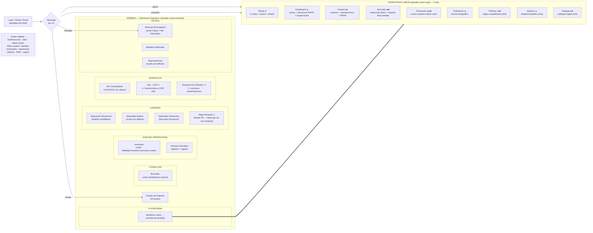
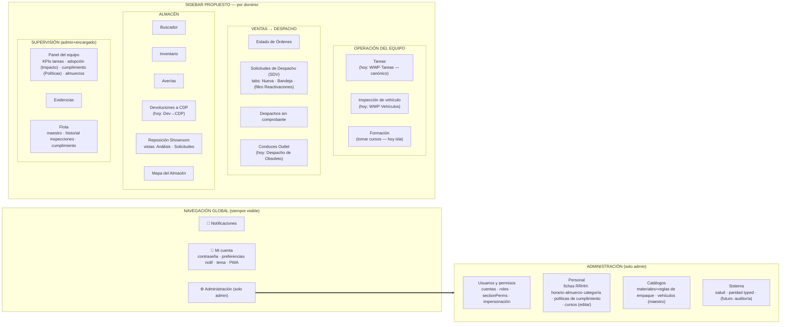

# Auditoría integral de UX, arquitectura de información y navegación — OpsAT

> **Fecha:** 2026-07-23 · **Tipo:** auditoría de organización conceptual (IA/UX/navegación/roles/terminología/flujos) — NO visual ni técnica.
> **Alcance:** los 15 destinos del sidebar + 9 tabs de Workforce + 6 islas + menús + estados + móvil, verificados **en el código** (`historial.html` v228, `core.js`, `proxy.js`, islas) y **en la app corriendo** (sandbox local `:3210`, sesiones reales con los 3 roles: Admin, Encargado, Auxiliar).
> **Método:** 6 agentes de levantamiento en paralelo (navegación, Workforce, RBAC, solicitudes, rutas/ocultos, terminología/estados) + recorrido visual con capturas por rol + evidencia de uso real (MEMORIA-PROYECTO.md, decisiones de Gabriel, hallazgos de la auditoría técnica 09 del mismo día).
> **Regla cumplida:** no se modificó ningún archivo de la aplicación. Este documento es diagnóstico + propuesta + plan; la implementación espera aprobación.
> **Anexo:** [`10-anexo-hallazgos-ux-2026-07-23.md`](10-anexo-hallazgos-ux-2026-07-23.md) — hallazgos en formato completo (evidencia `archivo:línea`, principio UX, criterio de aceptación, prioridad).
> **Relación con la auditoría 09 (técnica, mismo día):** complementaria, sin solaparse. La 09 audita *cómo está construido y operado* el sistema; esta audita *cómo está organizado para el usuario*. Donde un hallazgo técnico tiene cara de UX (p. ej. PR-04 datos mock en Políticas, FE-04 bug RBAC del kanban, API-10 forgot-password roto), se cita con su ID original.

---

## 1. Resumen ejecutivo

### Qué se auditó

OpsAT sirve a ~30 usuarios en 3 roles reales (Admin, Encargado, Auxiliar de almacén, más un rol Ventas parcial) desde una sola app (`historial.html`). La app tiene **dos mundos pegados**: el "Dashboard Operativo" (sidebar con 14 secciones: buscador, inventario, averías, reposición/showroom, despachos especiales, SDV) y **Workforce Labor** (9 tabs: tareas, dashboard, usuarios, vehículos, formación, evidencias, políticas, impacto, empaque). La navegación, los nombres y la ubicación de las funciones crecieron por acreción histórica — cada feature aterrizó donde fue más fácil construirla, no donde el usuario la buscaría.

### Estado general: **producto operativamente maduro, mapa conceptual desordenado**

La plataforma resuelve bien los flujos (el wizard de tareas, el checklist de despacho con evidencia, el gate de picking están bien pensados). El problema no es funcional sino **de organización**: un usuario nuevo no puede predecir dónde está nada, y el propio dueño del producto lee "Dev→CDP" como "pantalla de desarrollo" cuando es "Devoluciones→CDP" — la prueba más contundente de esta auditoría de que los nombres actuales no comunican.

### Los problemas estructurales (síntesis)

1. **No existe Administración.** Usuarios, roles, permisos RBAC de TODA la app, horarios laborales, tiempo de almuerzo y categorías de empleado se administran desde un tab ("Usuarios") **dentro del módulo operativo Workforce**, visible solo para admin. La configuración global vive dentro de un módulo operativo — exactamente el anti-patrón que esta auditoría debía confirmar (evidencia: `historial.html:7498-7512`, modal de usuario con RRHH `8016-8118`, modal de rol con los permisos de las 14 secciones `8138-8193`).
2. **Workforce Labor es 4 cosas a la vez.** De sus 9 tabs, solo **2** son operación diaria (Tareas, inspección de Vehículos). Los otros 7 mezclan supervisión (Dashboard, Evidencias, Impacto), configuración de módulo (Empaque, Políticas, cursos de Formación, maestro de flota escondido en un modal) y administración global (Usuarios/Roles). Todo al mismo nivel visual, en la misma barra.
3. **El sidebar agrupa por rótulos que no reflejan el negocio.** "Mapa Almacén" está bajo **COMPRAS**; el portal de Solicitud de Despacho que usan Encargados de operaciones está bajo **VENTAS**; "Estado de Órdenes" flota sin grupo; tres items distintos de reposición/showroom (Reposición Showroom, Solicitudes Repos., Solicitudes Showroom) reparten un mismo proceso en dos grupos con nombres casi intercambiables.
4. **Nombres que ocultan la función.** "Dev→CDP" (devoluciones), "Despacho de Obsoleto" (conduces de venta al por mayor «como está» — suena a pantalla obsoleta), "Workforce Labor" (anglicismo doble para "el trabajo del equipo"), "Impacto" (analítica de adopción), "SDV" (sigla nunca expandida en la UI), "Sin Comprobante" (control documental de OUTs). En Estado de Órdenes conviven "órdenes" y "solicitudes" para la misma fila.
5. **El RBAC funciona, pero miente en los bordes.** El Encargado ve el tab Dashboard y el backend le responde 403 (`historial.html:8342` vs `proxy.js:4819`); dos permisos del editor de roles no tienen ningún efecto (`wwp.usuarios`, `wwp.validar_tarea`); Empaque es admin-only en la barra pero alcanzable por URL con otro permiso (`core.js:192`); y conviven dos sistemas de roles (el vigente y uno legacy por empleado-Odoo, `proxy.js:12628-12671`).
6. **La experiencia del Auxiliar ya es otra app — pero nadie lo decidió.** Con el RBAC actual, el auxiliar ve un sidebar con **un solo item** y 3 tabs. De facto existen "la app del operario" y "la app del escritorio"; reconocerlo explícitamente (y diseñar el módulo operativo móvil-primero) es una oportunidad, no un problema.

### Impacto de no corregir

- **Entrenamiento:** cada usuario nuevo necesita que alguien le explique qué es "Dev→CDP", dónde se cambia una contraseña ajena, por qué "Empaque" está junto a "Tareas". El conocimiento vive en personas, no en la interfaz.
- **Errores:** funciones administrativas a un clic de las operativas (validar/borrar junto a iniciar/completar); permisos que se marcan y no hacen nada (el admin cree que delegó).
- **Soporte:** hallazgo PR-08 de la auditoría 09 — el tab Políticas estuvo **roto en producción durante toda la era Node sin que ningún usuario lo reportara**: los usuarios no reportan lo que no entienden o no usan; el sidebar actual no distingue lo vital de lo marginal.
- **Escalabilidad:** sin regla de "dónde va lo nuevo", cada feature futura seguirá aterrizando "donde quepa" (ya pasó: el maestro de flota quedó dentro de un modal del formulario de inspección).

### Los diez cambios prioritarios (aprobables por separado)

| # | Cambio | Tipo | Esfuerzo |
|---|---|---|---|
| 1 | Renombrar **Dev→CDP → "Devoluciones a CDP"** y **Despacho de Obsoleto → "Conduces Outlet/Obsoleto"** (labels, no rutas) | Quick-win | Bajo |
| 2 | Crear la sección **Administración** (sidebar, solo admin) y mover ahí Usuarios+Roles, Políticas (edición), catálogo/reglas de Empaque, maestro de Vehículos y cursos (edición) de Formación | Estructural | Medio |
| 3 | Reagrupar el sidebar por **procesos de negocio** (Ventas→Despacho / Almacén / Consulta) en vez de los rótulos actuales (Compras/Ventas/Plataforma) | Estructural | Bajo-Medio |
| 4 | Consolidar las 3 entradas de **SDV** (Portal/Bandeja/Reactivaciones) en un módulo "Despachos (SDV)" con tabs internos | Estructural | Bajo-Medio |
| 5 | Consolidar **Reposición/Showroom** (3 items hoy) en un módulo con 2 vistas: análisis y solicitudes | Estructural | Medio |
| 6 | Arreglar los bordes RBAC: Dashboard del Encargado (dar datos o quitar tab), retirar los permisos sin efecto del editor de roles, unificar guard/build de Empaque | Corrección | Bajo |
| 7 | Renombrar **Workforce Labor → "Equipo y Tareas"** (o "Operación del Equipo") y separar visualmente sus tabs en dos filas conceptuales: Operación / Gestión | Quick-win+ | Bajo |
| 8 | Sacar el **Dashboard de almuerzos e inspecciones** del tab Dashboard hacia sus dominios (RRHH→Administración; Inspecciones→Vehículos) | Estructural | Medio |
| 9 | **Estados vacíos con acción** en las 5 pantallas de mayor tráfico (Tareas, Bandeja SDV, Estado de Órdenes ya la tiene, Averías, Reposición) | Quick-win | Bajo |
| 10 | Decidir el futuro de **Políticas e Impacto** con datos de uso (hoy: cumplimiento con historial mock en prod — PR-04; sin evidencia de consumo real) antes de moverlos: candidatos a fusionarse en un "Panel del equipo" | Decisión | — |

### Nivel de madurez UX global: **2,4 / 5** (detalle en §17)

El produto está por encima de la media en flujos operativos con evidencia y por debajo en arquitectura de información, administración y consistencia terminológica. Todo lo crítico es corregible sin reescribir: renombrar, reagrupar, mover — el código de las funciones no cambia.

---

## 2. Método y fuentes de evidencia

| Fuente | Qué aportó |
|---|---|
| **Código** (`historial.html` 33.991 líneas, `core.js`, `proxy.js`, 6 islas) | Inventario exhaustivo de secciones, tabs, modales, permisos, rutas y labels, con `archivo:línea` |
| **App corriendo** (sandbox `:3210`, DATA_DIR desechable, patrón de la suite e2e) | Sidebar real por rol (capturas Admin/Encargado/Auxiliar), aterrizajes por rol, estados vacíos, terminología en pantalla |
| **MEMORIA-PROYECTO.md** | Decisiones reales de negocio (D1–D4 go-live, browse-first devoluciones, wizard, filtro del auxiliar) = modelo mental del dueño |
| **Auditoría técnica 09 (2026-07-23)** | 132 hallazgos técnicos; se reutilizan los que tienen cara de usuario (PR-04, PR-08, FE-04, FE-11, API-10, SEC-07, OW-05) |
| **Suite e2e** (`tests/e2e/`) | Confirmación de las 15 secciones + 9 tabs como contrato vivo; deep-links funcionantes |

**Clasificación de certeza usada en todo el documento:** `[Confirmado]` = verificado en código Y en la app corriendo; `[Probable]` = verificado en código, comportamiento inferido; `[Requiere validación]` = hipótesis que necesita datos de uso u opinión de usuarios reales.

---

## 3. Inventario completo de pantallas

### 3.1 Sidebar — módulo "Dashboard Operativo" (pantalla `screen-historial`)

| ID | Ruta | Grupo actual | Pantalla (label) | Propósito real | Usuario principal | Frecuencia | Criticidad | Tipo | Estado | Problema detectado |
|---|---|---|---|---|---|---|---|---|---|---|
| S01 | `/estado-ordenes` | *(sin grupo)* | Estado de Órdenes | Pipeline en vivo de órdenes de venta→despacho (SDV+WWP+Odoo); "Solo lo mío/Todo el equipo" | Ventas, Encargado, Admin | Diaria | Alta | Operación/consulta | OK | Sin grupo; mezcla "orden"/"solicitud" en labels; subtítulo "ALTRI TEMPI · VENTAS" |
| S02 | `/buscar` | CONSULTAR | Buscador | Buscar orden / transferencia / artículo (Odoo) con historial reciente | Todos los de escritorio | Diaria | Alta | Consulta | OK | Es una *sección*, no una búsqueda global omnipresente |
| S03 | `/inventario` | ANÁLISIS OPERACIONAL | Inventario | Salud de inventario: fiabilidad, negativos, tránsitos, estructura Odoo, cuadre (4 tabs) | Admin, Encargado | Diaria/Semanal | Alta | Consulta+casos | OK | Nombre genérico para lo que es "salud/fiabilidad de inventario" |
| S04 | `/averias` | ANÁLISIS OPERACIONAL | Artículos Averiados | Registrar avería (foto+estado) y consultar registro (Recibido/En Taller/Reparado/Descartado) | Auxiliar, Encargado | Semanal | Media | Operación | OK | Registro está aquí pero el rol que más lo usa (auxiliar) no ve el sidebar |
| S05 | — | PLATAFORMA | Workforce Labor | Contenedor de 9 tabs (ver 3.2) | Todos | Diaria | Crítica | Módulo | OK | Anglicismo; cambia el paradigma de navegación al entrar |
| S06 | `/reposicion` | COMPRAS | Reposición Showroom | Análisis: artículos con stock en almacén sin existencia en showroom (candidatos) | Encargado showroom | Semanal | Media | Consulta/operación | OK | Trío confuso con S07/S08 |
| S07 | `/solicitudes-reposicion` | COMPRAS | Solicitudes Repos. | Bandeja de solicitudes de reposición (Borrador→…→Completada) | Encargado | Semanal | Media | Operación | Oculto por defecto (`display:none`, revela RBAC) | Nombre truncado "Repos."; ¿relación con S06/S08 no evidente |
| S08 | `/solicitudes` | COMPRAS | Solicitudes Showroom | Lista de artículos solicitados para showroom (alimentada desde S06 y Contenedores) | Encargado | Semanal | Media | Operación | OK | Ruta genérica `/solicitudes` para algo específico de showroom |
| S09 | `/almacen-mapa` | COMPRAS | Mapa Almacén | Mapa 3D/2.5D del almacén (iframe `almacen-mapa.html`) | Todos los de escritorio | Semanal | Media | Consulta/herramienta | OK | **Bajo COMPRAS sin relación alguna** |
| S10 | `/sin-adjuntos` | DESPACHOS | Sin Comprobante | Control documental: OUTs sin adjunto y PICKs sin despacho (Odoo Discuss notif) | Admin, Encargado | Diaria/Semanal | Media | Control/consulta | OK | Nombre elíptico ("¿sin comprobante de qué?") |
| S11 | `/dev-cdp` | DESPACHOS | Dev→CDP | **Devoluciones de PTN recibidas en almacén CDP** (isla iframe) | Encargado almacén | Semanal | Media | Operación | OK | **Se lee como "development"**; el dueño lo listó como pantalla DEV |
| S12 | `/despacho-obsoleto` | DESPACHOS | Despacho de Obsoleto | Conduces de salida de OBSOLETO/NAVE2, venta al por mayor «como está» (escaneo+fotos+impresión) | Encargado outlet | Semanal | Media | Operación | OK | **Se lee como "pantalla obsoleta de despacho"** |
| S13 | `/sdv-portal` | VENTAS | Solicitud de Despacho | Portal de creación SDV: 4 tipos (Despacho a Cliente / Devolución / Traslado Interno / Solicitud Especial) + Mis Solicitudes | Ventas, Encargado | Diaria | Crítica | Operación | OK | El grupo dice VENTAS pero lo usan Operaciones también |
| S14 | `/sdv-bandeja` | VENTAS | Bandeja Solicitudes | Bandeja de SDV recibidas para procesar (→ tarea WWP) | Encargado, Admin | Diaria | Crítica | Operación | OK | Separada del portal y de reactivaciones sin necesidad conceptual |
| S15 | `/sdv-reactivations` | VENTAS | Reactivaciones | SDV canceladas con petición de reactivación | Admin, Encargado | Excepcional | Media | Flujo excepcional | Oculto por defecto | Item de primer nivel para un flujo excepcional |

**Retiradas/residuales:** visor Base de datos (eliminado jul-2026; clave `basedatos` residual en `core.js:156,172`), tab `auditor` (redirige, `core.js:188`), `index.html` Ventas (retirado R-06D, página tumba), aliases `inventario-salud`/`validacion` → `/inventario`.

### 3.2 Workforce Labor — 9 tabs (pantalla `screen-app`)

| ID | Ruta | Tab | Propósito real | Visible para | Clasificación real | Problema |
|---|---|---|---|---|---|---|
| W01 | `/wwp/tasks` | Tareas | Núcleo operativo: 8 tipos de tarea, 6 vistas, wizard, drawer con evidencia/chat/checklist | Todos | **Operación diaria** | Sano; 6 vistas quizá exceso para auxiliar |
| W02 | `/wwp/dashboard` | Dashboard | KPIs de tareas + **control de almuerzos (RRHH)** + **historial de inspecciones (flota)** | can('dashboard') (admin; manager solo UI→403 datos) | Supervisión (3 dominios mezclados) | Mezcla; roto para Encargado |
| W03 | `/wwp/users` | Usuarios | Usuarios del sistema + roles/sectionPerms + RRHH (horario semanal, almuerzo, categoría) + mapa GPS | Solo admin (hardcoded) | **Administración global** | No pertenece a un módulo operativo |
| W04 | `/wwp/vehiculos` | Vehículos | Formulario de inspección diaria; maestro de flota escondido en modal "Gestionar vehículos" | Todos (inspección); admin/manager (maestro) | Operación + config mezcladas | Config dentro de pantalla operativa |
| W05 | `/wwp/formacion` | Formación | Salón de entrenamientos: cursos+examen+certificación; matriz del equipo; `enforceGate` bloquea asignación | Todos (tomar); admin (crear) | Operación + supervisión + config | Creación de cursos = config, mismo lugar |
| W06 | `/wwp/archivo` | Evidencias | Archivo fotográfico por orden/tarea (incluye cerradas) | Admin, Encargado | Supervisión/auditoría | id interno `archivo` ≠ label |
| W07 | `/wwp/politicas` | Políticas | Reglas de cumplimiento del personal (almuerzo, llegada, tareas, inspección) con medición en vivo | Solo admin | Config RRHH + supervisión | Historial con datos mock en prod (PR-04); dudas de uso real (PR-08) |
| W08 | `/wwp/impacto` | Impacto | Analítica de adopción de la app (semáforo, ranking, termómetro) + impacto de políticas | Solo admin | Supervisión/analítica | Nombre opaco; audiencia de 1–2 personas |
| W09 | `/wwp/empaque` | Empaque | **Configuración**: catálogo de materiales + reglas por categoría Odoo (consumidas por tareas de empaque) | Solo admin (barra); guard difiere | **Config de módulo** | Config al mismo nivel que Tareas; guard≠build |

### 3.3 Otras superficies

| Superficie | Contenido | Nota |
|---|---|---|
| **Menú de usuario** (`#profile-menu`) | Cambiar de usuario (admin/impersonación), Cambiar contraseña, Instalar como app, Cerrar sesión | Es el único "Mi cuenta"; sin preferencias de perfil propias |
| **Footer del sidebar** | Notificaciones (única entrada global), Salir, **Modo noche** | Tema personal en el footer del sidebar; en WWP-móvil el sidebar es drawer |
| **Panel de notificaciones** | Historial + **Ajustes por categoría** (preferencias personales) | Preferencias personales dentro del panel, no en Mi cuenta |
| **mob-nav** (≤767px) | 12 botones scroll horizontal | Faltan Estado de Órdenes, Solicitudes Repos., Reactivaciones |
| **Pantalla de bienvenida** | 1ª vez: describe Tareas + pide permisos (ubicación/notif/cámara) | Bien enfocada al auxiliar |
| **Guías** | `wwp-guide.html` (admin) / `wwp-guide-staff.html` (resto) | Ayuda estática por rol |

---

## 4. Sitemap actual (as-is)



Leyenda: ● operación diaria · ▲ supervisión · ■ configuración/administración · ⚠ nombre que engaña.

**Profundidad**: 2 niveles reales (sección → tab/vista) + modales. **Anomalía central del sitemap:** "Workforce Labor" no es una sección sino **otra pantalla** con su propio paradigma de navegación (tabs horizontales + topbar propia) — el usuario "sale" del sidebar al entrar, y el sidebar pasa a drawer.

**Rutas fantasma** (sirven el shell pero no llegan a ninguna sección): `/basedatos`, `/dashboard-ventas`, `/contenedores` (`proxy.js:20629-20630`, `historial.html:24319-24322`). **Obsoletos alcanzables por URL directa en producción**: 19 HTML de `_archivo/` (incluido el viejo `wwp.html` archivado) y 2 de `tests/` — trackeados en git, desplegados y servibles (`proxy.js:20641-20676` permite cualquier `.html`) `[Confirmado por análisis estático]`.

---

## 5. Mapa de dominios del negocio (real, no hipotético)

Del levantamiento emergen **7 dominios reales** (no los ~20 hipotéticos del cuestionario):

| Dominio | Propósito | Entidad principal | Usuarios | Procesos incluidos hoy | Hoy repartido en | Relación |
|---|---|---|---|---|---|---|
| **Ventas → Despacho** | De la orden de venta a la entrega con evidencia | SDV / orden de venta | Ventas, Encargado, Admin | Portal SDV (4 tipos), Bandeja, Reactivaciones, Estado de Órdenes | 4 items en 2 grupos (VENTAS + suelto) | Consume Odoo; genera Tareas |
| **Tareas del equipo** | Ejecutar y supervisar el trabajo físico | Tarea (8 tipos) | Todos | Tareas (6 vistas), wizard, drawer, evidencias, chat por tarea | Tab Tareas + Evidencias | Recibe de SDV/manual; gated por Formación |
| **Almacén e inventario** | Confiabilidad del stock y del espacio físico | Artículo / ubicación | Encargado, Admin, Auxiliar | Inventario (4 tabs), Averías, Mapa 3D, Dev→CDP, Despacho Obsoleto, Sin Comprobante, Reposición/Showroom | 8 items en 4 grupos distintos | Todo contra Odoo |
| **Flota** | Vehículos aptos y con evidencia diaria | Vehículo / inspección | Auxiliar (inspección), Encargado/Admin (gestión) | Inspección diaria, maestro (modal), historial (en Dashboard WWP) | 3 lugares distintos | Gate de inspección al entrar a Vehículos |
| **Personal (RRHH ligero)** | Horarios, almuerzos, conducta, formación, presencia | Empleado/usuario | Admin (config), Encargado (supervisión), Auxiliar (sujeto) | Horario semanal+almuerzo (en alta de usuario), control almuerzos (Dashboard), Políticas, Formación, presencia, GPS | 5 lugares distintos | Se solapa con Administración |
| **Administración del sistema** | Cuentas, roles, permisos, catálogos | Usuario, Rol, Material de empaque, Curso, Vehículo (maestro), Política | Solo Admin | Usuarios+Roles (tab WWP), Empaque, Políticas (edición), cursos, flota | Disperso dentro de WWP | Debería ser sección propia |
| **Análisis / adopción** | Cómo va la operación y quién usa la app | KPI / métrica | Admin (Encargado a medias) | Dashboard WWP, Impacto, Gráficos de tareas, gráficos de Estado de Órdenes | 4 lugares | Audiencia real: 1–3 personas |

**Dominios hipotéticos que NO existen como tales:** "Compras" (el grupo COMPRAS del sidebar no contiene ninguna compra — contiene reposición interna showroom y el mapa), "Órdenes" como módulo propio (las órdenes viven en Odoo; aquí solo se consultan y se convierten en SDV/tareas), "Integraciones" (no hay UI de integraciones), "Datos maestros" (solo empaque y flota, hoy dentro de WWP).

---

## 6. Mapa de entidades

| Entidad | Definición operativa | Módulo actual | Módulo natural | Relaciones | Confusión detectada |
|---|---|---|---|---|---|
| **Usuario** (cuenta) | Identidad de login con rol | Tab Usuarios (WWP) | Administración | 1↔0..1 Empleado Odoo (`odooId`) | Se confunde con "empleado"; mismo formulario mezcla identidad + RRHH |
| **Empleado** (persona) | Recurso humano con horario/almuerzo/categoría/certificaciones | Mismo formulario de Usuario | Personal (RRHH) | sujeto de Tareas/Políticas/Formación/GPS | No existe como concepto separado en la UI |
| **Rol** | admin/manager(Encargado)/assistant(Auxiliar)/ventas + custom con `sectionPerms` | Subsección de Usuarios | Administración | gobierna secciones+acciones | 2 sistemas coexistentes (role-defs vs legacy `wwp-roles.json`); `ventas` sin etiqueta |
| **Tarea** | Unidad de trabajo (8 tipos) con estados pending→…→validated | Tab Tareas | Tareas | hija de SDV u orden; madre de subtareas; bloqueada por Formación (gate) | tipo `packaging` se muestra como "Empaque" Y "Embalaje" |
| **Orden (de venta)** | Documento Odoo (`sale.order`) | Buscador / Estado de Órdenes / wizard | (vive en Odoo) | origen de SDV, tareas, picks | En Estado de Órdenes las filas se llaman a la vez "órdenes" y "solicitudes" |
| **SDV (solicitud de despacho)** | Petición interna de ejecutar un despacho/devolución/traslado/especial | 3 items del sidebar | Ventas→Despacho | 1→N tareas; ancla RETs | Sigla nunca expandida en UI; "solicitud" colisiona con reposición/showroom/personal |
| **Solicitud de reposición** | Petición de reponer stock en showroom | Solicitudes Repos. | Almacén/Showroom | nace del análisis de Reposición | 3 pantallas con nombres casi iguales |
| **Avería** | Artículo dañado con estado de taller | Artículos Averiados | Almacén | vinculable a tareas de despacho (item con avería) | módulo usa 4 nombres (§12) |
| **Vehículo** | Unidad de flota | Modal dentro de tab Vehículos | Flota | 1→N inspecciones | maestro escondido |
| **Inspección** | Chequeo diario con fotos/combustible/apto | Tab Vehículos | Flota | historial en Dashboard (!) | partida en 3 lugares |
| **Política** | Regla de conducta medida (almuerzo/llegada/tareas/inspección) | Tab Políticas (isla) | Personal | mide a Empleados; alimenta Impacto | nombre sugiere "documento normativo", es "regla de monitoreo" |
| **Material/Regla de empaque** | Catálogo + asignación por categoría Odoo | Tab Empaque (isla) | Administración (datos maestros) | consumida por tareas `packaging` | config al nivel de operación |
| **Curso/Certificación** | Formación con examen y vencimiento anual | Tab Formación (isla) | Personal | `enforceGate` bloquea asignación de tareas | crear curso (config) junto a tomar curso (operación) |
| **Notificación** | Aviso push/SSE con target tipado | Footer sidebar + panel | Global | apunta a Tarea/SDV | preferencias personales dentro del panel |
| **Conduce (obsoleto)** | Documento de salida de mercancía OBSOLETO/NAVE2 | Despacho de Obsoleto | Almacén/outlet | imprime para firma | el nombre no dice "conduce" |
| **Evidencia (foto)** | Prueba fotográfica por tarea/artículo | Drawer + tab Evidencias | Tareas | pertenece a Tarea/ítem | tab se llama "Evidencias", id interno `archivo` |

---

## 7. Auditoría del sidebar (opción por opción)

| Opción actual | Función real | Problema | Acción recomendada | Nueva ubicación | Nuevo nombre | Roles |
|---|---|---|---|---|---|---|
| Estado de Órdenes | Pipeline ventas→entrega | Sin grupo; título dice VENTAS; mezcla orden/solicitud | Mover al bloque de Despacho | Ventas→Despacho | "Estado de Órdenes" (ok) | ventas, manager, admin |
| Buscador | Consulta Odoo 3 modos | Correcto; único item de su grupo | Mantener; evaluar búsqueda global futura | Consulta (o topbar) | "Buscador" | escritorio |
| Inventario | Salud/fiabilidad + casos | Nombre genérico; correcto de fondo | Mantener | Almacén | "Inventario" (ok) | admin, manager |
| Artículos Averiados | Registro de averías | 4 nombres distintos según superficie | Unificar label | Almacén | "Averías" (una sola forma) | admin, manager, (auxiliar contextual) |
| Workforce Labor | Módulo tareas/equipo | Anglicismo; cambia paradigma de navegación | Renombrar; integrar navegación | Módulo propio | "Equipo y Tareas" | todos |
| Reposición Showroom | Análisis candidatos | Trío confuso | Fusionar como vista "Análisis" | Almacén→Showroom | "Reposición Showroom · Análisis" | admin, manager |
| Solicitudes Repos. | Bandeja solicitudes reposición | Nombre truncado; oculto default | Fusionar como vista "Solicitudes" | Almacén→Showroom | (vista interna) | admin, manager |
| Solicitudes Showroom | Lista para showroom | Ruta `/solicitudes` genérica | Fusionar (vista o tab) | Almacén→Showroom | (vista interna) | admin, manager |
| Mapa Almacén | Mapa 3D | **Grupo equivocado (COMPRAS)** | Reagrupar | Almacén | "Mapa del Almacén" | todos escritorio |
| Sin Comprobante | Control OUTs/PICKs sin adjunto | Nombre elíptico | Renombrar levemente | Despacho (control) | "Despachos sin comprobante" | admin, manager |
| Dev→CDP | Devoluciones recibidas en CDP | **Se lee "development"** | Renombrar YA | Almacén (devoluciones) | "Devoluciones a CDP" | admin, manager |
| Despacho de Obsoleto | Conduces outlet/mayoreo | **Se lee "pantalla obsoleta"** | Renombrar YA | Despacho / Outlet | "Conduces Outlet (Obsoleto/Nave 2)" | admin, manager outlet |
| Solicitud de Despacho | Portal SDV 4 tipos | Grupo VENTAS para función de ambos lados | Consolidar módulo SDV | Ventas→Despacho | "Solicitudes de Despacho · Nueva" | ventas, manager, admin |
| Bandeja Solicitudes | Procesar SDV | Item separado sin necesidad | Consolidar (tab Bandeja) | Ventas→Despacho | (tab interna) | manager, admin |
| Reactivaciones | Flujo excepcional SDV | Primer nivel para excepción | Consolidar (tab o filtro) | Ventas→Despacho | (tab/filtro "Reactivaciones") | admin, manager |

**Veredicto del sidebar:** el problema no es el número de items (15 es manejable) sino que (a) los **rótulos de grupo** no corresponden al contenido (COMPRAS y VENTAS son etiquetas heredadas, no dominios reales), (b) **un mismo proceso está partido** en items hermanos (SDV ×3, reposición ×3), y (c) dos items llevan **nombres que activan el modelo mental equivocado** (Dev→CDP, Despacho de Obsoleto). El usuario no puede predecir: predicción = agrupación por proceso + nombre que describe la función.

---

## 8. Auditoría de Workforce Labor (el problema principal)

### Qué es hoy
Un contenedor de 9 tabs donde conviven **cuatro planos**: operación diaria, supervisión, configuración de módulo y administración global. Clasificación verificada (agente WWP, con evidencia por tab):

| Tab | Operación | Supervisión | Config módulo | Admin global/RRHH |
|---|:--:|:--:|:--:|:--:|
| Tareas | ● | ○ | | |
| Dashboard | | ● | | ○ (almuerzos RRHH) |
| Usuarios | | | ○ (roles) | ● **fuerte** |
| Vehículos | ● (inspección) | | ● (maestro en modal) | |
| Formación | ○ (tomar curso) | ● (matriz) | ● (crear cursos + gate) | |
| Evidencias | | ● | | |
| Políticas | | ● (cumplimiento) | ● (definir reglas) | ○ |
| Impacto | | ● **fuerte** | | |
| Empaque | | | ● **fuerte** | |

### Respuestas a las preguntas del brief

- **¿Tareas debe seguir en Workforce?** Sí — es EL módulo. Las tareas son la unidad de ejecución de toda la operación (SDV→tarea, reposición→tarea, avería→tarea de recogida). Son transversales *por sus entradas* (8 accesos contextuales de creación levantados, §13) pero con **ubicación canónica única** en el módulo del equipo. Lo que sobra alrededor de Tareas no es Tareas: es lo administrativo.
- **¿Usuarios/roles/permisos?** Fuera. Administran el acceso de TODA la app (el modal de rol edita los `sectionPerms` de las 14 secciones del sidebar, `historial.html:8153-8186`) — su alcance es global, su audiencia es solo admin, su frecuencia es baja. Pertenece a **Administración** (§18.3). El argumento "los usuarios también son empleados" se resuelve separando el registro en dos caras: **cuenta** (identidad+rol → Administración) y **ficha de empleado** (horario, almuerzo, categoría, certificaciones → Personal), aunque compartan almacenamiento.
- **¿Políticas?** Son *reglas de monitoreo de conducta del personal* (almuerzo, puntualidad, tareas, inspección) con medición en vivo — no son políticas organizacionales ni flujos de aprobación. Nombre engañoso. Su **edición** es configuración (Administración→Personal); su **cumplimiento** es supervisión (panel del equipo). Precaución antes de invertir: el historial muestra datos mock en producción (PR-04) y el tab estuvo roto sin que nadie lo reportara (PR-08) → decidir con Gabriel si se consolida con Impacto en un "Panel del equipo" o se retira `[Requiere validación]`.
- **¿Empaque?** Es **dato maestro** (catálogo de materiales + reglas por categoría Odoo) que consume el flujo de tareas de empaque. Lo administra admin; lo consume la operación. Va a **Administración→Catálogos**, con acceso contextual de lectura desde la tarea (ya existe: el drawer enriquece artículos con materiales).
- **¿Vehículos?** Partir en dos caras (§10): **Inspección diaria** (operación, todos, móvil) se queda en el módulo operativo; **Flota** (maestro + historial + cumplimiento) se consolida en un solo lugar de gestión. No amerita módulo de primer nivel separado del de operación *hoy* (no hay mantenimiento programado ni asignaciones); si crece, ya quedará separado el eje.

### Nueva estructura de Workforce (resumen; detalle en §18)

| Hoy (9 tabs) | Propuesta |
|---|---|
| Tareas | **Se queda** (corazón del módulo, renombrado "Equipo y Tareas") |
| Vehículos (inspección) | **Se queda** como "Inspección de vehículo" (operación diaria) |
| Formación (tomar cursos/examen) | **Se queda** (operación del empleado) |
| Evidencias | **Se queda** (supervisión de la operación, admin+manager) |
| Dashboard | **Se divide**: KPIs de tareas se quedan; almuerzos → Panel del equipo (Personal); inspecciones → Flota |
| Usuarios + Roles | **Se va** → Administración → Usuarios y permisos |
| Políticas (edición) | **Se va** → Administración → Personal (o retiro; decisión) |
| Impacto | **Se fusiona** → Panel del equipo (supervisión) |
| Empaque | **Se va** → Administración → Catálogos |

---

## 9. Auditoría de solicitudes

### El levantamiento (verificado en código)

**"Solicitud" nombra 4 entidades de datos distintas** en 2 familias sin relación entre sí:

| Familia | Entidad | Dónde vive | ¿Aprobación? | ¿Genera tarea? |
|---|---|---|---|---|
| SDV (ventas→despacho) | `sdv-solicitudes.json` — 4 subtipos (despacho_cliente, devolucion, traslado_interno, solicitud_especial) | 3 items grupo VENTAS | Sí (bandeja→crear tarea) | **Sí** (cadena empaque→despacho) |
| Reposición formal "D5" | `reposiciones.json` — borrador→pendiente_aprobacion→aprobada→en_proceso→completada | "Solicitudes Repos." **OCULTO por defecto** (`historial.html:5478`) | **Sí** (admin, con comentario) | **Sí** (`/api/reposicion/:id/crear-tarea`) |
| Showroom informal | `wwp-solicitudes-showroom.json` — activo→completado | "Solicitudes Showroom" (visible) | **No** | **No** |
| Análisis reposición | efímero (query Odoo) | "Reposición Showroom" (visible) | n/a | alimenta la anterior por checkbox |
| *(+ Solicitud de Personal)* | tarea `staffing` | wizard de Tareas | — | es una tarea |

**El hallazgo más serio de la auditoría** `[Confirmado]`: el flujo **formal** de reposición (con aprobación y puente a tareas) está escondido del menú, mientras que el flujo **informal** (checkbox sin aprobación, sin tareas) es el visible. Dos puertas al mismo objetivo con rigor opuesto — y la puerta seria es la invisible. Además la palabra clave está invertida respecto al backend ("Solicitudes Showroom"→`wwp-solicitudes-showroom.json` pero "Solicitudes Repos."→`reposiciones.json`).

### Decisión recomendada (justificada por el uso real)

**No** crear un "centro de solicitudes" transversal único: las dos familias tienen usuarios, ciclos y dominios distintos (Ventas pide despachos; Almacén repone showroom). Forzarlas a una bandeja única añadiría filtros sin quitar confusión (violaría el match con el modelo mental).

En su lugar:
1. **SDV = un módulo "Despachos (SDV)"** con 3 vistas internas (Nueva / Bandeja / Reactivaciones como filtro) — hoy son 3 items de sidebar. La entidad es una; la separación actual es por pantalla, no por concepto.
2. **Reposición Showroom = un módulo con 2 vistas** (Análisis / Solicitudes) y **una sola decisión de proceso**: o el checkbox informal alimenta el flujo formal D5 (recomendado: unificar en `reposiciones.json` con aprobación opcional), o se retira el D5 si el negocio no lo usa `[Requiere validación con Gabriel: ¿por qué D5 quedó oculto?]`.
3. **"Solicitud de Personal"** se queda como tipo de tarea (staffing) — ya está bien resuelta en el wizard.
4. Cada módulo afectado conserva **acceso contextual** de creación (ya existen 8, §13) — la ubicación canónica es el módulo; el acceso contextual es atajo.

---

## 10. Auditoría de vehículos

**Hoy — partido en 3 lugares:** formulario de inspección (tab Vehículos, todos los roles), maestro de flota (modal "Gestionar vehículos" dentro del mismo tab, admin/manager, `historial.html:27087-27140`), historial de inspecciones (tab **Dashboard**, con export CSV, `historial.html:7460-7494`). No existe mantenimiento programado ni incidencias vehiculares como entidad (las averías son de artículos, no de vehículos).

**Propuesta:**

| Cara | Contenido | Dónde | Quién |
|---|---|---|---|
| **Inspección diaria** (operación) | Formulario actual + gate de inspección | Módulo operativo (tab del equipo), móvil-primero | Auxiliar/chofer |
| **Flota** (gestión) | Maestro de vehículos + historial de inspecciones + cumplimiento (quién no inspeccionó) | Una sola pantalla de gestión (sección del área de supervisión o Administración→Catálogos para el maestro) | Encargado, Admin |

El gate diario ("no puedes operar sin inspección") ya existe y es correcto — se conserva tal cual (`proxy.js:15917`).

---

## 11. Auditoría de configuraciones (dónde está cada cosa hoy)

| Configuración | Dónde vive hoy | Alcance real | Dónde debería vivir |
|---|---|---|---|
| Usuarios (alta/edición/rol/activo) | Tab Usuarios (WWP, admin) | Global | Administración → Usuarios y permisos |
| Roles + `sectionPerms` (14 secciones + tabs + acciones + campo GPS) | Modal dentro de Usuarios | Global | Administración → Usuarios y permisos |
| Horario semanal, almuerzo permitido, categoría | **Dentro del alta de usuario** | RRHH | Administración → Personal (ficha de empleado) |
| Toggles por usuario (Resumen diario, Inspección requerida) | Fila de la lista de usuarios | RRHH/operación | Ficha de empleado |
| Políticas (definir reglas + parámetros) | Tab Políticas (admin) | RRHH | Administración → Personal |
| Catálogo de materiales + reglas de empaque | Tab Empaque (admin) | Datos maestros | Administración → Catálogos |
| Maestro de flota (CRUD vehículos, medidor) | Modal dentro del tab Vehículos | Datos maestros | Administración → Catálogos (o pantalla Flota) |
| Cursos de formación (crear/editar + `enforceGate`) | Tab Formación (admin) | Config de módulo | Administración → Personal/Formación |
| Preferencias de notificaciones por categoría | Panel de notificaciones ("Ajustes") | Personal | Mi cuenta (aceptable donde está si se enlaza) |
| Tema claro/oscuro | Footer del sidebar ("Modo noche") | Personal | Mi cuenta / menú usuario (aceptable) |
| Cambiar contraseña propia | Menú de usuario | Personal | Mi cuenta ✔ (correcto hoy) |
| Impersonación (Cambiar de usuario) | Menú de usuario (admin) | Admin | Correcto; auditar como admin (OW-05) |

**Lo que NO existe y debe existir:** una entrada "Administración" en la navegación (solo admin) que agrupe lo global; y una noción explícita de "Mi cuenta" (hoy el menú de usuario ya cumple a medias — falta agrupar ahí notificaciones y tema para que lo personal tenga un solo lugar).

---

## 12. Auditoría de terminología y glosario

### Problemas transversales `[Confirmado]`

1. **Marca**: 5 variantes conviven — "ALTRI TEMPI / Dashboard Operativo" (sidebar), "Ops AT" (títulos e islas), "Workforce"/"WWP" (módulo), "OpsAT" (repo/producción). El usuario no sabe cómo se llama la app.
2. **Labels distintos por superficie para el mismo destino**: "Workforce Labor"↔"Workforce", "Artículos Averiados"↔"Averías"↔"Registro de Averías", "Buscador"↔"Buscar", "Despacho de Obsoleto"↔"Despacho Obsoleto", "Solicitud de Despacho"↔"Sol. Despacho".
3. **Estados sin fuente única**: "En Progreso" (mapa `18576`) vs "En progreso" (KPI `7321`) vs "En Proceso" (SDV `4277-4281`); tipo `packaging` = "Empaque" en 4 mapas y "Embalaje" en 2 (+filtro). Seis mapas de labels de tipo y cuatro de estado, todos inline y divergentes.
4. **Jerga técnica expuesta**: SDV (nunca expandida), OUT, RET, PICK, folio, Kanban, CDP/PTN/NAVE2 (sin glosario visible), IDs de Odoo.
5. **Averías** muestra el estado **crudo del backend** sin traducción y con color por fallback silencioso (`historial.html:26250`).

### Glosario oficial propuesto (extracto operativo)

| Término actual | Significado real | Problema | Término recomendado | Definición oficial |
|---|---|---|---|---|
| Workforce Labor / WWP | Módulo de tareas y equipo | Anglicismo doble, 4 variantes | **Equipo y Tareas** | Módulo donde el equipo ejecuta y supervisa el trabajo físico diario |
| Dev→CDP | Devoluciones de tiendas recibidas en CDP | Se lee "development" | **Devoluciones a CDP** | Reporte de artículos devueltos por tiendas y recibidos en el almacén CDP |
| Despacho de Obsoleto | Conduces de salida OBSOLETO/NAVE2 | Se lee "pantalla obsoleta" | **Conduces Outlet** (Obsoleto/Nave 2) | Documento firmado de salida de mercancía vendida «como está» |
| SDV / Solicitud de Despacho | Petición de ejecutar despacho/devolución/traslado/especial | Sigla opaca; "solicitud" sobrecargada | **Solicitud de Despacho (SDV)** — expandir la sigla la 1ª vez en cada pantalla | Petición de Ventas a Operaciones que se convierte en tareas |
| Solicitudes Repos. / Solicitudes Showroom / Reposición Showroom | 3 pantallas del proceso de reponer showroom | Nombres cruzados, backend invertido | **Reposición Showroom** (módulo) con vistas **Análisis** y **Solicitudes** | Proceso de detectar faltantes en showroom y pedir su reposición |
| Estado de Órdenes | Pipeline venta→entrega | Mezcla "orden"/"solicitud" en pantalla | Estado de Órdenes (unificar: la fila es una **orden**; la SDV es su solicitud) | Tablero en vivo del avance de órdenes hacia la entrega |
| Sin Comprobante | OUTs/PICKs sin adjunto en Odoo | Elíptico | **Despachos sin comprobante** | Control de transferencias sin evidencia documental |
| Impacto | Analítica de adopción de la app | Opaco | **Panel del equipo** (fusionado con cumplimiento) | Uso de la plataforma y cumplimiento por persona |
| Evidencias (id `archivo`) | Archivo fotográfico por tarea | id≠label | Evidencias (unificar id en futuro refactor) | Fotos de la operación, buscables por orden |
| Encargado / manager | Rol supervisor | Interno inglés, UI español | Mantener **Encargado** en UI (ya correcto) | Rol que asigna y supervisa tareas de su equipo |
| Auxiliar / assistant / staff / personal / empleado | Operario | 5 palabras | **Auxiliar** (persona operativa) / **empleado** (ficha RRHH) | — |
| Estados de tarea | pending…validated | 3 grafías de "en curso" | **Pendiente · Asignada · En curso · Completada · Validada** (una sola fuente) | — |

Regla de oro derivada: **una función = un nombre = en todas las superficies** (sidebar, mob-nav, título de sección, notificaciones).

---

## 13. Auditoría de flujos principales

| Flujo | Rol | Entrada actual | Pasos | Problemas detectados | Recomendación |
|---|---|---|---|---|---|
| Crear SDV (despacho a cliente) | Ventas | Sidebar VENTAS→Solicitud de Despacho | Tipo→orden Odoo→confirmar items→datos entrega (GPS opcional)→enviar | Bien resuelto (browse-first, textos guía). Sin deep-link a SDV creada; "Mis Solicitudes" separado de Estado de Órdenes | Deep-link `#sdv/<id>`; enlazar desde EO |
| Procesar SDV → tarea | Encargado | Bandeja Solicitudes | Revisar→Crear tarea (1 clic, cadena) | Bandeja/Portal/Reactivaciones = 3 items para 1 entidad | Consolidar módulo SDV |
| Completar despacho | Auxiliar | Tareas→drawer | Gate pick→iniciar→3 fotos checklist→estado por artículo→completar | Flujo ejemplar (evidencia obligatoria). 6 vistas de tareas quizá exceso móvil | Mantener; vista móvil simplificada |
| Asignar tarea | Admin/Encargado | +Nueva Tarea (wizard 4 pasos) | Concepto→encargados→órdenes→resumen | Bien; bloqueo por conflictos ya existe | Mantener |
| Reponer showroom | Encargado | **2 caminos**: análisis→checkbox (informal) o D5 oculto (formal) | ver §9 | **El formal está oculto; el visible no aprueba ni genera tareas** | Unificar (decisión §9) |
| Registrar avería | Auxiliar/Encargado | Sidebar→Artículos Averiados | Escanear→ficha→cantidad/estado/fotos→registrar | Auxiliar no ve el sidebar (llega por link directo o no llega) | Acceso contextual desde tarea + mob |
| Registrar avería EN entrega | Auxiliar | Drawer→estado por artículo "Con avería" | 1 paso | Bien resuelto (contextual) | Mantener |
| Inspección diaria vehículo | Auxiliar/chofer | WWP→Vehículos (+gate al entrar) | Vehículo→combustible→4 fotos→checklist→apto→firmar | Bien; historial en otro tab (Dashboard) | Historial → Flota |
| Crear usuario | Admin | WWP→Usuarios→+Nuevo | Identidad+rol+RRHH en un modal | Mezcla cuenta/ficha; horario semanal dentro del alta | Separar cuenta vs ficha |
| Modificar roles/permisos | Admin | WWP→Usuarios→Roles→modal | Checkboxes de 14 secciones+tabs+acciones | 2 permisos sin efecto; sin descripción de cada permiso | Administración + limpiar permisos muertos |
| Cambiar mi contraseña | Todos | Menú usuario | Modal, re-verifica actual | Bien. **Pero olvido de contraseña = roto en prod** (API-10: sin SMTP el token no llega) | Arreglar canal o flujo asistido por admin |
| Consultar mapa almacén | Escritorio | Sidebar COMPRAS→Mapa Almacén | iframe 3D | Grupo equivocado | Reagrupar |
| Consultar ventas | — | *(retirado R-06D)* | index.html es placeholder | Ruta fantasma `dashboard-ventas` | Retirar ruta y placeholder |
| Buscar una orden | Escritorio | Sidebar→Buscador (o `/buscar/<término>`) | modo orden/transferencia/artículo→resultado | No busca tareas/SDV (no es federado); artículos no reflejan en URL | Fase 3: búsqueda federada |
| Gestionar despacho sin comprobante | Encargado | Sidebar DESPACHOS→Sin Comprobante | rango→consultar→notificar por Odoo Discuss | Requiere Odoo vivo (banner correcto) | Mantener |

**Accesos contextuales existentes (inventario completo, ya sanos):** crear tarea desde orden buscada, desde reporte de transferencias, desde SAF, desde avería (×2, recogida), desde isla dev-cdp (postMessage), desde bandeja SDV (1 clic), desde reposición D5 aprobada, y "+ Nueva subtarea" desde el drawer. **Este patrón es la fortaleza UX del producto** — la propuesta lo conserva y lo declara norma (§22).

---

## 14. Auditoría heurística, estados y responsive

### 14.1 Heurísticas de Nielsen (lo esencial con evidencia)

| Heurística | Veredicto | Evidencia |
|---|---|---|
| Correspondencia sistema↔mundo real | **Débil** — jerga técnica (SDV, OUT, Dev→CDP, folio) y nombres que activan el modelo mental equivocado | §12 |
| Consistencia y estándares | **Débil** — labels por superficie, 3 grafías de estados, 6 mapas duplicados, breakpoints ad-hoc | §12; agente terminología |
| Visibilidad del estado | **Media** — buena en tareas/SDV (badges, banners de gate, "En vivo"); débil en carga (solo spinners, 0 skeletons) y en errores de permiso silenciosos (aterrizaje calla si la ruta no está permitida) | `historial.html:24406` |
| Reconocimiento vs recuerdo | **Débil en nav** (hay que *saber* que Empaque configura, que la bandeja procesa) — **fuerte en flujos** (wizard guiado, checklists) | §8, §13 |
| Prevención de errores | **Fuerte en operación** (gate de pick, guard anti-vacío, conflictos de orden en wizard, confirmaciones) | MEMORIA §wizard |
| Control y libertad | **Media** — atrás cierra modales (PWA), impersonación con banner; pero validar/borrar sin papelera (DB-07) | |
| Flexibilidad/eficiencia | **Media** — 6 vistas de tareas, filtros persistentes; sin atajos de teclado; búsqueda no federada | |
| Minimalismo | **Media** — pantallas operativas limpias; Dashboard WWP y sidebar acumulan | |
| Recuperación de errores | **Media** — "Reintentar" presente; forgot-password roto en prod (API-10) | |
| Ayuda | **Media** — guías estáticas por rol + textos de ayuda contextuales buenos (portal SDV); sin glosario | |

### 14.2 Leyes UX aplicadas al caso

- **Jakob's Law**: los usuarios esperan "Administración/Configuración" como sección — no existe; esperan que "solicitudes" sea una cosa — son cuatro.
- **Hick's Law**: admin escoge entre 15+9 destinos planos; el auxiliar entre 3 (su experiencia es mejor *por accidente del RBAC*).
- **Information scent**: "Dev→CDP", "Impacto", "Sin Comprobante" no huelen a lo que son; el scent correcto existe en "Inspección de Vehículos" o "Estado de Órdenes".
- **Progressive disclosure**: bien usada en wizard/drawer; ausente en el sidebar (todo al mismo nivel).
- **Fitts/targets**: mayoría 44px ✔; excepciones 34–36px (presence-btn, chips SDV en `pointer:coarse`).

### 14.3 Estados de pantalla `[Confirmado]`

- **Carga**: 29 spinners, 0 skeletons; "Cargando X…" inconsistente.
- **Vacío**: ad-hoc por sección ("No hay tareas que mostrar", "Sin solicitudes activas", "Ninguna orden coincide…", "Sin datos"); solo Estado de Órdenes ofrece acción ("Limpiar todo"); sin componente compartido.
- **Error**: toast + "Reintentar" (bien); sesión expirada con mensaje claro; **Averías renderiza estado crudo del backend con color engañoso de fallback** (`historial.html:26250`).
- **Sin permisos**: el aterrizaje deniega **en silencio** (sin toast "no tienes acceso") — correcto para no ser ruidoso, pero un deep-link compartido a sección prohibida simplemente "no lleva", sin explicación.
- **Offline/PWA**: "Sin conexión" presente; SW SWR correcto.

### 14.4 Responsive / dispositivos por rol

| Rol | Dispositivo real | Estado |
|---|---|---|
| Auxiliar | Terminal Zebra / móvil | Tareas/Vehículos refluyen bien (44px, tarjetas); **Formación (isla) tiene 0 media queries** — su matriz/cursos no refluyen `[Confirmado]`; mob-nav chips ocultos (drawer OK) |
| Encargado | Escritorio + móvil | Bien en general; Dashboard roto por 403 (datos) |
| Ventas | Escritorio | Estado de Órdenes + portal SDV responsive OK |
| Admin | Escritorio | Islas admin (empaque/impacto) con responsive mínimo — aceptable |

**A11y**: ARIA abundante (103 aria-label, dialogs correctos), Escape cierra modales; **sin focus-trap ni retorno de foco** (0 resultados de restauración); contraste `--text-3` ≈1.8:1 con 466 usos (falla AA; coincide FE-11).

---

## 15. Evidencia de uso real

| Evidencia | Fuente | Lectura |
|---|---|---|
| El dueño del producto lee "Dev→CDP" como pantalla DEV | Brief de esta auditoría (§3-§4 del encargo listan "funciones DEV" y "Despacho obsoleto" como candidatos a obsoletos) | **Hecho confirmado** — la terminología falla incluso para quien encargó la app |
| Tab Políticas roto en prod toda la era Node, cero reportes | Auditoría 09, PR-08 | Funcionalidad admin sin uso real o audiencia de 1 |
| Historial de Políticas = datos mock en prod | PR-04 | Refuerza lo anterior |
| Decisiones D1–D4 go-live: "vendedoras crean orden en Odoo; Encargado convierte en tarea" | MEMORIA-PROYECTO | El modelo mental del negocio ya está claro: Odoo=venta, OpsAT=ejecución. La IA propuesta lo sigue |
| Filtro del auxiliar `auxFinishedAndStale` (solo su próxima tarea) | MEMORIA-PROYECTO | El producto YA reconoce que el auxiliar necesita mínima superficie — extenderlo a la navegación es coherente |
| Browse-first de devoluciones (decisión Gabriel 21-jul) | MEMORIA-PROYECTO | Preferencia validada por elegir de una lista vs digitar — aplicable a otras búsquedas |
| "Solicitudes Repos." oculto por defecto | `historial.html:5478` | O bien el flujo D5 no se usa (retirarlo) o se usa por deep-link (visibilizarlo) — **pregunta directa para Gabriel** |
| Suite e2e cubre 15 secciones + 9 tabs | tests/e2e | El "contrato" de navegación ya está testeado — la reorganización debe actualizar estos specs (colchón de seguridad ya existente) |

Sin analítica de navegación instrumentada (no hay tracking de uso por pantalla), los ítems marcados `[Requiere validación]` deben resolverse con 3 preguntas a usuarios reales (§20 Fase 0), no con más código.

---

## 16. Matriz de hallazgos (resumen; formato completo en el anexo)

| ID | Área | Hallazgo | Severidad | Rol afectado | Prioridad | Esfuerzo |
|---|---|---|---|---|---|---|
| UX-01 | IA | No existe Administración; usuarios/roles/permisos/RRHH dentro del módulo operativo WWP | Crítica | Admin | P1 | Medio |
| UX-02 | IA | Workforce mezcla 4 planos en 9 tabs hermanos (solo 2 son operación) | Crítica | Todos | P1 | Medio |
| UX-03 | IA | Grupos del sidebar no corresponden al negocio (Mapa en COMPRAS; SDV-operaciones en VENTAS; "Despachos"=auditorías; EO sin grupo) | Alta | Escritorio | P1 | Bajo |
| UX-04 | IA/Flujo | Flujo formal de reposición (D5) oculto del menú; el visible no aprueba ni genera tareas | Alta | Encargado | P1 | Bajo (decisión) |
| UX-05 | IA | SDV partida en 3 items de sidebar; sin deep-link a SDV individual | Media | Ventas/Encargado | P2 | Bajo-Medio |
| UX-06 | IA/Term | Trío reposición/showroom con nombres cruzados y backend invertido | Alta | Encargado | P1 | Medio |
| UX-07 | IA | Dos paradigmas de navegación sin unificar (sidebar vs pantalla WWP con tabs) | Media | Todos | P2 | Medio |
| UX-08 | IA | Rutas fantasma (`basedatos`, `dashboard-ventas`, `contenedores`) y residuos (`nav-basedatos`, alias) | Baja | — | P3 | Bajo |
| UX-09 | Seguridad/IA | 21 HTML obsoletos (`_archivo/`, `tests/`) servibles por URL en producción | Alta | — | P1 | Bajo |
| UX-10 | Móvil | mob-nav omite Estado de Órdenes, Solicitudes Repos., Reactivaciones | Media | Móvil | P2 | Bajo |
| UX-11 | Terminología | "Dev→CDP" se lee como pantalla de desarrollo | Alta | Todos | **P0** | **Bajo** |
| UX-12 | Terminología | "Despacho de Obsoleto" se lee como pantalla obsoleta | Alta | Todos | **P0** | **Bajo** |
| UX-13 | Terminología | "Solicitud" = 4 entidades; "Despacho" = 3 conceptos | Alta | Todos | P1 | Medio |
| UX-14 | Terminología | 5 variantes de marca (Altri Tempi/Dashboard Operativo/Ops AT/Workforce/OpsAT) | Media | Todos | P2 | Bajo |
| UX-15 | Terminología | Estados y tipos sin fuente única (6+4 mapas inline; Empaque/Embalaje; 3 grafías de "en curso") | Alta | Todos | P1 | Bajo-Medio |
| UX-16 | Terminología | Labels distintos escritorio/móvil/sección para el mismo destino | Media | Móvil | P2 | Bajo |
| UX-17 | Terminología | Jerga técnica expuesta (SDV, OUT, RET, folio, Kanban, IDs Odoo) | Media | Auxiliar/Ventas | P2 | Bajo |
| UX-18 | RBAC | Encargado ve tab Dashboard → backend 403 (`ROLE_PERMISSIONS.dashboard=['admin']`) | Alta | Encargado | P1 | Bajo |
| UX-19 | RBAC | Permisos configurables sin efecto (`wwp.usuarios`, `wwp.validar_tarea`) + Empaque build≠guard | Alta | Admin | P1 | Bajo |
| UX-20 | RBAC | Doble sistema de roles (role-defs vs `wwp-roles.json` legacy por empleado) | Media | Admin | P2 | Medio |
| UX-21 | RBAC | Rol `ventas` sin etiqueta (`ROLE_LABELS`) y experiencia residual | Media | Ventas | P2 | Bajo |
| UX-22 | RBAC/Flujo | Kanban: arrastrar tarjetas solo funciona para admin (clave `tasks_edit` inexistente — FE-04) | Media | Encargado | P2 | Bajo |
| UX-23 | Flujo | Recuperación de contraseña rota en producción (API-10: token sin canal de entrega) | Alta | Todos | P1 | Medio |
| UX-24 | IA | Dashboard WWP mezcla tareas + almuerzos (RRHH) + inspecciones (flota) | Media | Admin/Encargado | P2 | Medio |
| UX-25 | Producto | Políticas: historial mock en prod (PR-04) + sin señales de uso (PR-08) → decidir futuro | Media | Admin | P2 | Decisión |
| UX-26 | IA | Flota partida en 3 (inspección/maestro-modal/historial-en-Dashboard) | Media | Encargado | P2 | Medio |
| UX-27 | IA | Ficha RRHH (horario/almuerzo/categoría) dentro del alta de cuenta | Media | Admin | P2 | Medio |
| UX-28 | Flujo | Solicitudes Showroom sin puente a tareas (asimetría con D5) | Baja | Encargado | P3 | Medio |
| UX-29 | A11y | Contraste `--text-3` ≈1.8:1 (466 usos) y modales sin focus-trap/retorno de foco | Alta | Todos | P1 | Bajo-Medio |
| UX-30 | Móvil | Isla Formación sin media queries (rol auxiliar en Zebra) | Media | Auxiliar | P2 | Bajo |
| UX-31 | Estados | Vacíos ad-hoc sin acción; solo spinners; Averías muestra estado crudo | Media | Todos | P2 | Bajo-Medio |
| UX-32 | UI | Breakpoints inconsistentes (380–1100 sin sistema) | Baja | — | P3 | Alto (gradual) |

---

## 17. Evaluación de madurez (1–5)

| Dimensión | Nota | Por qué |
|---|---|---|
| Arquitectura de información | **2** | Dominios reales existen pero están repartidos; sin Administración; grupos con rótulos heredados |
| Navegación | **2,5** | Deep-links y router excelentes (v227) ↔ sidebar/tabs sin lógica de dominio ni unificación |
| Claridad de módulos | **2** | Solo Tareas/Inventario/Estado de Órdenes se explican solos |
| Terminología | **1,5** | El dueño malinterpreta sus propios labels; 4 "solicitudes"; estados sin fuente única |
| Flujos | **4** | Wizard, gates, evidencia, checklists: sobresaliente para operación de bodega |
| Roles y permisos | **3** | RBAC real front+back con re-lectura por request ↔ permisos muertos, 403 sorpresa, doble sistema |
| Consistencia UI | **2,5** | Tokens de tema bien ↔ 6 mapas de labels, empty states ad-hoc, breakpoints libres |
| Responsive | **3** | Núcleo operativo móvil sólido (44px, drawer) ↔ Formación sin media queries, mob-nav incompleta |
| Accesibilidad | **2,5** | ARIA abundante y Escape ↔ contraste AA fallando en texto terciario, sin focus-trap |
| Búsqueda | **3** | Buscador Odoo 3 modos con deep-link ↔ no federada (tareas/SDV/pantallas no se buscan) |
| Estados | **2,5** | Errores con Reintentar ↔ vacíos sin acción, sin skeletons, denegación silenciosa |
| Analítica de uso | **1** | No hay instrumentación de navegación; decisiones de IA sin datos de uso |
| Documentación | **4** | MEMORIA/CLAUDE/guías por rol excepcionales para equipo de 1 |
| Gobierno de UX | **1** | Sin reglas de dónde-va-lo-nuevo (este doc las propone en §22) |

**Promedio: 2,4/5.** El patrón es consistente: **la capa de flujo (lo que pasa dentro de una pantalla) es muy superior a la capa de estructura (cómo se llega y se llama)**. Esta auditoría ataca la segunda.

---

## 18. Propuesta de arquitectura

### 18.1 Sitemap recomendado (to-be)

Principio rector: **el sidebar refleja los 7 dominios reales (§5); lo global (Administración, Mi cuenta, notificaciones, búsqueda) vive en superficie global; toda función conserva UNA ubicación canónica y los atajos contextuales existentes.**



Notas de diseño:
- **Workforce Labor desaparece como "otra pantalla"**: sus tabs operativos se integran al mismo sidebar (un solo paradigma de navegación). El nombre "Equipo y Tareas" identifica al grupo OPERACIÓN DEL EQUIPO.
- **"Reactivaciones" deja de ser item**: es un filtro/tab dentro de SDV (flujo excepcional → no merece primer nivel; Progressive disclosure).
- **"Panel del equipo"** fusiona Dashboard(tareas) + Impacto + cumplimiento de Políticas + control de almuerzos: una sola pantalla de supervisión con secciones — audiencia idéntica (admin/encargado), hoy 4 lugares.
- **Flota** consolida lo vehicular de gestión; la inspección diaria (operación) queda arriba con el equipo.
- Administración **no** es un módulo más del sidebar: es entrada global separada (patrón estándar: engranaje), reforzando la frontera operación/configuración.

### 18.2 Sidebar por rol (resultado)

| Orden | Item | Admin | Encargado | Auxiliar | Ventas |
|---|---|:--:|:--:|:--:|:--:|
| 1 | Tareas | ✔ | ✔ | ✔ | — |
| 2 | Inspección de vehículo | ✔ | ✔ | ✔ | — |
| 3 | Formación | ✔ | ✔ | ✔ | — |
| 4 | Estado de Órdenes | ✔ | ✔ | — | ✔ |
| 5 | Solicitudes de Despacho (SDV) | ✔ | ✔ | — | ✔ (Nueva+Mis) |
| 6 | Despachos sin comprobante | ✔ | ✔ | — | — |
| 7 | Conduces Outlet | ✔ | ✔ (outlet) | — | — |
| 8 | Buscador | ✔ | ✔ | — | opc. |
| 9 | Inventario | ✔ | ✔ | — | — |
| 10 | Averías | ✔ | ✔ | ctx. | — |
| 11 | Devoluciones a CDP | ✔ | ✔ | — | — |
| 12 | Reposición Showroom | ✔ | ✔ | — | — |
| 13 | Mapa del Almacén | ✔ | ✔ | ✔ | — |
| 14 | Panel del equipo | ✔ | ✔ | — | — |
| 15 | Evidencias | ✔ | ✔ | — | — |
| 16 | Flota | ✔ | ✔ | — | — |
| ⚙ | Administración | ✔ | — | — | — |

- **Auxiliar: 4 items** (Tareas, Inspección, Formación, Mapa) — casi lo de hoy, ahora explícito y sin pantalla-dentro-de-pantalla. Móvil-primero.
- **Ventas: 3 items** (Estado de Órdenes como aterrizaje, SDV, opcionalmente Buscador) + etiqueta de rol propia ("Ventas") en `ROLE_LABELS`.
- **Encargado: todo lo operativo/supervisión, nada de Administración** — y su Dashboard (Panel del equipo) por fin le responde datos (corrigiendo UX-18: decidir si se abre el endpoint a manager o se recorta la vista).
- Los `sectionPerms` actuales se conservan como mecanismo — solo cambian las claves agrupadas y se retiran las muertas (UX-19).

### 18.3 Nueva estructura de Administración (detalle)

| Sección | Contenido | Origen actual |
|---|---|---|
| **Usuarios y permisos** | Cuentas (alta/edición/activo/rol/contraseña reset), Roles y permisos (editor sectionPerms con descripciones por permiso), Impersonación (con auditoría del admin — cerrar OW-05) | Tab Usuarios WWP |
| **Personal** | Fichas de empleado (horario semanal, almuerzo, categoría, resumen diario, inspección requerida, vínculo Odoo), Políticas de cumplimiento (editar; el monitoreo vive en Panel del equipo), Cursos (crear/editar, `enforceGate`) | Modal usuario + Políticas + Formación |
| **Catálogos** | Materiales y reglas de empaque, Maestro de vehículos | Tab Empaque + modal Gestionar vehículos |
| **Sistema** | Salud (`/api/health` visual), paridad typed (`typed-parity`), enlaces a guías; futuro: log de auditoría visible | Hoy solo por API/SQL |

### 18.4 Wireframes de baja fidelidad (conceptuales)

**Shell escritorio (un solo paradigma):**
```
┌──────────────┬──────────────────────────────────────────────┐
│ ALTRI TEMPI  │  [breadcrumb: Almacén / Inventario]  🔔 3  GJ▾│
│──────────────│──────────────────────────────────────────────│
│ OPERACIÓN    │                                              │
│ ▸ Tareas  ③  │   (contenido de la sección — igual que hoy)  │
│ ▸ Inspección │                                              │
│ ▸ Formación  │                                              │
│ VENTAS→DESP. │                                              │
│ ▸ Estado Órd.│                                              │
│ ▸ SDV        │                                              │
│ ▸ Sin compr. │                                              │
│ ▸ Conduces   │                                              │
│ ALMACÉN      │                                              │
│ ▸ Buscador   │                                              │
│ ▸ Inventario │                                              │
│ ▸ Averías    │                                              │
│ ▸ Devol. CDP │                                              │
│ ▸ Reposición │                                              │
│ ▸ Mapa       │                                              │
│ SUPERVISIÓN  │                                              │
│ ▸ Panel eq.  │                                              │
│ ▸ Evidencias │                                              │
│ ▸ Flota      │                                              │
│──────────────│                                              │
│ ⚙ Administr. │                                              │
│ 🌙 Modo noche│                                              │
│ ⏻ Salir      │                                              │
└──────────────┴──────────────────────────────────────────────┘
```

**SDV consolidada (tabs internos):**
```
┌ Solicitudes de Despacho (SDV) ────────────────────────────┐
│ [ Nueva ] [ Bandeja (5) ] [ Mis solicitudes ]             │
│ Filtros: (Todas|Pendientes|En curso|Despachadas|Rechazadas│
│          |Canceladas|Reactivaciones ⚑)                    │
│ ┌──────────────────────────────────────────────────────┐  │
│ │ SD-2026-0412 · Despacho a Cliente · Pendiente        │  │
│ │ Cliente X · promesa 24-jul   [Crear tarea] [Ver]     │  │
│ └──────────────────────────────────────────────────────┘  │
└───────────────────────────────────────────────────────────┘
```

**Administración → Usuarios y permisos:**
```
┌ Administración ───────────────────────────────────────────┐
│ [ Usuarios y permisos ] [ Personal ] [ Catálogos ] [Sist.]│
│ ┌ Cuentas ─────────────┐ ┌ Roles ──────────────────────┐  │
│ │ + Nuevo usuario      │ │ + Nuevo rol                 │  │
│ │ GJ Gabriel · Admin   │ │ Admin (builtin)             │  │
│ │ FC Franklin · Encarg.│ │ Encargado (builtin)         │  │
│ │ [Editar cuenta]      │ │ ☑ secciones ☑ acciones ☑ GPS│  │
│ └──────────────────────┘ └─────────────────────────────┘  │
│  (la ficha RRHH del empleado vive en Personal)            │
└───────────────────────────────────────────────────────────┘
```

**Móvil operario (auxiliar):**
```
┌────────────────────────┐
│ ☰  Ops AT      🔔  HE  │
│ [Tareas][Inspección][Formación]│  ← 3 tabs, scroll no necesario
│ ┌────────────────────┐ │
│ │ MI PRÓXIMA TAREA   │ │
│ │ Despacho S09115    │ │
│ │ ▶ Iniciar          │ │
│ └────────────────────┘ │
│ (vista simplificada:   │
│  Lista/Tarjetas solo)  │
└────────────────────────┘
```

Los wireframes validan jerarquía y navegación — el contenido interno de cada pantalla (ya bueno) no se rediseña.

---

## 19. Matriz de reubicación (resumen ejecutable)

| Función | Ubicación actual | Ubicación recomendada | Nombre recomendado | Tipo de cambio |
|---|---|---|---|---|
| Usuarios + Roles | WWP → tab Usuarios | Administración → Usuarios y permisos | igual | Mover |
| Horario/almuerzo/categoría | Modal de usuario | Administración → Personal (ficha) | "Ficha de empleado" | Dividir modal |
| Políticas (edición) | WWP → tab Políticas | Administración → Personal | "Reglas de cumplimiento" | Mover+renombrar |
| Cumplimiento de políticas (monitoreo) | WWP → tab Políticas | Panel del equipo | — | Fusionar |
| Impacto | WWP → tab Impacto | Panel del equipo | "Adopción" (sección) | Fusionar |
| Control de almuerzos | WWP → Dashboard | Panel del equipo | — | Mover |
| KPIs de tareas | WWP → Dashboard | Panel del equipo (o header de Tareas) | — | Mover |
| Historial de inspecciones | WWP → Dashboard | Flota | — | Mover |
| Maestro de vehículos | Modal en tab Vehículos | Administración → Catálogos (editar) + Flota (ver) | "Vehículos" | Mover |
| Empaque (catálogo+reglas) | WWP → tab Empaque | Administración → Catálogos | "Materiales de empaque" | Mover |
| Crear cursos | WWP → Formación | Administración → Personal | — | Mover (tomar cursos se queda) |
| Dev→CDP | Sidebar DESPACHOS | Almacén | **"Devoluciones a CDP"** | Renombrar+reagrupar |
| Despacho de Obsoleto | Sidebar DESPACHOS | Ventas→Despacho | **"Conduces Outlet"** | Renombrar+reagrupar |
| Mapa Almacén | Sidebar COMPRAS | Almacén | "Mapa del Almacén" | Reagrupar |
| Solicitudes Repos. (D5) | Oculto | Reposición Showroom → vista Solicitudes | — | Fusionar (o retirar; decisión) |
| Solicitudes Showroom | Sidebar COMPRAS | Reposición Showroom → vista Solicitudes | — | Fusionar |
| Bandeja + Reactivaciones SDV | 2 items sidebar | SDV → tabs/filtro | — | Fusionar |
| Estado de Órdenes | Suelto | Ventas→Despacho | igual | Reagrupar |
| Preferencias notif + tema | Panel notif + footer | Mi cuenta (menú usuario) | — | Agrupar accesos |
| `_archivo/`, `tests/` HTML | Servibles por URL | Bloquear prefijos en static serving | — | Denylist |
| Rutas `basedatos`/`dashboard-ventas`/`contenedores` | `_MODULE_ROUTES` | Retirar (con 302 a destino lógico) | — | Limpieza |

---

## 20. Plan de implementación por fases

> Regla heredada del plan 08 (ya operativa): **suite e2e verde antes y después de cada fase**; los specs de navegación (15 secciones + 9 tabs) se actualizan en la misma PR que el cambio de navegación. Nada se implementa sin aprobar esta propuesta.

### Fase 0 — Preparación (sin tocar UI)
1. Validar con Gabriel las 4 decisiones abiertas: (a) ¿D5 se usa o se retira? (b) ¿Políticas/Impacto se fusionan en Panel del equipo o se retiran? (c) ¿Dashboard para Encargado: abrir datos o recortar? (d) nombres finales del glosario (§12).
2. Instrumentación mínima de uso: contador de navegación por sección/tab (1 evento por `navTo`/`switchTab` al audit log existente) → 2 semanas de datos para validar frecuencias `[cierra el gap de analítica]`.
3. Congelar el glosario oficial (tabla §12) como archivo del repo.
- **Criterio de salida:** decisiones firmadas + glosario aprobado.

### Fase 1 — Correcciones rápidas (1 PR, sin mover nada de lugar)
| Iniciativa | Resuelve | Esfuerzo |
|---|---|---|
| Renombrar labels: Dev→CDP → "Devoluciones a CDP"; Despacho de Obsoleto → "Conduces Outlet"; unificar Averías/Buscador/labels móviles | UX-11, UX-12, UX-16 | Bajo |
| Reagrupar sidebar actual (sin cambiar rutas): Mapa→grupo Almacén; EO→grupo Ventas-Despacho; renombrar rótulos de grupo (COMPRAS→SHOWROOM, etc.) | UX-03 | Bajo |
| Fuente única de labels de estado/tipo (constante compartida shell+islas) | UX-15 | Bajo-Medio |
| RBAC: quitar del editor de roles los permisos sin efecto; resolver Dashboard-manager; unificar guard de Empaque; etiqueta del rol ventas | UX-18, UX-19, UX-21 | Bajo |
| Bloquear `/_archivo` y `/tests` en el static serving; retirar rutas fantasma de `_MODULE_ROUTES` (+302); limpiar `nav-basedatos` | UX-08, UX-09 | Bajo |
| Fix kanban `can('tasks_edit')`→clave correcta (FE-04) | UX-22 | Bajo |
| Completar mob-nav (o eliminar chips ya ocultos y confiar en el drawer) | UX-10 | Bajo |
| Contraste `--text-3` a ≥4.5:1 en theme.css (claro+oscuro) | UX-29 (parte) | Bajo |

### Fase 2 — Nueva arquitectura de información
1. **Administración** (nueva pantalla, solo admin): mover Usuarios+Roles; dividir cuenta/ficha; mover Empaque; mover edición de Políticas y cursos; maestro de flota.
2. **Consolidar SDV** (un item, tabs internos; Reactivaciones como filtro).
3. **Consolidar Reposición Showroom** (Análisis+Solicitudes; ejecutar la decisión D5).
4. **Panel del equipo** (fusión Dashboard-tareas + Impacto + cumplimiento + almuerzos) y **Flota** (maestro-vista + historial).
5. **Unificar paradigma de navegación** (los tabs WWP operativos pasan al sidebar por dominios; `screen-app`/`screen-historial` se funden o se enlazan sin cambio de paradigma).
- Cada punto = 1 PR con redirects (§21) + e2e actualizado. Orden sugerido: 1→2→3→4→5 (5 es el más invasivo).

### Fase 3 — Simplificación de flujos
- Deep-link a SDV individual (`/sdv/<id>`) y desde notificaciones; enlace EO↔SDV.
- Arreglar recuperación de contraseña (canal real o flujo asistido por admin) — UX-23.
- Vista móvil simplificada de Tareas para auxiliar (Lista/Tarjetas; ocultar vistas de análisis).
- Acceso contextual "Registrar avería" desde el drawer para auxiliares.
- Búsqueda federada (fase 3b, opcional): órdenes+tareas+SDV+pantallas.

### Fase 4 — Estandarización UI
- Componente compartido de empty-state (mensaje+icono+CTA) y skeletons en las 5 listas de mayor tráfico; traducir estados crudos (Averías).
- Focus-trap + retorno de foco en modales (reutilizable).
- Normalizar breakpoints (2 puntos: 768/1024) gradualmente al tocar cada sección.
- Responsive de la isla Formación.

### Fase 5 — Validación
- Tree-testing ligero con 3 usuarios reales (1 por rol): "¿dónde crearías un usuario? ¿dónde ves las devoluciones recibidas?" — éxito ≥80% sin ayuda.
- Prueba por rol de los `sectionPerms` migrados (matriz §18.2 contra la app).
- Medición: tiempo-a-primera-acción del auxiliar; clics para procesar una SDV; búsquedas fallidas.

### Fase 6 — Lanzamiento
- Feature flag de navegación nueva (`NAV_V2` por env/rol) → primero admin, luego encargados, luego todos.
- Redirects de rutas viejas (§21) permanentes ≥6 meses.
- Toast informativo "X se movió a Y" la primera vez que un usuario usa una ruta vieja (patrón ya existente de toasts).
- Actualizar guías `wwp-guide*.html` + pantalla de bienvenida + changelog.
- Plan de reversión: el flag apaga la nav nueva; las rutas viejas nunca dejaron de responder.

---

## 21. Plan de migración de rutas

El router v227 (paths reales + compat con hashes v224–v226) ya demuestra el patrón a seguir: **las rutas viejas se mapean, nunca mueren en silencio**.

| Ruta actual | Ruta nueva | Mecanismo |
|---|---|---|
| `/wwp` y `/wwp/tasks[...]` | `/tareas[...]` | alias en `_MODULE_ROUTES` + normalización client-side (igual que hash→path hoy) |
| `/wwp/users` | `/admin/usuarios` | 302 + toast "se movió a Administración" |
| `/wwp/politicas` · `/wwp/impacto` | `/equipo/panel` (secciones) | 302 |
| `/wwp/empaque` | `/admin/catalogos/empaque` | 302 |
| `/wwp/vehiculos` | `/inspeccion` | alias |
| `/sdv-portal` · `/sdv-bandeja` · `/sdv-reactivations` | `/sdv` (+tab) | alias con tab inicial |
| `/solicitudes` · `/solicitudes-reposicion` · `/reposicion` | `/reposicion-showroom` (+vista) | alias |
| `/dev-cdp` | `/devoluciones-cdp` | alias (mantener el viejo: vive en favoritos/push) |
| `/despacho-obsoleto` | `/conduces-outlet` | alias |
| `/basedatos` · `/dashboard-ventas` · `/contenedores` | — | retirar de `_MODULE_ROUTES`; 302 al home |

Además: los deep-links de **notificaciones push** usan `?notif=<id>` con target tipado (no rutas) — no se rompen; el `start_url` y el shortcut "Mis Tareas" del manifest se actualizan en la misma PR que el alias `/tareas`; sessionStorage/localStorage de preferencias (`wwp_task_view`, filtros) conservan sus claves.

**No se elimina ninguna ruta vieja sin**: grep de usos en notificaciones históricas, guías, tests e2e y `MEMORIA-PROYECTO.md`; y 1 ciclo completo de release con contador de hits a la ruta vieja en 0.

---

## 22. Gobierno futuro de UX

**Árbol de decisión "¿dónde va una función nueva?"** (adoptar como checklist de PR):
1. ¿Afecta solo al usuario actual? → **Mi cuenta** (menú de usuario).
2. ¿Administra cuentas, roles o permisos? → **Administración → Usuarios y permisos**.
3. ¿Es un dato maestro o regla que consume la operación (catálogo, parámetro)? → **Administración → Catálogos** (+acceso de lectura contextual donde se consume).
4. ¿Es sobre las personas como empleados (horario, conducta, formación)? → **Administración → Personal** (config) o **Panel del equipo** (monitoreo).
5. ¿Es una operación diaria de un dominio existente? → ese dominio del sidebar; si el que la ejecuta es el auxiliar, diseñar móvil-primero.
6. ¿Se usa desde varios módulos? → ubicación canónica en su dominio + acción contextual (patrón wizard/postMessage ya existente).
7. ¿Es una entidad nueva con proceso propio y ≥2 pantallas? → evaluar módulo nuevo (requiere: nombre en el glosario, dueño, rol-matriz, e2e).
8. ¿Es solo una acción? → botón/acción contextual; **nunca** item de sidebar.

**Reglas duras:**
- Un nombre nuevo entra **solo si está en el glosario** (una función = un nombre en todas las superficies; sin siglas sin expandir la primera vez).
- Ningún item de sidebar sin: grupo de dominio asignado, matriz de roles, entrada en e2e de navegación, y ruta con plan de alias si algún día se mueve.
- Ninguna configuración dentro de una pantalla operativa (los modales tipo "Gestionar X" dentro de tabs operativos quedan prohibidos; van a Administración con acceso contextual de solo-lectura si hace falta).
- Labels de estado/tipo **solo** desde la fuente única.
- Quién aprueba: Gabriel aprueba módulos nuevos y cambios de sidebar; el glosario lo mantiene quien haga el cambio (PR al archivo del glosario); QA-WWP valida la matriz de roles en cada cambio de navegación.
- Pruebas mínimas antes de publicar navegación: e2e de secciones+tabs verde, deep-links viejos respondiendo, matriz de 4 roles verificada (patrón de esta auditoría: sesión por rol en sandbox).

---

## 23. Cierre

**La aplicación no necesita rediseño visual ni reescritura: necesita un mapa.** Los flujos internos son de calidad superior a la media del sector (evidencia fotográfica, gates, wizard); lo que falla es la capa que decide *cómo se llama cada cosa, dónde vive y quién la ve*. Todo lo propuesto es reorganización de lo existente — mover secciones ya modulares (el plan de islas 08 juega a favor: Empaque/Políticas/Impacto/Formación ya son iframes independientes reubicables), renombrar labels y consolidar entradas — con el colchón de la suite e2e que ya vigila la navegación.

**Siguiente paso:** revisar esta propuesta (en particular las 4 decisiones de Fase 0 y el sitemap §18.1) y aprobar fases 1–2 para comenzar.


